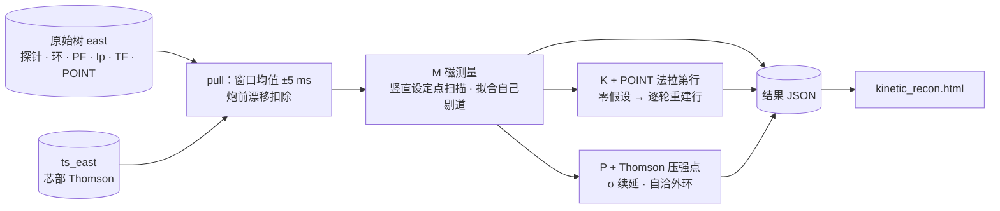

# EAST 实验数据动理学平衡反演

给一发 EAST 放电的一个时刻，从**原始测量**出发把平衡反演沿约束阶梯走三档——只用磁测量（M）、
加 POINT 偏振干涉（K）、加 Thomson 压强并做自洽外环（P）——把三档的平衡、逐道残差与外环证书
写成一份结果 JSON，由一页单文件网页并排读出来。

问题与读法取自校验册旧页 B-06（EAST #137985 动理学平衡反演对标）：**档不同，参考与判据都不同，
读数不可跨档比较**——同一炮上 q₀ 差百分之几十，可以只是约束集之差。本应用不带参考答案：
它只把 fylite 在同一组原始测量上三档各自给出什么、各自对测量拟合得多好、档与档差多少，
照实摆出来。

| 文件 | 是什么 |
| :--- | :--- |
| `kinetic_recon.py` | 取数与反演（单文件，只用 Python 标准库 + `libfylite.so`）：`pull` 取一个时刻的原始测量，`run` 跑三档写结果 JSON |
| `kinetic_recon.html` | 页面（单文件，双击即开，不联网、不上传）：「原理与过程」·「结果」两个页签 |
| `test/smoke.mjs` | 页面的 node 检查：把页面脚本在极小 DOM 垫片里真跑一遍，逐块断言画出了东西 |
| `wei2026.py` | 复现 Wei et al. 2026（AIP Advances 16, 085007）：`profiles` 一炮逐 TS 时刻剖面（清洗 · 分段拟合 · NRMSE），`transport` 一个时刻加 LH 沉积与功率平衡反演 χ_e · χ_i（见〈八〉） |
| `wei_profiles.py` | 上一条的数值件（标准库）：光滑样条 · GCV · Levenberg–Marquardt · 文献的局部稳健清洗 · mtanh 台基 + 斜率积分过渡 · NRMSE |
| `ASSESSMENT-wei2026.md` | 评估：用本应用复现 Wei et al. 2026（AIP Advances 16, 085007）的 EAST 剖面快速处理链，逐步对照、复现路线与「快速」的账 |
| `libfylite.so` | **不入仓**，自己放进来（见〈库〉）：fylite 的计算库，内核 + 编进去的装置事实 + mdsip 客户端 |

★★**独立发行：只依赖 `libfylite.so`。**脚本不 import fylite 的 Python 包，也不要 numpy / pyyaml——
Python ≥ 3.8 的标准库（ctypes · json · math）就是全部。要的三样都在库里：内核的文档门（每一次物理计算）、
编进去的 EAST 装置描述与它按炮号 / 测量链解析的规则、mdsip 客户端（取数）。

★★**实验数据不入仓。**测量文档与结果 JSON 都写在调用方给的路径上（本目录的 `.gitignore`
兜住常见的名字）；取数写出的文件里，服务器地址一律记作 `mds.invalid`。

## 库

`libfylite.so` 放在本文件旁边，名字固定——脚本**只在这一处找**，不搜上层目录、不读环境变量
（「到别处找库」一旦找错不会报错，会静默地用另一份库算完；要换库就换这个文件，或显式 `--lib 路径`）。

要的是这样一份：

- **带内核**（`fylite_kernel` 的静态归档链进来）且**编进了 EAST**（facts 版别 internal）——EAST 装置数据的权利方是
  ASIPP、不公开，公开版的库里没有它，脚本会按名拒绝并说出这份库带着哪几台装置；
- **2026-09-18 之后的构建**：编进去的 EAST 文档带 `pf_active/fylite:channel`（PF 通道的罗氏线圈节点、匝数、拟合序），
  取 PF 电流要它；更早的库只能 `run`、不能 `pull`，脚本会按名说；
- **2026-09-19 之后的内核**（fylite_kernel ab5e3444 起）：档 M 缺省的 `anderson = 10` 要它；更早的库不认这个键、照纯 Picard 算，
  脚本在结果里记 `anderson_ignored` 并说一句（或显式 `--anderson 0`）；
- 最好是 **`--no-io` 档**：不链 HDF5 / netCDF，`ldd` 只剩 libc / libm / libgcc_s，拷到哪都能跑（要 glibc ≥ 2.35）。

在 fylite 仓根上构建（要 `rust/kernel-lib/` 里的内核归档，由内核仓的构建装进来）：

```bash
bash rust/build.sh --no-io
cp rust/fylite_runtime/target/release/libfylite_runtime.so apps/east-kinetic-reconstruction/libfylite.so
```

## 一 · 为什么是三档

**磁测量单独约束不住内部剖面。**很不一样的 p′、FF′ 给得出几乎一样好的磁拟合：在 #137985
的实测上，档 M 的 p′ 后验 1σ 带是 p′ 自身值的一半上下（页面「剖面 · p′」那条灰带）。把内部
剖面定下来的，是磁测量之外的约束：

- **K · POINT**：11 弦偏振干涉。线密度只用来定密度形状；法拉第角 ∫n_e B_∥ dl 作为一行进平衡拟合，
  它对内部极向场敏感。
- **P · Thomson**：芯部 Thomson 的 n_e、T_e（加 TXCS 的 T_i0）组装成压强点 p = e·n_e·T_e·(1 + T_i/T_e)，
  在实空间 (R, Z) 上作动理学行。压强测在**位置**上，挂到 ψ_N 要一个平衡，而平衡正是待解的——
  所以 P 档带一个**自洽外环**：解一次、按刚解出的磁面把测点重映到 ψ_N、再解，逐遍报证书。



## 二 · 每一档做了什么

### 取数（`pull`）

- **装置**：EAST 在这一炮、`east` 测量链上的描述由库解析（编进去的装置事实 + `fylite_runtime_device_resolve`）；
  节点名——磁通环 · 磁探针 · PF 罗氏线圈（`pf_active/fylite:channel`）· POINT 弦——都从这份文档里取，脚本不写死任何一个。
- 磁测量与 POINT：原始节点经 GUI_v5 的归约——|t − t₀| ≤ 5 ms 窗口均值、−6.9…−6.1 s 炮前线性漂移扣除、
  POINT 用它自己的窗（先减 t ≈ −0.9 s 零偏）与条纹闸。这段归约写在脚本里，与 fylite 的 `reduce_series`
  逐项对过：同一组原始序列喂两边，75 环 · 79 探针 · 12 路 PF · Ip · 11 弦 POINT 相差 ≤ 3×10⁻¹⁴（求和次序的舍入）。
- **B_T 不读 B_T 节点**：那个节点自 #97286 起单位是伏特（B-06 §7.1）。改读 TF 线圈电流 `\TOP.T2:TFP`，
  F = μ₀NI/2π，N = 16 × 130。
- Thomson：`ts_east` 离所要时刻最近的一个激光脉冲，带诊断自报的逐点误差，加 `analysis` 树的 TXCS 芯部 T_i0；
  与 fylite 的 `fetch_thomson` 在 #137985 两个时刻上逐点相同。
- mdsip 读超时缺省 120 s（`--timeout`）——`east` 树在服务器上打开可能要一分钟。

### 档 M · 磁测量

- σ = max(0.05·|读数|, 位下限)（环 5e-4 Wb/rad、探针 7.5e-4 T）——EFIT / KEFIT 的 data_input 约定，
  B-06 两个代码同用；权重 1/σ。PF 电流取实测、固定；竖直位置由 16 个设定点（−30…+30 mm）扫描取 χ² 极小。
- **坏道由拟合自己剔**：每轮在 χ² 最小且收敛的那个设定点上看逐道残差，超过 5 σ 的里剔最坏的至多 4 道，
  重扫，直到没有超阈的道。一轮剔完反而一个设定点都不收敛，就把这一批撤回（掩码与答案永远对得上）。
- **环的起步组是 FL*B**：75 个环全进，16 个设定点一个都不收敛（等离子体在几十次外迭代里被拟合推出盒子）；
  只用 FL*B 起步则收敛。收敛之后把其余环里**在收敛解上预测得进 5 σ 的收回来**，再扫一遍。
  所以最后用哪些环，是数据选的，不是一张写死的行表。
- 名字重复的探针槽（卡片上 HBPL1T…5T 各出现两次，没有独立节点）起步即不用。
- **设定点扫描缺省走粗网格排序（`--scan coarse`）**：每轮先把 16 个设定点在 33² 上解一遍、按粗 χ² 排序，只把最好的
  4 个在 65² 上冷启动复核，再从其中最好的往两侧邻点走（65²），直到两侧都不更好。粗网格上收敛的不到一半（排序不可信），
  或复核的无一收敛，这一轮照全扫。粗网格只用来排序：报出的解、剔道依据都是 65² 上的冷启动解。`--scan full` 是
  每个设定点都在 65² 上解的原做法（与 2026-09-19 之前逐位相同）。实测见下〈粗扫的验证〉。
- **反演外迭代缺省开 Anderson 混合（`--anderson 10`）**：内核 `code/reconstruction` 的 `anderson = m`（2026-09-19 起的库），
  只混固定日程（预热 · 交接 · 边界斜坡）之后的 Picard 尾巴，停机判据不变、终点是同一个不动点。粗扫的 33² 粗解、65² 复核
  与全扫三种调用都带它；只用在档 M（K / P 的反演照旧）。`--anderson 0` 是纯 Picard（不写这个键，与之前逐位相同）。
  更早的库不认这个键、也不报错：脚本在结果里记 `scan.anderson_ignored` 并说一句。实测见下〈Anderson 混合的验证〉。

#### 粗扫的验证（2026-09-19，同一份库，全扫对粗扫）

24 片、三炮，档 M 冷启动：#137985 五片（`run` 的缺省：5 σ、至多 6 轮、每轮剔 4），#81481 三片（4.0 · 6.0 s 同上；
5.517 s 用 `wei2026.py` 的设定：4 σ、4 轮、每轮剔 3），#63948 十六片（0.8–7.4 s，`wei2026.py` 的设定）。
**24 片的竖直设定点、χ²、χ²/dof、q₀、磁轴、拟合 I_p 逐位相同，剔的道与收回的环全部相同**（#63948 7.022 s 一片
剔道的先后不同、集合相同）——最后那个解就是同一设定点、同一掩码上的同一次 65² 冷启动。耗时是两种扫法同时各跑
一进程、同一负载下的墙钟（机器上约 30 个进程并行，绝对值偏大，比值可比）：

| 片 | 全扫 [s] | 粗扫 [s] | 加速 | 设定点 [mm] | χ²/dof | q₀ | 磁轴 (R, Z) [m] | 剔道 | 65² / 33² 解数 · 退回全扫的轮 |
| :--- | ---: | ---: | ---: | ---: | ---: | ---: | :--- | ---: | :--- |
| #137985 2.5 s | 45 | 32 | 1.40 | −18 | 0.9925 | 2.823 | (1.846, −0.016) | 4 | 20 / 32 · 0 |
| #137985 3.0 s | 55 | 64 | 0.86 | −14 | 0.8896 | 2.247 | (1.859, −0.012) | 4 | 32 / 32 · 0, 1 |
| #137985 4.041 s | 133 | 105 | 1.26 | −14 | 1.0324 | 1.988 | (1.863, −0.011) | 5 | 40 / 64 · 0, 1 |
| #137985 5.0 s | 101 | 124 | 0.82 | −18 | 0.7036 | 2.070 | (1.805, −0.018) | 6 | 80 / 80 · 全部 |
| #137985 6.0 s | 128 | 94 | 1.36 | −14 | 1.2433 | 2.036 | (1.816, −0.013) | 5 | 41 / 64 · 0, 1 |
| #81481 4.0 s | 167 | 134 | 1.25 | +10 | 1.3014 | 0.400 | (1.913, +0.015) | 6 | 36 / 48 · 0, 2 |
| #81481 5.517 s | 59 | 36 | 1.63 | +14 | 1.6777 | 2.921 | (1.946, +0.019) | 4 | 24 / 48 · 0 |
| #81481 6.0 s | 53 | 29 | 1.81 | +30 | 1.6449 | 4.783 | (1.910, +0.037) | 5 | 24 / 48 · 0 |
| #63948 0.822 s | 70 | 43 | 1.60 | −22 | 1.2492 | 2.313 | (1.925, −0.013) | 6 | 24 / 48 · 0 |
| #63948 1.022 s | 68 | 54 | 1.25 | −18 | 1.0475 | 0.933 | (2.038, +0.007) | 5 | 24 / 48 · 0 |
| #63948 1.422 s | 67 | 46 | 1.45 | −14 | 0.7311 | 1.237 | (1.874, −0.003) | 5 | 24 / 48 · 0 |
| #63948 1.822 s | 72 | 35 | 2.05 | −2 | 0.7337 | 0.965 | (1.891, +0.005) | 5 | 24 / 48 · 0 |
| #63948 2.222 s | 117 | 39 | 3.00 | +14 | 0.8797 | 1.037 | (1.888, +0.018) | 5 | 24 / 48 · 0 |
| #63948 2.822 s | 113 | 64 | 1.77 | +30 | 1.1492 | 2.134 | (1.870, +0.037) | 4 | 24 / 48 · 0 |
| #63948 3.222 s | 124 | 50 | 2.50 | +26 | 1.2407 | 1.666 | (1.869, +0.032) | 4 | 24 / 48 · 0 |
| #63948 3.622 s | 113 | 36 | 3.15 | +18 | 0.9620 | 0.870 | (1.890, +0.022) | 5 | 24 / 48 · 0 |
| #63948 4.022 s | 108 | 40 | 2.67 | +22 | 1.3242 | 1.387 | (1.872, +0.027) | 4 | 24 / 48 · 0 |
| #63948 4.422 s | 142 | 60 | 2.38 | +18 | 0.9531 | 0.856 | (1.891, +0.022) | 5 | 24 / 48 · 0 |
| #63948 5.022 s | 164 | 59 | 2.80 | +18 | 0.8545 | 0.864 | (1.898, +0.022) | 5 | 24 / 48 · 0 |
| #63948 5.622 s | 119 | 41 | 2.89 | +22 | 1.4224 | 1.381 | (1.873, +0.027) | 4 | 24 / 48 · 0 |
| #63948 6.222 s | 114 | 43 | 2.63 | +26 | 1.2083 | 1.681 | (1.871, +0.032) | 4 | 24 / 48 · 0 |
| #63948 6.622 s | 112 | 36 | 3.06 | +22 | 1.5029 | 1.359 | (1.874, +0.028) | 4 | 25 / 48 · 0 |
| #63948 7.022 s | 150 | 29 | 5.24 | +18 | 0.8504 | 0.917 | (1.899, +0.022) | 5 | 12 / 48 · — |
| #63948 7.422 s | 156 | 52 | 3.01 | +18 | 0.9785 | 0.867 | (1.892, +0.022) | 5 | 24 / 48 · 0 |

合计 2547 s → 1345 s（× 1.9）。#63948 × 1.3–5.2（中位 × 2.6）；#137985 只有 × 0.8–1.4：这一炮（`east_new` 测量链）
在 33² 上收敛的设定点常不到一半，门槛让大多数轮退回全扫，多花的是那 16 次粗解。`wei2026.py profiles` 的 #63948
全炮 35 片（12 进程，其中 12 片冷启动全扫）：35 片的平衡与剖面逐片相同，各片墙钟 235 s → 192 s。

★**门槛与 top = 4 是量出来的，不是先验。**最初的做法（只复核粗排前 3、不走邻点、不设门槛）在前 12 片里有 3 片答案
与全扫不同：#81481 5.517 s（65² 上 +14 mm 与 +22 mm 的 χ² 只差 0.14%，前 3 没排进 +14 → q₀ 2.92 变 3.96）、
#137985 3.0 s 与 6.0 s（剔坏道之前那几轮 33² 与 65² 上收敛的设定点几乎不重合，粗排选错之后剔了不同的道）。
门槛（粗网格收敛过半才信它的排序）、top = 4 与走邻点是照这 12 片定的；其余 12 片（#63948 八片、#137985 2.5 · 5.0 s、
#81481 4.0 · 6.0 s）是定完之后才跑的，同样全部相同。χ² 景观平的片（设定点之间 χ² 差 < 1%）上，粗扫与全扫哪怕都「对」，
也可能落到不同的设定点——内核后处理掩码让 χ² 在近乎相同的两次运行之间差约 1%（另案在修），这类片的设定点本来就
只定到 ±4–8 mm。要逐位的原做法：`--scan full`。

#### Anderson 混合的验证（2026-09-19，同一份库，`anderson` 0 对 10）

同〈粗扫的验证〉那 24 片、同样的设定，都走 `--scan coarse`，库是内核 ab5e3444 链出来的同一份。两种深度各一进程、
8 进程并行（绝对值偏大，比值可比）。**24 片里 23 片的设定点、χ²、χ²/dof、q₀、磁轴、拟合 I_p、剔的道与收回的环逐位相同**
（#63948 3.622 s 剔道的先后不同、集合相同）；**#137985 3.0 s 一片不同**（加粗）：

| 片 | `anderson 0` [s] | `10` [s] | 加速 | 设定点 [mm] | χ²/dof | q₀ | 磁轴 (R, Z) [m] | 剔道 | 65² 解数 · 退回全扫的轮 |
| :--- | ---: | ---: | ---: | ---: | ---: | ---: | :--- | ---: | :--- |
| #137985 2.5 s | 32 | 22 | 1.44 | −18 | 0.98973 | 2.823 | (1.846, −0.016) | 4 | 20 · 0 |
| #137985 3.0 s | 54 | 39 | 1.38 | −14 → **−18** | 0.88654 → **0.87037** | 2.247 → **2.311** | (1.859, −0.012) → **(1.843, −0.019)** | 4 | 32 · 0, 1 |
| #137985 4.041 s | 98 | 47 | 2.11 | −14 | 1.0327 | 1.988 | (1.863, −0.011) | 5 | 40 · 0, 1 → 32 · 0 |
| #137985 5.0 s | 123 | 100 | 1.24 | −18 | 0.68845 | 2.07 | (1.805, −0.018) | 6 | 80 · 0, 1, 2, 3, 4 |
| #137985 6.0 s | 84 | 55 | 1.51 | −14 | 1.223 | 2.036 | (1.816, −0.013) | 5 | 41 · 0, 1 |
| #81481 4.0 s | 136 | 61 | 2.22 | +10 | 1.3014 | 0.4004 | (1.913, +0.015) | 6 | 36 · 0, 2 |
| #81481 5.517 s | 32 | 27 | 1.18 | +18 | 1.6742 | 3.388 | (1.945, +0.024) | 4 | 24 · 0 |
| #81481 6.0 s | 28 | 25 | 1.15 | +30 | 1.6449 | 4.783 | (1.910, +0.037) | 5 | 24 · 0 |
| #63948 0.822 s | 40 | 24 | 1.69 | −22 | 1.2492 | 2.313 | (1.925, −0.013) | 6 | 24 · 0 |
| #63948 1.022 s | 43 | 24 | 1.81 | −18 | 1.048 | 0.9332 | (2.038, +0.007) | 5 | 24 · 0 |
| #63948 1.422 s | 41 | 23 | 1.79 | −14 | 0.73118 | 1.237 | (1.874, −0.003) | 5 | 24 · 0 |
| #63948 1.822 s | 31 | 25 | 1.24 | +2 | 0.73131 | 1.085 | (1.890, +0.011) | 5 | 24 · 0 |
| #63948 2.222 s | 33 | 25 | 1.33 | +18 | 0.87159 | 1.184 | (1.887, +0.024) | 5 | 24 · 0 |
| #63948 2.822 s | 52 | 26 | 1.98 | +22 | 0.88184 | 1.11 | (1.889, +0.027) | 5 | 24 · 0 |
| #63948 3.222 s | 44 | 28 | 1.57 | +26 | 1.2175 | 1.666 | (1.869, +0.032) | 4 | 24 · 0 |
| #63948 3.622 s | 31 | 24 | 1.31 | +22 | 0.95862 | 1.003 | (1.889, +0.027) | 5 | 24 · 0 |
| #63948 4.022 s | 32 | 23 | 1.39 | +26 | 1.3029 | 1.58 | (1.871, +0.033) | 4 | 24 · 0 |
| #63948 4.422 s | 49 | 23 | 2.13 | +22 | 0.95134 | 0.9881 | (1.890, +0.027) | 5 | 24 · 0 |
| #63948 5.022 s | 52 | 53 | 0.98 | +22 | 0.852 | 0.997 | (1.897, +0.027) | 5 | 24 · 0 → 36 · 0, 2 |
| #63948 5.622 s | 35 | 27 | 1.32 | +22 | 1.4023 | 1.381 | (1.873, +0.027) | 4 | 24 · 0 |
| #63948 6.222 s | 31 | 25 | 1.23 | +26 | 1.1866 | 1.681 | (1.871, +0.032) | 4 | 24 · 0 |
| #63948 6.622 s | 31 | 23 | 1.33 | +22 | 1.4822 | 1.359 | (1.874, +0.028) | 4 | 24 · 0 |
| #63948 7.022 s | 22 | 17 | 1.26 | +22 | 0.84852 | 1.056 | (1.898, +0.027) | 5 | 12 · — |
| #63948 7.422 s | 41 | 24 | 1.70 | +26 | 1.224 | 1.657 | (1.873, +0.033) | 4 | 24 · 0 |

合计 1197 s → 790 s（× 1.51，逐片 × 0.98–2.22，中位 × 1.39）。`run` 的整条 MKP（#137985 4.041 s，单进程）
113 s → **64 s**，K、P 两档的读数逐位相同（K、P 不开 Anderson，差只在 M）。

★**不同的那一片是 Anderson 救活了一个点。**#137985 3.0 s 第 0 轮（坏道还没剔）纯 Picard 下只有 +14…+30 mm 收敛，
Anderson 让 −30 mm 也收敛了，且它的 χ² 更小（5702 对 7553）——于是第 0 轮在另一个设定点上剔道，第 4 道剔的是 HBPD6N
而不是 HBPD3N，最后落在 −18 mm（χ²/dof 0.8704，比 −14 mm 的 0.8865 小）。这一片在〈粗扫的验证〉里也是粗扫曾经选错的
那几片之一：剔道前的 χ² 景观上收敛的设定点很少，谁收敛谁就定了剔道的方向。
★**反过来也有：Anderson 让一些点被拒。**逐轮逐设定点数（约 650 次 65² 解）：15 个纯 Picard 收敛的点在 `anderson 10` 下被拒
（内核码 −5，约 0.8 s 就拒，正是混合开始的那一轮），5 个点反过来被救活，其余相同。复查的 5 个被拒点都是纯 Picard 要
1300–3200 轮才收敛的慢点；15 个里 13 个在第 0 轮（坏道还在、χ² ≈ 4×10⁴ 的时候）。只有一次被拒的恰是纯 Picard 选中的点
（#63948 3.622 s 第 0 轮 −30 mm）：那一片第 0 轮换了设定点，剔道的先后因此不同，集合与终点相同。
#63948 5.022 s 第 2 轮的 33² 粗解少收敛了一个（7/16，不过半），这一轮退回全扫，所以那一片不快（× 0.98）。
★换库本身（内核 ab5e3444：χ² 后处理掩码修复等）在 `anderson 0` 下也改了〈粗扫的验证〉那张表：χ²/dof 普遍移 0–2%，
#63948 九片与 #81481 5.517 s 的设定点移了 4–8 mm（χ² 景观平的片；2.822 · 7.422 s 剔的道也不同），#137985 与 #81481
4.0 · 6.0 s 的设定点不变。那张表是旧库上的数，新库上的数是上表的 `anderson 0` 一列。

### 档 K · 加 POINT

- **零假设**：在档 M 的平衡上前向算 11 弦（`code/chords`：先按线密度拟一个 (1 − x²)^α 的密度形状，
  再沿弦积分），对实测。零假设残差超过 8 σ 的行判为死道、关掉（B-06 实测过：干涉死道 +22 σ、法拉第死道 −10.9 σ）。
- **拟合**：法拉第角作行加进 `code/reconstruction`（行给定档：磁测量扣掉线圈份额、外场随行），
  每轮在新平衡上重建行，至 |Δq₀|/q₀ < 1e-3。σ 取 KEFIT GUI 缺省（法拉第 0.05、线密度 0.3）。

### 档 P · 加 Thomson

- 压强点：p = e·n_e·T_e·(1 + T_i0/T_e0)，质量闸 50 eV < T_e < 8 keV、n_e 在量程内、自报误差可用（与 fylite 的
  `pressure_from_thomson` 同一规则、逐点相同）；之后只收挂在 ψ_N < 0.98 上的点。
- **离群点逐个剔**：对 p(ψ_N) 做一次带 GCV 定阶的光滑拟合（`code/profile_fit`），离它最远、且超过 4 σ
  的那一点剔掉，重拟，直到没有这样的点。剔掉的点与当时的 σ 都写进结果。
- **σ 续延**：先按实测 σ 进；内核拒了就把全部压强行的 σ 依次放宽 1.5、2、3、4、6、8 倍，
  取第一个收敛的，**放宽倍数写进结果并在页面上标红**——放宽了多少，这一档就少说了多少。
  为什么要这一步，见〈四〉。
- **自洽外环**：`code/reconstruction` 的 `kinetic_passes`（缺省 6）逐遍把测点重映到 ψ_N，证书是逐遍的
  χ²/dof 与映射移动；内核按 χ² 取最优遍收官。页面把「收官那一遍的映射是否已经不动」单独判出来。
- 缺省叠在档 M 上（全测量档）。`--p-on K` 叠在档 K 上，但那一档的外环不重映（见〈四〉），所以只跑一遍。

## 三 · 用法

任何一个 Python ≥ 3.8 都行，不装任何包（`libfylite.so` 已放在脚本旁边，见〈库〉）：

```bash
export FYLITE_MDSIP_SERVER=<host:port>          # 只在 pull 时要（或 pull --server）
A=apps/east-kinetic-reconstruction              # 或拷走之后的那个目录

# 取数：原始树 + Thomson → 一份测量文档（实验数据，不入仓）
python3 $A/kinetic_recon.py pull --shot 137985 --time 4.041 -o ~/ekr/meas_137985_4041.json

# 反演三档 → 结果 JSON（单机约一分钟，大半花在档 M 的扫描与剔道上）
python3 $A/kinetic_recon.py run ~/ekr/meas_137985_4041.json -o ~/ekr/result_137985_4041.json

# 结果页：双击 kinetic_recon.html，点「导入结果 JSON」
# 页面检查（要一份结果）
node $A/test/smoke.mjs $A/kinetic_recon.html ~/ekr/result_137985_4041.json
```

`run` 也直接收 B-06 那份原始树归约件（fydoc CASE-23 `corpus/raw/raw_slices_east137985.json`，三片，
`--time` 取最近的一片），Thomson 另给：`pull --thomson-only` 取一份，`run … --thomson <它>`。
`east` 树取不到的时候（本页写成那天就是，见〈四〉），这是跑通整条链的办法。

常用开关（全表 `run --help`）：

| 开关 | 缺省 | 做什么 |
| :--- | :--- | :--- |
| `--tiers` | `MKP` | 跑哪几档（M 总是跑） |
| `--npp` / `--nff` | 2 / 2 | p′ / FF′ 基的阶数（与 KEFIT GUI 的 KPPCUR / KFFCUR 同） |
| `--loops` | `B+readmit` | 环的起步组：FL*B 起步、收敛后按残差收回（`B` 只用 B 组，`all` 全进） |
| `--reject-sigma` | 5 | 档 M 剔道阈值 |
| `--scan` | `coarse` | 档 M 设定点扫描：`coarse` 粗网格排序 + 65² 复核，`full` 全部在 65² 上解（见〈二〉档 M） |
| `--scan-grid` / `--scan-top` | 33 / 4 | 粗网格边长；65² 上复核几个设定点 |
| `--anderson` | 10 | 档 M 反演外迭代的 Anderson 混合深度（0 = 纯 Picard；见〈二〉档 M） |
| `--point-off` | — | 手动关掉的 POINT 弦（B-06 主集为 `4,7,8,11`） |
| `--thomson-clip` | 4 | Thomson 离群点阈值（σ，对光滑拟合） |
| `--sigma-scales` | `1,1.5,2,3,4,6,8` | 档 P 的 σ 续延序列 |
| `--kinetic-passes` / `--kinetic-tol` | 6 / 1e-3 | 外环遍数上限与映射移动阈值 |
| `--p-fast-frac` | 0 | 声明的快离子压强份额（峰值热压 × f × (1 − x²)，先算 σ 后扣除） |
| `--curv` | 0 | p′ / FF′ 曲率正则权重 |
| `--p-on` | `M` | 档 P 叠在哪一档上 |

## 四 · #137985 上跑出来的（2026-09-18 实测）

输入：CASE-23 的原始树归约件三片 + 当天 `pull --thomson-only` 取的 Thomson（`east` 树当天在服务器上打不开：
`cannot open east shot 137985`——所以磁测量走了离线归约件；取数那一路的 Thomson 与出错记录都实测过）。
跑在一台只有系统 Python 3.10（无 numpy、无 fylite 包）、环境变量清空的机器上，库是本目录旁的 `--no-io` 档；
每片单机两分钟上下。

| 片 | 档 M q₀ | 档 K q₀ | 档 P q₀ | 档 M χ²/dof | K 法拉第 rms（零假设 → 拟合） | P σ 放宽 · 进拟合的点 |
| :--- | ---: | ---: | ---: | ---: | :--- | :--- |
| 4.041 s | 2.022 | 1.918 | 2.168 | 1.05 | 2.35 → 2.38 σ | × 6 · 10 / 19 |
| 4.944 s | 2.062 | 1.924 | 1.386 | 0.91 | 2.39 → 2.37 σ | × 1.5 · 7 / 18 |
| 5.976 s | 2.068 | 内核拒绝 | 1.378 | 1.36 | — | × 6 · 7 / 17 |

对照（B-06 §7.1，同一组原始输入、剔 7 个探针）：fylite 纯磁 q₀ 2.042 / 1.984 / 1.924，KEFIT 1.913 / 1.924 / 2.000；
efit_east 树的答案（只作比较）1.806 / 1.828 / 1.821。

★★**限制器用的是装置文档的缺省那一条。**库里编进去的 EAST 文档只带限制器 `base`（64 点），另一条
`m-file`（48 点）记为备选、不带轮廓——这是 fylite 2026-09-13 的裁定（EAST 的壁缺省回 `base`；换一条是要人来定的改动）。
经 fylite Python 包读的卡片形则把两条都交给内核，内核用的是 `m-file`。所以同一组输入，本应用与经 Python 包跑出来的
读数差在限制器上：同一片 4.041 s，档 M q₀ 2.022（`base`）对 1.988（`m-file`）。★这一点逐位核过——把本应用的装置
文档里的壁换成卡片形的那两条，三档的事实、ψ 图与逐道残差与经 Python 包的那次运行**逐位相同**：差别只在限制器，
不在移植。

读法：

- **档 M 站得住。**三片各剔 5 个探针，其中 4 个三片相同（HBPH1N · HBPH1T · HBPD8N · HBPL10N，剔时 37–47 / 42 / 21 / 5–7 σ），
  第 5 个前两片是 HBPD6N（13 σ）、第三片是 HBPH8N（16 σ）——三个时刻独立地判出几乎同一组，是这几道真坏的有力证据；
  剔法由 fylite 自己的拟合给出，不借 KEFIT。没进拟合的 FL*A 环在收敛解上的残差中位约 140 σ、VP1…5 在 120…920 σ——
  这就是起步不能全进的原因；收回的只有 FL15A · 16A · 31A · 32A · 33A（第三片另加 FL13A · 14A）。
  q₀ 与 B-06 两个代码的纯磁答案差 0.02–0.15。
- **档 K 与 B-06 同形。**前两片法拉第行进了拟合，残差几乎不动——B-06 同输入跑 KEFIT 与 fylite，两者都留约 2.4 σ、
  逐弦同号，结论是「这份残差属于数据」。5.976 s 那片内核在行给定档的第一次求解就把等离子体拟丢（空掩码，第 151 次外迭代）；
  B-06 记的也是「5.976 s 两代码一起塌落」，经 Python 包、用 `m-file` 限制器时这一片解得出（q₀ 1.21）但同样塌落。
  4.041 s 的第 1、2、4 弦线密度被判死道。
- **档 P 在这一炮上不可信，页面照实标出来。**#137985 的 Thomson 全炮只有 6 个脉冲（每秒一个，x.019 s），
  离 4.041 s 最近的是 4.019 s，无从做时间窗平均；单个脉冲逐道的 T_e、n_e 起伏远超自报误差
  （相邻道相差数倍，个别道差一个量级；逐道读数是实测数据，不入本仓）。剔掉离群点后只剩 7–10 个点，
  两片还要把 σ 放宽 6 倍内核才收；三片外环的收官遍都是第 2 遍，那一遍的映射移动 0.015–0.020，
  **比阈值大十五到二十倍**——按 χ² 取的最优遍对它自己的磁面并不自洽。链是通的，这一炮的数据撑不起这一档。

### 给内核维护者的三条（实测，可复现）

1. **紧的动理学行会把等离子体拟丢，即便数据与解完全自洽。**把档 M 自己的压强剖面原样当动理学行喂回去
   （同一套磁测量、同一设定点），σ 取峰值 5 % 时 `code/reconstruction` 拒绝（空掩码，外迭代刚过 warmup 即丢；
   `relax` 0.1 / 0.15、`warmup` 150 / 300、`fb_gain` 4 / 16 各试一档都一样），20 % 时一步收敛、χ²_kin ≈ 2e-7。
   本应用的 σ 续延就是为这一条做的绕行。
2. **行给定档（`fylite:psi_ext` + `loop_plasma` / `probe_plasma`）上 `kinetic_passes` 不重映。**同一份 Thomson 行叠在
   档 K 的行给定档上跑 6 遍，逐遍 χ²/dof 在 47.5 与 2.72 之间来回跳、映射移动每遍都是 0.994。全测量档上同一组行
   映射移动逐遍单调降。所以 `--p-on K` 只跑一遍。
3. **最优遍按 χ² 取，可能取到映射还在动的那一遍。**上表三片都是：收官第 2 遍、映射移动 0.020 / 0.015 / 0.019；
   而最后一遍（第 6 / 4 / 4 遍）已降到阈值以下（9.7e-4 / 2.7e-4 / 3.7e-4），χ²/dof 只比收官那遍高 8.6 / 0.8 / 1.1 %。
   「取最优遍不取最后一遍」防的是交替不单调；但「χ² 最小」与「自洽」是两件事，证书里两条迹都在，判据只看了一条。

另有一条给 fylite 装置数据维护者：**同一台 EAST 的两种写法把不同的限制器交给反演门**（卡片形 `base` + `m-file` 两条、
内核用 `m-file`；文档形只留 `base`）。二者按 2026-09-13 的裁定应当一致，今天不一致。

## 五 · 结果文件

一份 JSON（`@type: fylite:KineticReconResult`），页面只读它：

- `shot` · `time_s` · `origin`（输入是哪种文件、哪一片）· `source`（地址已抹）· `fylite`（版本与 ABI）· `settings`（本次的全部开关）
- `inputs`：Ip、B_T 与它的来路、PF 安匝、起步即不用的道
- `device`：限制器、每个环 / 探针的名字与位置、POINT 弦的视线
- `tiers.M` / `K` / `P`：`status`（`ok` / `error` / `skipped` 与理由）· `facts`（q₀、q₉₅、l_i(3)、磁轴、χ²、χ²/dof、最劣单道、迭代、
  外环证书的标量）· `grid` + `psi`（65 × 65）· `boundary` · `profiles`（p、p′ 及其后验 σ、FF′、q，201 点）· `channels`（逐道残差，
  用与不用都列）；M 另有 `scan`（哪种扫法与它的参数、Anderson 深度 `anderson`（库不认时另有 `anderson_ignored`）、
  65² / 粗网格各解了几次、哪几轮退回全扫；`settings.scan` · `settings.anderson` 同记）、
  `rounds`（逐轮扫描：`scan` 是 65² 上的读数；粗扫的轮另有 `strategy`、`coarse`（33² 上逐设定点的读数）、`coarse_converged`、
  `fallback`）、`rejected`、`readmitted`；K 另有 `point`（零假设与拟合后的逐弦残差、死道、密度形状）
  与 `passes`；P 另有 `certificate`、`sigma_scale`、`attempts`、`thomson`（逐点：R、Z、p、σ、起止 ψ_N、模型 p、残差、剔的理由）。

## 六 · 页面

`kinetic_recon.html`（单文件，系统字体，不加载任何外部资源）分两个页签。**「原理与过程」**是缺省页，不要结果也能读：
平衡与反演问题（Grad–Shafranov、自由边界、磁测量对电流的线性响应）· 带约束的 Picard 迭代（基函数、带权最小二乘与 I_p 等式约束、
竖直设定点、后验带）· 为什么磁测量不够 · 档 K 的偏振干涉物理与法拉第行 · 档 P 的压强组装、压强行与自洽外环的证书 ·
全过程流程图 · 误差与权重的约定 · 数据处理的每一步 · 读法与边界；公式与图都内嵌，离线可读。**「结果」**页签在导入结果后自动打开：约束阶梯表（三档并排、差值对档 M）· 极向截面
（主显示档的 ψ_N 等值线，各档边界叠画，探针 / 环按残差着色、空心为未用，POINT 弦与 Thomson 点）· 剖面（q、p 与 Thomson 点、
p′ 与档 M 的后验带、FF′）· 磁测量逐道残差与剔道轨迹 · POINT 逐弦残差（零假设对拟合后）· Thomson 逐点与外环证书 · 读法与边界。
右上角切主显示档与配色（自动 / 浅 / 深）。

## 七 · 边界

- **没有参考答案。**真实放电上没有 q₀ 的真值。能判的是残差（测量那一侧）与档差；efit_east 树与 KEFIT 的答案在 B-06 里，本应用不读它们。
- **外环只重映。**不重算自举电流与快离子；电流约束行（磁面平均电流形状）不在本应用里。
- **没有 MSE。**内核里一行 MSE 都没有；芯部电流在 EAST 上主要由模型约束，**收敛不蕴含正确**。
- **Thomson 的离子份额是假设**：T_i(x) = T_i0 · T_e(x) / T_e0（TXCS 只给芯部一个数），写在结果的 `assumptions` 里。
- **只做一个时刻。**时间序列是逐片调 `run`；本应用不做批处理与跨片平滑。
- **剔道是本应用的规则**：阈值 5 σ、每轮 4 道、FL*B 起步。另一套规则（B-06 用 KEFIT 纯磁 χ² 份额 > 25 剔 7 道）会给出另一个答案，
  两者之差是剔法之差。

## 八 · 复现 Wei et al. 2026（`wei2026.py`）

文献（D. Wei *et al.*, AIP Advances **16**, 085007 (2026)）只给炮号，把 TS · 反射计 · XCS 等诊断清洗、分段拟合成
n_e · T_e · T_i 剖面，再接 LH / EC 加热与 ONETWO 反解 χ_e · χ_i。本应用复现的是**它的方法与结果**，不是它的代码：
平衡自己反演（档 M，不读 P-EFIT），ρ_tor 由 `code/ladder` 在这份平衡上描迹，LH 用 `code/wave`、输运用
`code/interpretive`（2026-09-18 起收给定源剖面与电子–离子交换）。逐条的同与不同写在结果 JSON 的 `method` 里，
评估与路线见 `ASSESSMENT-wei2026.md`。

```bash
A=apps/east-kinetic-reconstruction
# 阶段 A：一炮的全部 TS 时刻（#63948：35 个脉冲）→ 逐片剖面、清洗记录、NRMSE（12 进程约 3 分钟）
python3 $A/wei2026.py profiles --shot 63948 --t0 0 --t1 8 --workers 12 -o ~/ekr/prof_63948.json
# 阶段 A + B + C：一个时刻 → LH 沉积与驱动电流、χ_e · χ_i（约 2 分钟）
python3 $A/wei2026.py transport --shot 81481 --time 5.3 -o ~/ekr/tr_81481.json
```

两条命令都收 `--scan coarse|full`（缺省 `coarse`）与 `--anderson M`（缺省 10），同〈二〉档 M。`--scan` 只作用在冷启动的
全扫上（每段第一片、热启动解不出退回的那片）；`--anderson` 冷热两种扫都带；热启动只在上一片 ±8 mm 的 5 个设定点上解，粗排省不下什么，照全扫（结果里该轮记
`strategy: full`）。所用做法记在结果的 `method.scan` · `method.anderson` 与每片的 `equilibrium.scan`。
#63948 全炮 35 片、12 进程，`anderson` 0 对 10（同一份库）：**33 片的平衡与剖面相同**（7.022 s 的 n_e NRMSE 差在第四位
有效数字上，0.007597 对 0.007598），各片墙钟 184 s → **128 s**；**0.822 s 一片不同**：它从 0.623 s 热启动、在 −38…−22 mm
上解，−22 mm 纯 Picard 跑满 4000 轮不收敛（χ² 113），Anderson 让它收敛（χ² 75.1，比 −34 mm 的 79.0 小），于是设定点
−34 → −22 mm、q₀ 1.83 → 1.00、T_e NRMSE 0.052 → 0.099（全炮均值 0.0418 → 0.0432）。这正是内核评估里说的「救活点会换路」。

诊断的树与节点名**全部从库里编进的装置事实解析**（`thomson_scattering` · `reflectometer_profile` ·
`spectrometer_x_ray_crystal` · `ece` · `nbi` 的 `fylite:signal`，`lh_antennas` / `ec_launchers` 的
`fylite:power_launched`，`magnetics` 的抗磁能与环电压）——要 2026-09-18 之后、带这些绑定的 `libfylite.so`。
`--signals FILE` 可给一份同形 JSON 覆盖；本仓不写新的节点名。

**2026-09-18 实测**（数与文献的对照；设定与理由见 `ASSESSMENT-wei2026.md`〈六〉）：

| | 本应用 | 文献 |
| :--- | :--- | :--- |
| #63948，4–8 s 的 18 片：T_e 的 NRMSE | 均值 **0.036**（0.016–0.060） | 0.03–0.09 |
| 同上：n_e（反射计）的 NRMSE | 均值 **0.006**（0.004–0.008） | ≈ 0.015 |
| #63948 全炮 35 片的耗时 | 取数 52 s + 各片 128 s（12 进程，`--scan coarse --anderson 10`；`--anderson 0` 184 s）≈ **3 分钟** | 19.95 s（平衡读 P-EFIT） |
| #81481（TS 只存 6 幅，取 5.517 s）：LH 驱动电流 | 479 kA（η_cd = 1×10¹⁹）；**η_cd = 3.8×10¹⁸ 给 181 kA** | 181.3 kA（METIS）· ≈ 176 kA（GENRAY+CQL3D） |
| 同上：χ_e · χ_i | χ_e 0.07 → 0.9（ρ 0.5）→ 12（ρ 0.82）；χ_i 1.3–1.7；**交叉于 ρ ≈ 0.55** | χ_e 0.35 → 10（峰在 0.82）；χ_i 1.9–7；交叉于 ρ ≈ 0.58 |
| 同上：芯部电子–离子交换 | 0.19 MW/m³ | ≈ 0.2 MW/m³（qdelt） |

★**限制**：清洗阈值文献没公布，低侧按文献图 1 的剔除样式定（`wei_profiles.CLEAN_DEFAULTS`）；H98 的来源文献没说，
本应用用抗磁能（缺则动理学 W）与 LH + EC + NBI **源**功率——#63948 多数片因此判 L 模（文献 5.98 s 记 0.943）；
#81481 的 n_e 由 POINT 弦拟合顶替（没有反射计、TS n_e 有坏道），T_i 只有芯部 T_i0、形状是假设的；EC 的发射几何
★2026-09-19 起**按炮号取自装置事实**：fydoc `providers.ec_launchers` 的逐炮覆盖层（#81481 · #81490，li2023lhcdtemperature §4.1）给镜角，base 页给镜位与束光学；没有公开镜角的炮缺省不算（`--ec-launch R,Z,极向角,环向角` 覆盖）；LH 快速模型的 η_cd 是待标定的系数。
