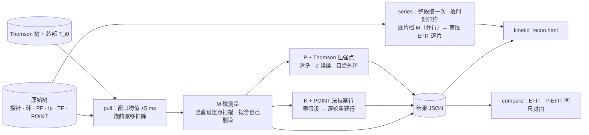

# EAST 实验数据动理学平衡反演（kefit）

版本 0.3.1。给一发 EAST 放电的一个时刻，从**原始测量**出发把自由边界平衡反演沿约束阶梯走三档——
只用磁测量（M）、加 POINT 偏振干涉（K）、加 Thomson 压强并做自洽外环（P）——把三档的平衡、逐道残差与
外环证书写成一份结果 JSON，由一页单文件网页并排读出来。给一段时间，还能逐时刻跑档 M、与装置自己的离线 EFIT
逐时刻比（`series`，页面上是时间迹 + 可换时刻的截面）。另带一条复现 Wei et al. 2026
（*AIP Advances* **16**, 085007，见〈[九 参考文献](#九--参考文献)〉[1]）的剖面处理 → 加热沉积 → 输运反演的管线（`wei2026.py`）。

目录：[一 概述](#一--概述) · [二 包含的物理](#二--包含的物理) · [三 所用算法](#三--所用算法) ·
[四 功能列表](#四--功能列表) · [五 Python 端调用接口](#五--python-端调用接口api) · [六 验证](#六--验证) ·
[七 已知限制](#七--已知限制) · [八 库与分发](#八--库与分发) · [九 参考文献](#九--参考文献)

## 一 · 概述

**做什么。**同一时刻、同一组原始测量，按约束集分三档各解一次 Grad–Shafranov 自由边界反演，照实报出每一档
给出什么（q 剖面、$p'$ / $FF'$、磁面）、对测量拟合得多好（逐道残差、$\chi^2$）、档与档差多少。**档不同，能声称的东西
不同，读数不可跨档比较**——同一炮上 $q_0$ 差百分之几十，可以只是约束集之差。真实放电上没有 $q_0$ 的真值，本应用
不带参考答案；与装置自己的 EFIT / P-EFIT（或本地的 g-file）的对拍是单独一条命令（`compare`），那些解只作比较、不进任何一档。

**输入 → 输出。**

| 步 | 输入 | 输出 |
| :--- | :--- | :--- |
| `pull` | 炮号、时刻、mdsip 服务器 | 测量文档 JSON：磁通环 · 磁探针 · PF 电流 · $I_p$ · TF 电流 · POINT 11 弦 + 一个 Thomson 脉冲 + 芯部 $T_{i0}$ |
| `kfile` | EFIT k-file（`&IN1` 名单） | 与 `pull` 同形的测量文档：对方那次拟合用的磁测量 + $\psi_N$ 上给定的压强（「同输入」，§6.3） |
| `run` | 测量文档 | 结果 JSON（`fylite:KineticReconResult`）：三档各自的事实、$\psi(R,Z)$、边界、剖面、逐道残差、剔道轨迹、外环证书 |
| `compare` | 结果 JSON、mdsip 服务器和/或本地 g-file（+ a-file） | 比较 JSON：与离线 EFIT · P-EFIT · 实时 EFIT 最近一片、与本地参考平衡的同尺对拍 |
| `series` | 炮号、时间区间 [$t_0$, $t_1$]、mdsip 服务器 | 时间序列 JSON（`fylite:KineticReconSeries`）：区间内逐时刻的档 M 与离线 EFIT（另可 P-EFIT · 实时 EFIT）逐时刻比——$q_0$ · $q_{95}$ · 同尺 $l_i$ · $\beta_p$ · $W$ · 磁轴 · 边界 · $\psi_N$ 之差，整段的均值 / rms / 系统性 |
| `kinetic_recon.html` | 结果 JSON · 时间序列 JSON | 三档并排的结果页 · 时间序列页（离线、不上传） |
| `wei2026.py profiles` / `transport` | 炮号（、时刻）、mdsip 服务器 | 逐 TS 时刻的 $n_e$ · $T_e$ · $T_i$ 剖面与 NRMSE / 一个时刻的 LH · EC 沉积与 $\chi_e$ · $\chi_i$ |

**随应用发的文件。**

| 文件 | 是什么 |
| :--- | :--- |
| `kinetic_recon.py` | 取数、k-file 读入、三档反演、对拍、时间序列对拍；命令行与可 import 的模块 |
| `wei_profiles.py` | 剖面数值件（标准库）：光滑样条 · GCV · Levenberg–Marquardt · 局部稳健清洗 · mtanh 台基 · NRMSE。档 P 缺省的 Thomson 清洗 import 它——**与 `kinetic_recon.py` 一起拷**（只有 `kinetic_recon.py` 时 `pull` · `compare` · 档 M / K 照常，档 P 要 `--thomson-clean smooth`） |
| `wei2026.py` | Wei 2026 管线：`profiles` · `transport`（import 上面两个） |
| `kinetic_recon.html` | 单文件页面：「原理与过程」·「结果」两个页签，不加载任何外部资源 |
| `kefit_compare.py` | 档 M 对本机 KEFIT 的同输入对拍（§6.6）：写 KEFIT 名单、跑它、同尺比较、`--check` 给判据；要本机的 KEFIT 构建与参考包的格林函数表（都不随包发） |
| `test/smoke.mjs` | 页面的 node 检查 |
| `test/test_xpoint.py` · `test/test_kefit_compare.py` | X 点平衡的解析场测试（纯标准库）；KEFIT 槽映射与名单写法的测试（缺参考包 / 数据时跳过） |
| `ASSESSMENT-wei2026.md` | 复现 Wei 2026 的评估：逐步对照、路线、「快速」的账 |
| `libfylite.so` | **不入仓**，自己放进来（见〈八〉）：内核 + 编进去的 EAST 装置事实 + mdsip 客户端 |

**要求。**

- Python ≥ 3.8，**不装任何包**：三个脚本只用标准库（ctypes · json · math · argparse · concurrent.futures），
  不 import fylite 的 Python 包，也不要 numpy。
- 一份**内部版** `libfylite.so`，放在脚本旁边（名字固定，只在这一处找；或 `--lib 路径`）。库按 x86-64-v3
  （AVX2 + FMA）编译，要 **Haswell（2013）或更新**的 CPU、glibc ≥ 2.35；`--no-io` 档只依赖 libc / libm / libgcc_s。
  它是内部版，因为里面编进了 EAST 的装置数据（权利方 ASIPP，不公开）——公开版的库没有 EAST，脚本会按名拒绝。
- 取数（`pull` · `compare` · `series` · `wei2026.py`）另要 mdsip 服务器：`export FYLITE_MDSIP_SERVER=<host:port>` 或 `--server`。
- 页面检查要 node（任何带 ES 模块的版本）。

**实验数据不入仓。**测量文档、结果、比较输出都写在调用方给的路径上（本目录 `.gitignore` 兜住常见的名字）；
写出的文件里服务器地址一律记作 `mds.invalid`。

```bash
export FYLITE_MDSIP_SERVER=<host:port>
A=apps/east-kinetic-reconstruction              # 或拷走之后的那个目录
python3 $A/kinetic_recon.py pull --shot 137985 --time 4.041 -o ~/ekr/meas.json
python3 $A/kinetic_recon.py run ~/ekr/meas.json -o ~/ekr/result.json      # 三档约十秒
python3 $A/kinetic_recon.py compare ~/ekr/result.json -o ~/ekr/compare.json
python3 $A/kinetic_recon.py series --shot 137985 --t0 3 --t1 8 -o ~/ekr/series.json   # 39 个 EFIT 片，约两分钟
# 双击 kinetic_recon.html → 「结果」页签 → 「导入结果 JSON」（结果 JSON 与时间序列 JSON 都收）
```



## 二 · 包含的物理

### 2.1 反演问题

轴对称平衡 $\mathbf{B} = \nabla\psi \times \nabla\varphi + F(\psi)\nabla\varphi$；力平衡要求 $p$ 与 $F = R B_\varphi$ 只是 $\psi$ 的函数，环向电流密度只剩两个自由剖面：

$$
\begin{aligned}
J_\varphi(R, Z) &= R\,p'(\psi) + \frac{F F'(\psi)}{\mu_0 R} \\
\Delta^{*}\psi &\equiv R\,\partial_R\!\left(R^{-1}\,\partial_R \psi\right) + \partial_Z^2 \psi = -\mu_0 R J_\varphi
  \qquad \text{(Grad–Shafranov)} \\
\psi_N &= \frac{\psi_{\mathrm{axis}} - \psi}{\psi_{\mathrm{axis}} - \psi_{\mathrm{bnd}}}
  \qquad (\text{磁轴 } 0,\ \text{边界 } 1)
\end{aligned}
$$

**自由边界**：$\psi$ 由等离子体电流与 12 路 PF 电路共同产生，等离子体边界是与限制器相切或过 X 点的最外闭合磁面，
本身是解的一部分。$\psi$ 的几何固定时，每个磁测量（经格林函数）都是 $J_\varphi$ 的线性泛函，$J_\varphi$ 又对 $p'$ · $FF'$ 的系数线性，
反演于是成为一串带权线性最小二乘与一次 GS 求解的交替（内核门 `code/reconstruction`）。

- **基函数与阶数**：$x = \psi_N$，边缘值为零的多项式基

  $$
  p'(x) = \sum_{k<n_p} \alpha_k \left(x^k - x^{n_p}\right), \qquad
  FF'(x) = \sum_{k<n_f} \beta_k \left(x^k - x^{n_f}\right)
  $$

  缺省 $n_p = 1$、$n_f = 2$（`--npp` / `--nff`），即 3 个系数——与离线 EFIT（`efit_east` 树）交付的基相同：它的 $p'$ 恰是
  $1 - \psi_N$、$FF'$ 恰是边缘为零的二次式（KPPCUR 1 / KFFCUR 2、PCURBD = FCURBD = 1，EFIT 的 `bsppel` 与内核 `poly` 是同一族，§6.5）。
  2026-09-22 之前缺省是 2 / 2（取自 KEFIT GUI 的 KPPCUR / KFFCUR）；`wei2026` 仍用 2 / 2。阶数是**输入**：抬高它，
  磁测量定不住的方向会自由漂移。`--curv` 可加 $p'$ / $FF'$ 的曲率正则（缺省 0 = 关）。
- **拟合的是什么**：系数 $(\alpha, \beta)$，$I_p$ 作**等式约束**（$\int J_\varphi\,dA$ = 实测 $I_p$）；设计矩阵先列均衡、再按奇异值截断。
  截断伪逆给系数的后验协方差，结果里的 `pprime_sigma` 是由它传出的 $p'$ 后验 $1\sigma$ 带。
- **固定的是什么**：12 路 PF 电路的安匝取实测值、固定，它们对环、探针、网格的贡献由 `code/coilshare` 一次算出；
  真空环向场函数 **$F_{\mathrm{vac}} = \mu_0 N I_{\mathrm{TF}} / 2\pi$**，$N = 16 \times 130$ 匝，$I_{\mathrm{TF}}$ 取 TF 线圈电流节点 ±5 ms 的均值
  （$B_T$ 节点自 #97286 起单位是伏特，不读它；旧炮没有该节点时退到装置文档的 `btor_node`，且只在它读来像 TF 电流、
  $\lvert I\rvert > 1$ kA 时用）。$B_T = F_{\mathrm{vac}} / R_0$，$R_0 = 1.75$ m 取自装置文档。本应用不向反演给真空室涡流的测量或自由度。
- **网格与限制器**：$R \in [1.2, 2.8]$ m、$Z \in [-1.4, 1.4]$ m 上 $65 \times 65$；限制器用装置文档的缺省轮廓（`base`，64 点）。
- **误差与权重**：$\sigma = \max(0.05\,\lvert\text{读数}\rvert,\ \text{位下限})$，位下限磁通环 $5\times10^{-4}$ Wb/rad、探针 $7.5\times10^{-4}$ T（EFIT / KEFIT 的
  data_input 约定）；权重 $1/\sigma$。

### 2.2 档 M · 磁测量

约束：磁通环 + 磁探针 + $I_p$ + 实测 PF 电流。

- **竖直设定点 `zc_anchor` 为什么要扫**：拉长的等离子体竖直不稳，磁测量对整体上下平移不敏感，Picard 迭代会滑走。
  求解器用电流质心的竖直设定点 $Z_c$ 作反馈锚；$Z_c$ 本身不是测量，所以在 −30…+30 mm 上扫 16 个值（步长 4 mm），
  取**收敛且 $\chi^2$ 最小**的那一个（KEFIT 用 `fitdelz` 拟合同一个自由度）。设定点之间 $\chi^2$ 差不到 1 % 的片上，
  $Z_c$ 只定到 ±4–8 mm。
- **剔道由拟合自己做**：每轮在选中的设定点上看逐道残差，超过 `--reject-sigma`（$5\sigma$）的道里剔最坏的至多
  `--per-round`（4）道，重扫，至多 `--max-rounds`（6）轮，最后一轮只量不剔。一批剔完反而一个设定点都不收敛，
  就撤回这一批（结果里 `reverted: true`）——掩码与答案永远对得上。
- **环的起步组与收回**：起步只用 `FL<n>B` 组的磁通环（新命名代 75 个环全进时，16 个设定点一个都不收敛）；
  收敛之后，把其余环里在收敛解上预测得进 $5\sigma$ 的**收回来**（`readmitted`），再扫一遍；收回后反而解不出就撤回。
  排布里没有 `FL*B` 环时退到全部环起步（结果里 `settings.loop_start_rule` 记明）。`--loops B` 只用 B 组，`all` 全进。
- 名字重复的探针槽：树里每个名字只有一个节点，按名读到的是**第一处**那一道（EAST 新命名代 HBPL1T–5T = 槽 16–20；
  限制器组的槽 74–78 同名、没有可区分的节点，装置绑定只绑前者）。第一处照用，后几处起步即不用，记在 `inputs.excluded`。
  2026-09-22 之前两处都不用（外侧上半 5 道探针白白丢掉，§6.5）。
- **能定与不能定**：外部磁场只认得电流分布的少数几个整体矩——总电流、质心、与拉长和 $\beta_p + l_i/2$ 相连的四极矩。
  边界、磁轴位置、$q_{95}$ 定得住；**芯部的 $p'$ / $FF'$ 怎么分、$q_0$ 多大，磁测量几乎看不见**：$p'$ 的后验 $1\sigma$ 带常是 $p'$
  自身值的一半上下，同一片上换一个 $Z_c$ 或换一组剔道，$q_0$ 可以动百分之几十。

### 2.3 档 K · 加 POINT 偏振干涉

POINT 是 11 条水平弦（$Z = +0.425 \ldots -0.425$ m），每条同时给

$$
\begin{aligned}
\text{干涉} &: & N_L &= \int n_e\,dl \\
\text{法拉第旋转} &: & \alpha_F &= C\lambda^2 \int n_e B_\parallel\,dl
\end{aligned}
$$

（$C = 2.62\times10^{-13}\,\mathrm{rad/T}$，$\lambda = 432.5\ \mu\mathrm{m}$）

水平弦上 $B_\parallel = B_R$，法拉第角对**内部极向场**敏感——这正是磁测量缺的那一块。

1. **密度形状**：11 个线密度拟 $n_e(\psi_N) = n_{e0}(1 - \psi_N^2)^{\alpha}$（`code/chords`）。线密度只定这个形状，不进平衡拟合。
2. **零假设**：在档 M 的平衡上、用这个密度沿弦前向算 11 个法拉第读数，对实测（$\sigma$：法拉第 0.05、线密度
   $\sqrt{0.3^2 + (0.03\,n)^2}$，KEFIT GUI 缺省）。零假设残差超过 `--dead-sigma`（$8\sigma$）的行判为**死道**关掉，重拟形状。
3. **弦迭代**：$n_e$ 与 $\psi$ 的几何固定时 $\alpha_F$ 对 $J_\varphi$ 线性，每条弦成为设计矩阵的一行（`faraday_rows`），与磁测量一起拟合。
   几何随解变，所以每轮在新平衡上重建这些行再解，至 $\lvert\Delta q_0\rvert / q_0 < 10^{-3}$，至多 6 轮（`passes` · `settled`）。
   法拉第行只能走内核的**行给定档**：磁测量先扣掉线圈份额，外场 $\psi_{\mathrm{ext}}$ 随请求给入。

**能定与不能定**：法拉第行把芯部极向场（因而 $q_0$、$l_i$）从「几乎不定」变成有约束；但弦只有 11 条、密度形状是
单参数族，法拉第残差里的系统差（标定、零偏）拟合消不掉——残差降得不多不说明拟合没做对。

### 2.4 档 P · 加 Thomson 压强

- **压强点**：芯部 Thomson 一个激光脉冲的逐道 $T_e$ · $n_e$（竖直弦，$R \approx 1.9$ m）加芯部 $T_{i0}$，组装成

  $$
  p = e\,n_e T_e \left(1 + f_{\mathrm{dil}}\,\frac{T_{i0}}{T_{e0}}\right)
  $$

  （$f_{\mathrm{dil}} = 1$；$T_{e0}$ = 过闸各道 $T_e$ 最高 5 个的中位）

  **声明的假设**：$T_i(x) = T_{i0}\,T_e(x) / T_{e0}$（离子温度只有芯部一个数）、$n_i = n_e$（不作 $Z_{\mathrm{eff}}$ 修正）、
  不含快粒子压强——三条都写进结果的 `thomson.assumptions`。质量闸：$50\,\mathrm{eV} < T_e < 8\,\mathrm{keV}$、$10^{18} < n_e < 2\times10^{21}\,\mathrm{m^{-3}}$、
  自报相对误差 $\le 2$。逐点 $\sigma = \max\bigl(\sqrt{(\delta n_e/n_e)^2 + (\delta T_e/T_e)^2},\ \texttt{--sigma-floor}\ 0.05\bigr)\cdot p$，绝对下限 100 Pa；
  没有误差节点时取 $0.2\,p$。只收挂在 $\psi_N$ < `--psin-max`（0.98）上的点。`--p-fast-frac f` 另声明一份快离子压强
  $f \times$ 峰值热压 $\times\,(1 - x^2)$ 交给内核。
- **清洗**（§3.4）：逐量的局部 MAD 判据，任一量离群的道整道不用；清洗失当由自检标出。
- **压强行**：$p(x) = \Delta\psi \int_x^1 p'\,dx'$ 对 $\alpha$ 线性，每个点是一行：在它的 $\psi_N$ 上取模型 $p$，对实测 $p$，权重 $1/\sigma_p$。
- **$\sigma$ 续延**：紧的动理学行会把等离子体拟丢（内核拒绝），即便数据与解自洽——把档 M 自己的压强剖面原样喂回去，
  $\sigma$ 取峰值 5 % 时被拒、20 % 时一步收敛。所以先按实测 $\sigma$ 进；被拒就把全部压强行的 $\sigma$ 依次放宽 `--sigma-scales`
  （1, 1.5, 2, 3, 4, 6, 8 倍），取第一个收敛的。放宽倍数写进结果（`sigma_scale` · `attempts`）、页面标红：
  **放宽了多少，这一档就少说了多少**。全部被拒时这一档 `status: error`，不出读数。
- **自洽外环与证书**：压强测在**位置** $(R, Z)$ 上，挂到 $\psi_N$ 要一个平衡，而平衡正是待解的。内核的
  `kinetic_passes`（缺省 6 遍）逐遍：解一次 → 在刚解出的 $\psi$ 上把测点重映到 $\psi_N$ → 再解。每遍报两条迹，合称**证书**
  （`certificate`）：$\chi^2/\mathrm{dof}$ 与**映射移动** $\max\lvert\Delta\psi_N\rvert$；移动低于 `--kinetic-tol`（$10^{-3}$）才叫自洽。交替不保证单调，
  内核**按 $\chi^2$ 取最优遍收官**（`best_pass`）；页面另判「收官那一遍的映射是否已经不动」——$\chi^2$ 最小的那一遍可能
  恰是映射还在走的一遍。外环**只重映**：不重算自举电流，不重算快离子。
- 缺省叠在档 M 上（`--p-on M`）。`--p-on K` 叠在档 K 的行给定档上，那一档内核的外环不重映，所以只跑一遍。
- **另一种压强输入：$\psi_N$ 上给定的行**（`kfile` 读的 k-file NPRESS 段，EFIT 约定 `RPRESS` $< 0$ 即 $-\psi_N$）。测量文档里
  没有 Thomson、有 `kinetic_pressure` 时，档 P 把它逐行原样交给内核（`pressure` · `pressure_x` · `pressure_weight` $= 1/$`SIGPRE`）：
  行钉在 $\psi_N$ 上、没有 $(R, Z)$ 可重映，外环只一遍——这正是 EFIT 对 `RPRESS` $< 0$ 的做法。同样只收 $\psi_N$ < `--psin-max` 的行、
  同样走 $\sigma$ 续延。k-file 的压强是**总**压强（ONETWO 的热 + 快离子），原样进，`--p-fast-frac` 在这条路上不用。
  结果里这些行记在 `pressure_rows.points`（`r` · `z` 为空），`thomson.points` 是同一份（页面按它画剖面）。

**能定与不能定**：压强行直接约束 $p'$，把 $p'$ / $FF'$ 的分配定下来，$q_0$ 随之移动；能定到什么程度取决于 Thomson
单脉冲的质量与 $T_i$ 假设。档 P 的压强**只含热压强**：LH 放电里快电子携带的非热部分不在其中，所以档 P 的储能
可以显著低于逆磁储能——这不是拟合失败。

### 2.5 Wei 2026 管线的物理（`wei2026.py` · `wei_profiles.py`）

**全文凡称「文献」、「文献式 (n)」、「文献 §II.x」，都指〈九〉的参考文献 [1]（Wei et al. 2026）。**

复现的是文献的**方法与结果**，不是它的代码；逐条的同与不同写进结果 JSON 的 `method`。

- **时间基准与取点**：以 Thomson 脉冲时刻为基准，其余诊断在 50 ms 窗内配——反射计取 ±25 ms 内各幅按径向位置的
  中位，XCS 取 ±25 ms 均值（没有则 ±50 ms 内最近一幅，每道弦标在它切到的最内一面）。$n_e$ 主源反射计
  （$\rho \le 1$ 内 $\ge 8$ 点），否则 TS；TS $n_e$ 也不可用（清洗后全段样条 NRMSE > 0.1 或不足 5 点）时用 POINT 弦拟合
  $n_{e0}(1 - \psi_N^2)^{\alpha}$ 顶上并标明来源（文献没有这一路）。
- **平衡与径向坐标**：平衡是本应用自己的档 M（不读 P-EFIT）；$\rho = \rho_{\mathrm{tor},N}$ 由 `code/ladder` 在这份平衡上描迹
  （51 面，最外一面 $\psi_N$ 0.995，以外按 $\sqrt{\psi_N}$ 外推）。
- **剖面清洗**（文献 §II.B，式 (2)–(7)）：见 §3.4。
- **L / H 分支**：$H_{98} \ge 0.7$ 走 H 模分段拟合，否则全段样条；$H_{98}$ 算不出时缺省 H 模。

  $$
  \begin{aligned}
  \tau_{98(y,2)} &= 0.0562\,I_p^{0.93}\,B_T^{0.15}\,\bar n_{19}^{0.41}\,P_{\mathrm{loss}}^{-0.69}\,
    R^{1.97}\,\kappa^{0.78}\,(a/R)^{0.58}\,M^{0.19} \\
  H_{98} &= \left(W / P_{\mathrm{loss}}\right) / \tau_{98}
  \end{aligned}
  $$

  （$I_p$ [MA]，$P_{\mathrm{loss}}$ [MW]，$M = 2$）

  $W$ 取逆磁储能（±10 ms 均值），缺则取全段样条剖面积出的动理学 $W_{\mathrm{th}}$；$\bar n$ 是过磁轴高度的中平面水平弦上的线平均；
  $R$ · $a$ · $\kappa$ 取自描迹梯子。**功率账**（`--h98-recipe loss`，缺省）：$P_{\mathrm{loss}} = P_{\mathrm{abs}} - dW/dt$，
  $P_{\mathrm{abs}} = P_{\mathrm{LH}}$（入射 − 反射）+ $P_{\mathrm{EC}}$（扣炮前基线）+ $P_{\mathrm{NBI}}$（**离子源**功率，±0.1 s 均值）+ $P_{\mathrm{ohm}}$（$\lvert V_{\mathrm{loop}} I_p\rvert$）；
  $dW/dt$ 在相邻 TS 片上对逆磁储能作有限差分（中间片中心差，首片前向、末片后向，格式记在 `dwdt_scheme`）。
  **$P_{\mathrm{rad}}$ 只记不减**：IPB98(y,2) 的拟合口径本身不减辐射，且只取得到 AXUV **总**辐射、分不出芯部；
  `--h98-prad total` 减一份总辐射作敏感性。`--h98-recipe legacy` 是不减 $dW/dt$、不记辐射的旧账。每片数了哪几项
  逐条记在 `h98_inputs.account`（`terms_included` · `terms_omitted`）。
- **剖面拟合**（文献 §II.C）：L 模 = 对 $\rho = 0$ 偶延拓的全段光滑样条（轴上斜率为零）。H 模 = 芯部样条（$\rho \le 0.85$ 的点）
  + **mtanh 台基** $f(\rho) = B + A\cdot\mathrm{mtanh}\bigl(2(x_{\mathrm{sym}} - \rho)/w;\ \alpha\bigr)$（文献式 (9)）+ $[\rho_s = 0.8,\ \rho_e]$ 上的**斜率积分过渡**（式 (11)，
  另补一个二次项 $\delta$ 让值也接上台基——文献只保证斜率）。$T_e$ 在分界面钉 50 eV；$n_e$ 的 $B$ 自由。台基点不足 4 个时退到 L。
- **$T_i$**：有 XCS 剖面时芯部样条（$\rho \le 0.8$ 的弦）+ 边缘系在 $T_e$ 上（$\rho \ge 0.9$ 取 $T_i = T_e$，文献），H 模同样走式 (11)
  过渡；**只有芯部 $T_{i0}$ 时序**的炮，取 $T_i = T_e(0.9) + \bigl(T_{i0} - T_e(0.9)\bigr)\bigl(1 - (\rho/0.9)^2\bigr)^{1.5}$（$\rho \le 0.9$），其外 $T_i = T_e$
  ——这是本应用的构造（形状是假设的），文献对这种炮没说怎么做。
- **NRMSE**（式 (14)）：$\mathrm{NRMSE} = \sqrt{\mathrm{mean}\bigl((y - f)^2\bigr)} \,/\, (\max y - \min y)$，只在清洗后留下的测点上算。
- **LH 加热与电流驱动**（`code/wave`，快速模型，不是 METIS / GENRAY+CQL3D）：每根天线的净功率、频率与 $n_\parallel$ 带取自
  装置事实；波进等离子体后 $n_\parallel$ **上移** `--lh-upshift`（1.5–2.5 倍；不上移时 EAST 的 $T_e$ 吸收不了），沉积按 Landau
  阻尼条件分布；驱动电流由效率 $\eta_{cd} = n_e R_0 I / P$ 参数化（`--eta-cd`，缺省 $1\times10^{19}\,\mathrm{A\,W^{-1}\,m^{-2}}$）。$\eta_{cd}$ 是**待标定的
  系数**：结果里另记 `eta_cd_for_paper_181kA`（要多大的 $\eta_{cd}$ 才给出文献的 181 kA）。
- **EC 加热与电流驱动**（`code/rf_ray`，射线 / 束追踪，不是 TORAY）：140 GHz **X2**；发射几何取自装置事实——镜位
  （$R$ 3.0 m，$\lvert Z\rvert$ 0.30 m）与高斯束光学（束腰 31 mm，镜面到束腰 1.2 m）来自基础页，**逐炮镜角**来自按炮号解析的
  覆盖层（今有 #81481 · #81490）；没有公开镜角的炮，该束记入 `heating.ec.skipped`、不算，`--ec-launch` ·
  `--ec-waist` · `--ec-focus` 可在命令行覆盖。镜面在反演网格外：束先**在真空里直线推进**到网格边内 2 cm，方向在
  新点的当地 $(R, \varphi, Z)$ 框架里重算成内核的极向 / 环向角（$\theta_p > 0$ 朝下，$\theta_t > 0$ 朝 $-y$，两者为零径向向内），
  束腰距离相应扣短。只算有实测功率的束；EC 功率扣炮前基线窗的常值偏置。
- **解释性输运**（`code/interpretive`，不是 ONETWO）：在描迹梯子的几何（$V'$、$\langle\lvert\nabla\rho\rvert^2\rangle$ 等）上做**功率平衡**，由
  给定剖面与源反解

  $$
  \begin{aligned}
  q_e(\rho) &= \int_0^{\rho}\left(S_{\mathrm{LH}} + S_{\mathrm{EC}} + S_{\mathrm{ohm}}
    - S_{\mathrm{rad}} - Q_{ei}\right) dV = -n_e \chi_e \nabla T_e \cdot (\text{面积因子}) \\
  q_i(\rho) &= \int_0^{\rho}\left(S_i + Q_{ei}\right) dV
    \phantom{{} + S_{\mathrm{EC}} + S_{\mathrm{ohm}} - S_{\mathrm{rad}}}
    = -n_i \chi_i \nabla T_i \cdot (\text{面积因子})
  \end{aligned}
  $$

  源剖面以表的形式给入（`sources = table`：LH 与 EC 的电子加热与驱动电流密度），欧姆项由 $V_{\mathrm{loop}}$ 给，
  轫致辐射开（`brem = 1`），**电子–离子交换** $Q_{ei} \propto n_e^2 (T_e - T_i) / T_e^{3/2}$ 开（`exchange = 1`），$Z_{\mathrm{eff}}$ = `--zeff`（2）。
  梯度太小或热流变号的点由内核判无效（`valid_e` · `valid_i`）。

## 三 · 所用算法

### 3.1 调用的内核门

每一次物理计算都是对库的文档门的一次调用（`Lib.door(code, settings, inputs)`，§5.2）。本应用调的门与给的设定，
完整如下（未列的设定取内核缺省）：

| 门 | 谁调 | 设定 | 作用 |
| :--- | :--- | :--- | :--- |
| `code/coilshare` | 每个 `Case` 一次 | `nu_loops 8` · `nu_probes 3` · `grid_psi 1` · `nu_grid 4` | 实测 PF 安匝对各环 / 探针的份额与网格上的 $\psi_{\mathrm{ext}}$ |
| `code/reconstruction` | 档 M / K / P | `npp 1` · `nff 2`（`wei2026`：2 / 2）· `relax 0.3` · `max_iter 4000` · `tol 1e-8` · `fb_gain 8.0` · `warmup 40` · `n_profile 201` · `n_q 20` · `n_theta 121` · `x_lo 0.06` · `x_hi 0.995` · `zc_anchor`；档 M 另加 `newton_krylov 10`（`--nk`）/ `anderson`（`--anderson`）、粗解时 `nw = nh = 33`；档 P 另加 `kinetic_passes` · `kinetic_tol` · `curv_p` · `curv_f`；`--efit-fit` 时另加 k-file 的拟合设定（`pprime_basis` · `pprime_knots` · `pprime_tension` · `spline_tension_scale` · `q0_target` · `q0_weight` · `fsa_norm ip_area` · `ffprime_lincon` · `ip_sigma` …，§3.2）与 `newton_krylov` | GS 自由边界反演 |
| `code/chords` | 档 K；`wei2026` 的 POINT $n_e$ | 拟形状：`ne0 3e19` · `rows 0`；出行：`ne0` · `peaking`（上一步拟得）· `rows 1` | 线密度拟密度形状；弦的前向值与 `faraday_rows` |
| `code/profile_fit` | 档 P `--thomson-clean smooth` | `max_order 6` · `n_curve 2` | 带 GCV 定阶的全局光滑拟合（旧清洗） |
| `code/ladder` | `wei2026` | `n_surfaces 51` · `axis_node 1` · `edge 0.995` | 磁面描迹：$\rho_{\mathrm{tor}}$、$V'$、几何因子、a、$\kappa$ |
| `code/wave` | `wei2026 transport` | `eta_cd` · `upshift_min` · `upshift_max` | LH 沉积与驱动电流 |
| `code/rf_ray` | `wei2026 transport` | `deposit 1` · `current_drive 1` · `zeff`，有束光学时 `beam_waist` · `beam_focus` | EC 束追踪：吸收与 ECCD |
| `code/interpretive` | `wei2026 transport` | `geometry ladder` · `a` · `r0` · `b0` · `exchange 1` · `brem 1` · `zeff`，有则 `v_loop`，有源则 `sources table` | 功率平衡反解 $\chi_e$ · $\chi_i$ |

反演的测量经 `discharge` 块的键给入：全测量档 `fylite:flux_loop` · `fylite:probe_field` · `fylite:loop_weight` ·
`fylite:probe_weight` · `fylite:channel_aturns` · `fylite:ip` · `fylite:b_tor`；行给定档（档 K）改给 `fylite:psi_ext` ·
`fylite:loop_plasma` · `fylite:probe_plasma` 与附加行 `fylite:row_extra` · `fylite:meas_extra` · `fylite:weight_extra`；
压强行 `fylite:pressure` · `fylite:pressure_x` · `fylite:pressure_weight` · `fylite:pressure_r` · `fylite:pressure_z`
（、`fylite:p_fast_profile`）。k-file 的电流密度行经 `fylite:fsa_x` · `fylite:fsa_shape` · `fylite:fsa_weight`（配 `fsa_norm ip_area`）。

### 3.2 GS 反演的外迭代

- **Picard**：定等离子体区域与 $\psi_N$ → 组设计矩阵 → 带权最小二乘（$I_p$ 等式约束）→ 用新电流解 GS 更新 $\psi$
  （松弛 0.3）；$\psi$ 的相对变化 < $10^{-8}$ 收敛，至多 4000 轮；前 40 轮预热，竖直反馈增益 8。
- **Newton–Krylov 加速**（档 M，`--nk 10`，缺省开）：内核的 `newton_krylov = m` 是 JFNK——GMRES(m) + Armijo 线搜索，
  以 Picard 映射本身为预条件；只在固定日程（预热 · 交接 · 边界斜坡）之后介入，用原停机判据，终点是同一个不动点；
  在加速态上失败就回卷成纯 Picard，**不会多出拒绝**。它能让纯 Picard 解不出（被拒 / 跑满 4000 轮）的设定点收敛，
  这样的点进入扫描比较，选中的设定点可能因此不同于纯 Picard。
- **Anderson 混合**（`--anderson M`，缺省 0）：同样只加速日程之后的 Picard 尾巴、失败即回卷；与 `--nk` 同给时
  Newton 先上，连败 4 次才交给 Anderson。`--nk 0 --anderson 0` 是纯 Picard（两个键都不写进请求）。
- 加速器只用在档 M 的三种调用上（粗解、$65^2$ 复核、全扫）；档 K / P 的反演是纯 Picard。
- 库不认这两个键时**不报错**（文档门忽略不认识的设定）：脚本看结果的事实里有没有回显，没有就在
  `tiers.M.scan` 记 `newton_krylov_ignored` / `anderson_ignored` 并在日志里说一句——答案仍对，只是慢。
- **k-file 的拟合设定**（`--efit-fit`，2026-09-22；内核 `code/reconstruction` 的 profile-fit 扩展，缺省关、逐位不变）。
  `kfile` 把 EFIT 名单里的拟合设定读成 `efit_fit` 块，`run` 把它换成内核设定（名单变量的含义取自公开的 EFIT 名单文档；
  文档没说的换算是本应用的选择，写在 `kinetic_recon.py` 的 `kfile_fit` 旁）：
  - `KPPFNC` / `KFFFNC` = 6 → $p'$ / $FF'$ 的 **C² 张力样条基**（结点 `PPKNT` / `FFKNT`、张力 `PPTENS` / `FFTENS`，
    每段在 $\{1, x, \sinh\sigma x, \cosh\sigma x\}$ 里；$\sigma = 	au(n-1)/(x_n - x_1)$——内核按参考解自己的剖面定下的标度）；
    样条的边缘值自由（名单文档：`PCURBD` / `FCURBD` 只管多项式）。`KPPFNC` < 3 → 多项式，`KPPCUR` 项，`PCURBD` 定边缘。
  - `FWTQA` / `QVFIT` → **磁轴 $q$ 行**：$q_0 = F_a / (\mu_0 R_a^2 \sqrt{g}\,\lvert J_a
vert)$（$g$ 是轴上 Hessian 的形状因子，
    $J_a = R_a p'(0) + FF'(0)/(\mu_0 R_a)$），几何冻结在本迭代时对系数线性；$\sigma_q = 10^{-3}/$`FWTQA`（本应用的选择）。
  - `KZEROJ` 段 → **电流密度行**：`RZEROJ` = 0 时 $\langle J/R
angle/\langle 1/R
angle \div (I_p/\mathrm{Area}) =$ `VZEROJ`（在 `SIZEROJ` 上），
    权 `FWTXXJ`（缺省 1）；`RZEROJ` > 0 时 $(R, \psi_N)$ 处的 $J_arphi$。
  - `KCGAMA` / `KCALPA` → 样条**结点参数**（值、$\psi_N$ 二阶导）上的线性约束；权取内核单位里的 1（EFIT 的名义权单位没说）。
  - `FWTCUR` → **$I_p$ 作带误差的测量**（$\sigma_{I_p}$ = `SERROR`·|`PLASMA`|/`FWTCUR`），不再是等式。
  这一路的档 P 带 `newton_krylov`（`--nk`）：$I_p$ 放开之后纯 Picard 在一格掩膜的开合上来回、收不到 $10^{-8}$。
  结果里 `tiers.P.efit_fit` 记下用了哪几样与换算，`jzero_residual` / `lincon_residual` 记各行残差，事实另有
  `q0_target` · `q0_minus_target` · `jzero_rms` · `ip_sigma` · `ip_measured` 等；库不认这些键时记 `efit_fit.ignored`。

### 3.3 设定点扫描与并行

- **粗扫（`--scan coarse`，缺省）**：每轮 ① 16 个设定点在 $33^2$（`--scan-grid`）上各解一遍、按粗 $\chi^2$ 排序；② 最好的
  4 个（`--scan-top`）在 $65^2$ 上冷启动复核；③ 从其中最好的往两侧邻点走（$65^2$），直到两侧都不更好；④ 粗网格上收敛的
  不到一半（排序不可信），或复核的无一收敛，这一轮**退回全扫**（`fallback`）。粗网格只用来排序：报出的解与剔道
  依据总是 $65^2$ 上的冷启动解。设定点不多于 2 × top 个时（`wei2026` 热启动的 5 点）直接全扫。
- **全扫（`--scan full`）**：每个设定点都在 $65^2$ 上解。
- **`--jobs N`（缺省 min(16, CPU 数)）**：一轮里互不依赖的反演——粗解的 16 点、复核的前 4 名、邻点的两侧、全扫的
  16 点——交给 N 个工作进程（`fork`；每个进程自己载一份库，传请求 JSON、回门的记录或拒绝），结果按串行的次序归并。
  门是确定的、单线程的，所以**读数、选中的解、剔道与 `--jobs 1` 逐位相同**（结果 JSON 只差 `settings.jobs` ·
  `scan.jobs` 与计时）。并行只用在档 M；K 的弦迭代、P 的外环一步依赖上一步，是串行的。
- **`wei2026.py profiles --workers W`**：把 TS 时刻切成 W 段，每段一个进程：段内第一片冷启动全扫，其后每片从
  **上一片**热启动——继承剔道与收回的环，只在上一片 $Z_c$ ± 8 mm 的 5 个设定点上解（2 轮、每轮剔 3、$4\sigma$），解不出
  退回冷启动（4 轮）。**`--workers` 定了热启动的链，改它会改答案**（个别片的设定点差一格、$q_0$ 随之跳）——
  报数时必须连 `--workers` 一起报；`--jobs`（这里是每个切片进程内的设定点并行，缺省 max(1, CPU 数 // W)，上限 16）
  不改答案。

### 3.4 离群处理

| 哪里 | 做法 |
| :--- | :--- |
| 档 M 磁测量 | 拟合残差 > $5\sigma$ 的道逐轮剔（§2.2）；收敛后按残差收回环 |
| 档 K POINT | 取数时条纹闸（$\lvert N_L\rvert$ 在中位的 0.15–1/0.15 倍之外的弦关掉）；零假设残差 > $8\sigma$ 判死道；`--point-off` 手动关 |
| 档 P Thomson（`--thomson-clean local`，缺省） | `wei_profiles.clean_profile` **分别**作用在 $T_e(\rho)$ 与 $n_e(\rho)$ 上，$\rho = \sqrt{\psi_N}$（$\psi_N$ 取自所叠那一档），任一量判离群的道整道不用 |
| 档 P（`--thomson-clean smooth`，旧法） | 对 $p(\psi_N)$ 做**全局** GCV 光滑拟合（`code/profile_fit`），离它最远且超过 `--thomson-clip`（$4\sigma$）的点一次剔一个，至少留 6 点。测点边缘密、芯部疏，峰化剖面上芯部会被整段当离群剔掉——**只为复现旧读数而留** |
| `wei2026` 剖面 | `clean_profile` 作用在 $T_e$ · $n_e$ 各自的 ($\rho$, 值) 上，参数 `--clean` 可覆盖 |

**局部 MAD 清洗（`clean_profile`）**：① 参照曲线 $y_{\mathrm{ref}}$ = 光滑样条（$\lambda = 3\times10^{-4}$，坐标归一）+ Tukey 双权 IRLS 6 次；
**IRLS 的起步权重取自 5 点滑动中位的残差**，两个相邻坏点拉不动它；`mirror` 开时对 $\rho = 0$ 偶延拓。② 每个内点的
残差除以邻域（`w_s` = 7 点窗）残差的 $1.4826\,\mathrm{MAD}$，尺度下限为极差的 2 %，得标度分 $s$。③ **两条都满足才判离群**：
低侧 $s < -2$ **且** 值 $< 0.5 \times$ 两邻点连线；高侧 $s > 3$ **且** 值 $> 1.3 \times$ 连线。④ 一次只剔 $\lvert s\rvert$ 最大的一个，重算，
至多剔 30 %；边界点不剔。阈值文献没公布，缺省见 `wei_profiles.CLEAN_DEFAULTS`（低侧按文献图 1 的剔除样式定）。

**为什么逐量而不在 $p$ 上洗**：坏道通常是**一个量**坏（$T_e$ 拟谱失败而 $n_e$ 正常，或反过来），在那个量上它孤立、
幅度大；乘成 $p$ 后两个量的涨落叠加、局部尺度变粗，峰化剖面上 $p$ 的梯度又更陡，趋势判据容易被真梯度触发。
**档 P 关 `mirror`**：偶延拓预设磁轴定得准，而这里的 $\psi_N$ 来自纯磁测量的平衡，磁轴可偏数厘米，轴两侧的测点
折到 $\rho$ 上会交错（`--thomson-clean-opts '{"mirror": true}'` 可改回）。

**清洗自检（两种清洗都过）**：剔掉的点超过候选点的 30 %，或芯部（$\psi_N < 0.5$）按 $\psi_N$ 相邻地连续剔掉 $\ge 3$ 个——
要么清洗错了，要么这一脉冲本身不可用，哪一种这一档都不可信。结果里记 `thomson.cleaning.suspect` · `reasons`，
证书记 `cleaning_suspect` · `cleaning_reasons` · `cleaning_rejected_fraction` · `cleaning_longest_core_run`，
`notes` 加一条 ★★，日志与页面标红。**不拦**（读数照出），但不静默。

### 3.5 剖面拟合的数值

- **光滑样条**：加权自然三次光滑样条（Reinsch；五对角 LDLᵀ），$\min \sum w\,(y - g)^2 + \lambda\int (g'')^2$；横坐标按跨度、纵坐标按
  极差归一，$\lambda$ 与量纲无关。
- **GCV 定 $\lambda$**：$\mathrm{GCV}(\lambda) = n\cdot\mathrm{RSS} / (n - \operatorname{tr}A)^2$，在 $10^{-6}$…$10^{-2}$ 的 17 点对数网格上取极小；$\operatorname{tr}A$ 逐点扰动求。下限 $10^{-6}$
  不让已经光滑过的剖面（反射计）被插值穿过。
- **mtanh 多起点**：先固定 $\alpha = 0$，从 $x_{\mathrm{sym}} \in \{0.85, 0.9, 0.95, 1.0\} \times w \in \{0.03, 0.08, 0.15\}$ 共 12 个起点做
  Levenberg–Marquardt（数值雅可比、参数盒约束），取 $\chi^2$ 最小者再放开 $\alpha$；然后形状固定，对 $(A, \rho_e)$ 做第二次 LM
  （$\rho_e$ 三个起点，$\in [0.82, 0.96]$），残差 = $\rho \ge \rho_s$ 各测点的偏差 + $\rho_e$ 处台基与芯部的值、斜率失配（权重 $\times 4$）。

### 3.6 取数

- **访问路径**：库自带的 mdsip 客户端（`Lib.mds_open` → `Mds`）。只发三种请求：节点的值（`data`）、时基
  （`dim_of`）、原始（`raw`），加对**值**的整数下标（大数组只取一片）；不拼任何 TDI 表达式。读超时缺省 120 s
  （`wei2026` 60 s）。
- **节点名从哪来**：库里编进的 EAST 装置事实，由 `Lib.device("east", shot, chain)` 按**炮号**与**测量链**解析成一份
  装置文档——磁通环 · 探针 · PF 罗氏线圈（`pf_active/fylite:channel`：节点、匝数、拟合序）· POINT 弦的名字与几何，
  各诊断的 `<ids>/fylite:signal`（Thomson · 反射计 · XCS · ECE · NBI · 辐射 · 抗磁能与环电压），LH / EC 的
  `fylite:power_launched`，对拍用的 `equilibrium/fylite:signal`。同一条测量链按炮号分代（旧命名代 35 环 + 38 探针，
  ≥ #97034 的新命名代 75 环 + 79 探针）。`--signals FILE` 可给一份同形 JSON 覆盖；本仓不写新的节点名。
- **归约**（GUI_v5 的规则）：磁测量取 $\lvert t - t_0\rvert \le 5$ ms 窗口均值，先扣 −6.9…−6.1 s 炮前线性漂移；PF · $I_p$ · TF 不扣
  漂移；$I_p$ 缺或 < 50 kA 时退到 PCS 树。POINT 用它自己的窗（装置文档的 `intev_pol`），先减 $t \approx -0.9$ s 的零偏，
  再过条纹闸；法拉第角换成 $\int n_e B_\parallel\,dl$。时基单调时用二分只看窗口附近（与全扫逐字节相同）。
- **Thomson 排布检测**：二维节点每行一个脉冲，时刻有两种排布——行首是时刻（行长 = 道数 + 1），或没有时刻列、
  时基在 `dim_of`（行长 = 道数）；两种都判，判不出就拒。取离所求时刻最近的一个脉冲，**离它超过 `--ts-max-dt`
  （0.5 s）就拒**，不当这一片的测量。芯部 $T_{i0}$ 取脉冲时刻 ±0.2 s 均值。

### 3.7 对拍的方法（`compare`）

- **来源**：离线 EFIT · P-EFIT · 实时 EFIT 三棵树离所求时刻最近的一片；树不在的记入 `unavailable`，不算失败；
  「在而全零」的槽按空槽记（`empty`），不当读数。另可给**本地参考平衡**：`--gfile` G-EQDSK（可重复，各带可选的
  `--afile` A-EQDSK 与 `--label`）。g-file 由库里的读者读（`fylite_runtime_gfile_json`，与页面读 g-file 同一份）；a-file 由
  本文件里一段标准库读者取 $l_i$ · $\beta_p$ · $W$ · $V$ · $q_0$ · $q_{95}$（EFIT 写 a-file 的固定次序，长度单位 cm 换成 m）。
  `--sources ''` = 不连 MDSplus、只比本地文件。
- **同尺**：$l_i$ · $\beta_p$ · $W$ · 体积**两边都由 $\psi(R,Z)$ + 边界 + $p(\psi_N)$ 用同一段程序**（`map_integrals`）在网格上积出
  （每格 $3 \times 3$ 子点）：

  $$
  \begin{aligned}
  B_p &= \frac{\lvert\nabla\psi\rvert}{R}, &
  B_{pa} &= \frac{\oint B_p\,dl}{L_p}, &
  I_p &= \frac{\oint B_p\,dl}{\mu_0} \\
  W &= \frac{3}{2}\int p\,dV, &
  \beta_p &= \frac{2\mu_0\langle p\rangle_V}{B_{pa}^2}, &
  l_i(1) &= \frac{\langle B_p^2\rangle_V}{B_{pa}^2} \\
  l_i(3) &= \frac{2\int B_p^2\,dV}{\mu_0^2 I_p^2 R_{\mathrm{geo}}}
  \end{aligned}
  $$

  （$I_p$ 由安培环路还原，不用任何一方报的 $I_p$）

  输出末尾的「同尺自检」把这把尺用在对方自己的图上、与它自报的 $l_i$ · $\beta_p$ · $W$ · $V$ 对——复现到约 1 %，所以表里的差
  是两个解的差，不是两种定义的差。$q_0$ · $q_{95}$ 取各自报的；另有磁轴距离、两条边界之间的最大 / 平均距离、$\psi_N$ 图之差
  （在我们的网格点上、两条边界都在内的点，对方的 $\psi_N$ 双线性插过来）。另附实测逆磁储能（±10 ms 均值）。
- **逐树的轴序 / 符号 / 单位**：$\psi(R,Z)$ 第一维是 $R$ 还是 $Z$ 随树不同，由「边界点须落在同一条等 $\psi$ 线上」判
  （取 $\psi$ 在边界上散得小的摆法，记 `psirz_first_axis` · `boundary_psin_spread`）；$\psi$ 的符号随树不同，$\psi_N$ 用各自的
  $\psi_{\mathrm{axis}}$ · $\psi_{\mathrm{bnd}}$ 归一所以不受影响；体积数值 $> 10^{3}$ 的按 $\mathrm{cm^3}$ 换成 $\mathrm{m^3}$（`volume_was_cm3`）。我们结果 JSON 里的 $\psi$ 是
  Wb、对方是 Wb/rad——用安培环路还原的 $I_p$ 与该档拟合的 $I_p$ 之比在 1 与 $2\pi$ 里取对得上的那个（`psi_map_unit`）。
  本地 g-file 走同一段：轴序由边界判（`boundary_psin_spread`），$\psi$ 的单位由安培环路 $I_p$ 与 g-file 自报的电流之比判
  （`integrals.ip_ratio`，换算后应近 1）；g-file 的 $p(\psi_N)$ 进同一把尺，所以本地参考也有同尺自检。

### 3.8 时间序列对拍（`series`）

- **时刻**：`--at-efit`（缺省）取离线 EFIT 自己在 [$t_0$, $t_1$] 内的片（`GTIME`），每个比较都在对方的片上、不插值；
  `--dt S` 取均匀网格 $t_0 + kS$，每个时刻与各来源最近的一片比，$\lvert\Delta t\rvert$ 记在每片的 `refs.<源>.dt_s`。
- **磁测量取一次**：`MagneticsSource.prefetch` 把环 · 探针 · PF · $I_p$（+ PCS 树的回退）· TF（+ 旧炮的 `btor_node`）的整条
  序列各读一次、关掉会话，再在每个时刻上 `at(t)` 归约——同一段 `reduce_series`（§3.6 的规则）只读缓存、不改它。POINT 不读
  （档 M 用不到；每条弦几百万个采样）。炮前漂移的直线只由序列与漂移窗定、与时刻无关，按序列记一次（`_drift_fit`）。
  **同一时刻，这样归约出的测量与单独 `pull` 的逐字节相同**（§6.4）；`pull` 本身也走 `MagneticsSource`（边归约边读，读的节点与次序同改动前）。
- **参考树取一次**：`EquilibriumSeries` 先读时基 · 标量 · 网格，定下时刻后读 $\psi$ · 边界 · $q$ · $p$：要的片占这棵树的片数
  不太少时整个数组各读一次（`whole`，线上最慢的轴是时间，逐片切），树的片数超过要用的片数 4 倍（实时 EFIT 每几十毫秒一片，
  P-EFIT 有的炮每 2 ms 一片）时只按下标把要的每一片读一次（`slab`）。两种读法切出的片与 `compare` 按下标单取的那一片逐字节相同。
  实测逆磁储能整条读一次，每个时刻取 ±10 ms 均值。
- **每片独立、并行**：各片互不依赖，`--jobs N` 个切片进程（`fork`，每个进程自己载库）同时解，按时间次序归并；每片内部是
  `reconstruct(meas, None, tiers="M", …)`——与 `run --tiers M` 同一条路，设定点并行另由 `--inner-jobs` 给（缺省 1）。两层并行都不改答案。
  **不从上一片热启动**：沿用上一片的 $Z_c$ 与剔道会省时间，但会改答案（`wei2026.py profiles` 的 `--workers` 即是），这里不做，
  所以每一片与同一时刻单独跑的档 M 逐字节相同，相邻两片的差全是数据与扫描自己给的。
- **比什么**：每片用 `compare` 的同一段（`compare_row`）：$q_0$ · $q_{95}$ · 磁轴取各自报的，$l_i(1)$ · $l_i(3)$ · $\beta_p$ · $W$ · 体积
  两边都用同一把尺（§3.7），另有磁轴距离、边界距离（平均 / 最大）、$\psi_N$ 图之差（rms / max）。
- **整段汇总**（`summary.by_source.<源>.<量>`）：差 $d_j$ = 我们 − 对方，逐片取，

  $$
  \bar d = \frac{1}{n}\sum_j d_j, \qquad
  d_{\mathrm{rms}} = \sqrt{\frac{1}{n}\sum_j d_j^2}, \qquad
  f_+ = \frac{\#\{j : d_j > 0\}}{n}, \qquad
  s = \frac{\sum_j (t_j - \bar t)(d_j - \bar d)}{\sum_j (t_j - \bar t)^2}
  $$

  另有最大 $\lvert d\rvert$、两边各自的均值与相对均差 $\bar d / \lvert\bar b\rvert$。$f_+$ 近 0 或 1 = 差一边倒（跨时间的系统差），
  斜率 $s$ 近 0 = 差不随时间走；rms 大而 $f_+$ 在一半上下是逐片的散布。距离类（磁轴 · 边界 · $\psi_N$）只给均值 · rms · 最大。
- **失败照记**：一片没有解（没有一个设定点收敛、测量归约不出、反演抛错）记 `status: error` + `why`，不丢；参考那一片比不了记
  `refs.<源>.error`；树不在记 `unavailable`。写出的是严格 JSON（非有限数写 `null`，没有裸 `NaN`）。

### 3.9 物理校验（`physics_check`）

解出来、收敛了，不等于物理上成立（#115672 7.95 s 之后档 M 解出负储能、$q_0 \approx 0.1$ 仍记 `ok`，§6.4）。`run` · `reconstruct()` ·
`series` · `kfile` 驱动的 `run` 在每一档（M · K · P）解完之后逐条核下表；**任一条不过，这一档的数照留，状态改记
`unphysical`**，`physics_check.failed` 列出没过的条目，控制台打一行 ★★ UNPHYSICAL（同 Thomson 清洗可疑）。
储能 · $\beta_p$ · $l_i(3)$ 用**同一把尺**（`map_integrals`，§3.7：$\psi$ 图 + 边界 + $p(\psi_N)$ 在网格上积，与 `compare` / `series`
同一段程序），不用内核报的 `li3`（口径不同，§7）。其余取这一档自己的 `facts` · `profiles` · `q` · `boundary` · `psi`。

| id | 核什么 | 缺省界（`physics_check.bounds` 的键） | 理由 |
| :--- | :--- | :--- | :--- |
| `w_positive` | 同尺 $W = \tfrac32\int p\,\mathrm dV$ | $W > 0$（`w_min_J` 0） | 负 $W$ 即压强整体为负 |
| `betap_range` | 同尺 $\beta_p = 2\mu_0\langle p\rangle_V / B_{pa}^2$ | $0 < \beta_p < 5$（`betap_min` · `betap_max`） | 平衡极限 $\beta_p \lesssim R_0/a \approx 4$（EAST）；高 $\beta_p$ 放电实测 $\lesssim 3$ |
| `p_nonnegative` | $\min p(\psi_N)$，$\psi_N \in [0, 1]$ 的 201 点 | $\min p \ge -0.05\,\max p$（`p_neg_frac`） | 负压强不是物理；比压强行的 $\sigma$ 相对下限（`--sigma-floor` 0.05）还小的下冲数据分辨不出，只当基函数的下冲 |
| `q0_range` | $q_0$ | $0.3 \le q_0 \le 20$（`q0_min` · `q0_max`） | $q_0 < 0.3$ 没有观测过（锯齿把 $q_0$ 钳在 0.7–1）；反剪切 $q_0$ 到 10 上下 |
| `q95_min` | $q_{95}$ | $q_{95} > 1$（`q95_min`） | $q_{95} \le 1$ 外扭曲模必然失稳（Kruskal–Shafranov） |
| `q_positive` | $\min q$（`profiles.qpsi` 与描迹的 `q.q`） | $> 0$（`q_min`） | 本应用 $I_p$ · $B_T$ 都取正，$q$ 处处为正 |
| `li3_range` | 同尺 $l_i(3) = 2\int B_p^2\,\mathrm dV / (\mu_0^2 I_p^2 R_{\mathrm{geo}})$ | $0.3 \le l_i(3) \le 3$（`li_min` · `li_max`） | 极端空心电流 $\approx 0.4$、极端峰化 $\approx 2$ |
| `boundary_closed` | 边界首尾间隙、截面积 | 间隙 ≤ 3 × 段长中位、面积 > 0.01 $\mathrm{m^2}$ | 不闭合或退化的边界上积分没有意义 |
| `boundary_in_limiter` | 边界点越出限制器（装置事实，`device.limiter`）多远 | ≤ 0.01 m（`limiter_tol_m`） | 限制器位形的边界贴着限制器；1 cm ≈ $65^2$ 网格间距的插值误差量级。结果里没有限制器时这条记 `pass: null`（没核） |
| `axis_inside` | 磁轴在边界多边形内 | — | |
| `psi_sign` | $\operatorname{sign}(\psi_{\mathrm{bnd}} - \psi_{\mathrm{axis}})$ | $= -\operatorname{sign} I_p$ | 内核的 COCOS 17：$I_p > 0$ 时 $\psi$ 由磁轴向外减 |
| `axis_extremum` | LCFS 内网格点的 $\psi_N$ | $\in [-0.02, 1.02]$（`psin_inside_tol`） | 低于 $-0.02$ = 有比磁轴更极端的点（磁轴不是极值）；高于 1.02 = 边界不是 $\psi$ 的等值线 |
| `ip_match` | 拟合 $I_p$ 与实测 $\lvert I_p\rvert$（`inputs.ip`；本应用一律取正） | 同号，且差 ≤ 5 %（`ip_rel_tol`）；$I_p$ 作带权测量（`facts.ip_sigma`，`--efit-fit` 的 `ip`）时 ≤ 5 $\sigma$（`ip_sigma_mult`） | 等式约束下拟合值就是实测值；带权时与剔道阈 `--reject-sigma` 5 同一把尺 |
| `chi2_dof` | $\chi^2/\mathrm{dof}$ | ≤ 20（`chi2_dof_max`） | **统计**校验，不是物理（`kind: statistical`）：模型离数据几倍于误差棒，剔道也没救回来 |
| `base_tier` | 这一档叠在的那一档（K 在 M 上，P 在 `on` 上）的状态 | 不是 `unphysical` | K / P 的设定点与 $\psi_N$ 映射都取自那一档：它不物理，叠在上面的也记不物理（继承，不另判） |

**状态**：`ok`（解出来且过了校验）· `unphysical`（解出来，校验没过；数照留、照画、照比）· `error`（没有解）· `skipped`（没跑）。
`run` 的退出码：档 M `ok` 0、`unphysical` 3、`error` 1。`compare` 照比 `unphysical` 的档（`ours.<档>.status` · `physics_failed` 标出、
控制台另起一行 ★★）。`series`：一片的档 M 不物理 → 这一片 `status: unphysical`，`ours` · `refs` 照写，**不进** `summary` 的
均值 / rms（`summary.n_unphysical` · `summary.unphysical` {`excluded_from_stats`, `times_s`, `checks_fired`}）。

**界值**一处定（`PHYS_BOUNDS`，每条带理由），写进结果的 `physics_check.bounds`（值 · `kind` · `why`，改过的带 `overridden`）；
`--phys-bounds q0_min=0.5,chi2_dof_max=10` 覆盖，`--no-physics-check` 整个不做（结果里 `physics_check.enabled: false` 或没有这一块）。
校验只**读**解，不改它：开与不开，除 `physics_check` 块与状态字外结果逐字节相同（§6.1）。

**`--physics-select`**（缺省关）：档 M 的设定点扫描（粗扫的 $65^2$ 复核、邻点行走、全扫）只在**过了物理校验**的收敛点里取
$\chi^2$ 最小者。懒求值——一个候选的 $\chi^2$ 比当前最好的还小时才核它（核一次 ≈ 1.5 s，同尺积分是纯 Python）；只看
`kind: physical` 的条目（$\chi^2/\mathrm{dof}$ 在剔道的前几轮本来就大，拿它挑设定点是循环论证）。一轮里收敛的全不物理：
第一轮 → 照旧取 $\chi^2$ 最小者（`rounds[].physics_select` 记 `fallback`，这一档会记 `unphysical`）；剔道之后的轮 → 与「全不收敛」
同样撤回上一批剔道、留上一轮的解；回收环之后全不物理 → 撤回回收。`scan.physics_select` 记核了几个、拒了几个、有没有退回。

## 四 · 功能列表

### 4.1 `kinetic_recon.py`

```
python3 kinetic_recon.py [--lib 路径] {pull,kfile,run,compare,series} ...
```

| 子命令 | 做什么 | 退出码 |
| :--- | :--- | :--- |
| `pull` | 取一个时刻的原始测量（磁 + POINT + Thomson）→ 测量文档 | 0 = 至少取到一块；1 = 都没取到（原因在 `errors`） |
| `kfile` | EFIT k-file → 测量文档（道序按装置事实对位，对不上就拒） | 0 = 写出；道序对不上 / 不是 k-file 时带原因退出 |
| `run` | 三档反演 → 结果 JSON | 0 = 档 M 成功（且过了物理校验）；3 = 档 M 有解但物理校验没过（`unphysical`，§3.9）；1 = 档 M 一个设定点都不收敛 |
| `compare` | 结果 JSON ↔ 装置自己的平衡重建 → 比较 JSON + 控制台表 | 0 = 至少比了一行；1 = 一个来源都没取到 |
| `series` | 一段时间：逐时刻档 M ↔ 装置的平衡重建 → 时间序列 JSON + 控制台汇总表 | 0 = 至少一片有解且过了物理校验；1 = 一片都没有；区间里没有时刻 / 取不到离线 EFIT（`--at-efit`）时带原因退出 |

全局：`--lib LIB`——`libfylite.so` 的路径（缺省脚本同目录的 `libfylite.so`；写在子命令**之前**）。

**`pull`**

| 开关 | 缺省 | 含义 |
| :--- | :--- | :--- |
| `--shot N` | 必给 | 炮号 |
| `--time T` | 必给 | 时刻 [s] |
| `--chain` | `east` | 测量链（装置事实里的名字） |
| `--server` | `$FYLITE_MDSIP_SERVER` | mdsip 服务器 `主机:端口` |
| `--timeout` | 120 | mdsip 读超时 [s] |
| `--no-thomson` | 关 | 不取 Thomson |
| `--thomson-only` | 关 | 只取 Thomson（与已有的磁测量件配合，`run --thomson`） |
| `--ts-max-dt` | 0.5 | Thomson 脉冲离 `--time` 最远几秒还收 |
| `-o, --out` | 必给 | 测量文档路径 |

**`kfile`**

| 开关 | 缺省 | 含义 |
| :--- | :--- | :--- |
| `kfile` | 必给 | EFIT k-file（名单 `&IN1`：`COILS` · `EXPMP2` · `BRSP` · `PLASMA` · `BTOR` · NPRESS 段；拟合设定 `KPPFNC` … `FWTCUR` 与 `&INWANT` 的 `SIZEROJ` / `VZEROJ` 进 `efit_fit`） |
| `--chain` | `east` | 测量链（k-file 道序只在其旧命名代上有据，见 §6.3） |
| `--weights` | `mask` | 探针权：`mask` 只取 k-file `FWTMP2` 的用 / 不用、数值用装置的 · `kfile` 照搬 `FWTMP2` 数值 |
| `--point-from FILE` | — | 取这份 `pull` 输出里的 POINT 块（k-file 里没有 POINT；档 K 要它） |
| `-o, --out` | 必给 | 测量文档路径 |

**`run`**

| 开关 | 缺省 | 含义 |
| :--- | :--- | :--- |
| `input` | 必给 | `pull` 的输出 · 原始树归约件（`fylite:slices`）· 裸测量字典 |
| `--time T` | — | 归约件里取哪一片（取最近） |
| `--thomson FILE` | — | 另给的 Thomson（`pull --thomson-only` 的输出） |
| `--tiers` | `MKP` | 跑哪几档（M 总是跑） |
| `--npp` / `--nff` | 1 / 2 | $p'$ / $FF'$ 基的阶数（与离线 EFIT 同；2026-09-22 之前 2 / 2）|
| `--loops` | `B+readmit` | 环的起步组：`B+readmit` FL\*B 起步、收敛后按残差收回 · `B` 只 B 组 · `all` 全进 |
| `--reject-sigma` | 5.0 | 档 M 剔道阈值 [$\sigma$] |
| `--max-rounds` | 6 | 档 M 扫描 + 剔道至多几轮 |
| `--per-round` | 4 | 每轮至多剔几道 |
| `--scan` | `coarse` | 设定点扫描：`coarse` 粗网格排序 + $65^2$ 复核 · `full` 全部在 $65^2$ 上解 |
| `--scan-grid` / `--scan-top` | 33 / 4 | 粗网格边长；$65^2$ 上复核几个设定点 |
| `--anderson M` | 0 | 档 M 的 Anderson 混合深度（0 = 不用） |
| `--nk M` | 10 | 档 M 的 Newton–Krylov 深度（0 = 不用） |
| `--jobs N` | min(16, CPU 数) | 档 M 一轮里的独立反演并行几路（1 = 串行；结果逐位相同） |
| `--point-off` | 空 | 手动关掉的 POINT 弦（1 起，逗号分隔） |
| `--dead-sigma` | 8.0 | 零假设残差超过它的 POINT 行判死道 |
| `--kinetic-passes` | 6 | 档 P 外环遍数上限 |
| `--kinetic-tol` | 1e-3 | 外环映射移动阈值 |
| `--psin-max` | 0.98 | Thomson 点只收 $\psi_N$ 小于它的 |
| `--sigma-floor` | 0.05 | Thomson 压强 $\sigma$ 的相对下限 |
| `--thomson-clean` | `local` | 档 P 清洗：`local` 逐量局部 MAD · `smooth` 旧法（全局光滑拟合） |
| `--thomson-clean-opts JSON` | — | `local` 的参数覆盖（键见 `wei_profiles.CLEAN_DEFAULTS`；档 P 缺省另关 `mirror`） |
| `--thomson-clip` | 4.0 | `smooth` 的阈值 [$\sigma$] |
| `--sigma-scales` | `1,1.5,2,3,4,6,8` | 档 P 的 $\sigma$ 续延序列 |
| `--p-fast-frac` | 0.0 | 声明的快离子压强份额（0 = 不扣） |
| `--curv` | 0.0 | 档 P 的 $p'$ / $FF'$ 曲率正则权重 |
| `--fvac TM` | — | 声明真空 $F = R B_T$ [T·m]，压过测量文档里 TF 电流算出的（旧炮 east 树没有 TF 节点时要给；出处记进 `inputs.b_tor_from`） |
| `--efit-fit` | `auto` | k-file 的拟合设定（`kfile` 读出的 `efit_fit`，§3.2）用在哪几档：`auto` = 测量文档带 `efit_fit` 时档 P · `off` 不用 · `P` · `M` · `MP` |
| `--efit-parts` | `basis,q0,j,lincon,ip` | `efit_fit` 里用哪几样：张力样条基 · 磁轴 $q$ · 电流密度行 · 结点约束 · $I_p$ 作测量（逗号分隔；消融用） |
| `--efit-override JSON` | — | 换算的覆盖：`pprime` / `ffprime`（整块替换，如 `{"basis": "poly_free", "n": 3}`）· `tension_scale` · `q0_weight` · `j_weight` · `lincon_weight` · `ip_sigma` |
| `--p-on` | `M` | 档 P 叠在哪一档上：`M` 外环照常 · `K` 叠 POINT 行、只跑一遍 |
| `--no-physics-check` | 做 | 不做物理校验（§3.9；缺省每档解完都核，没过的记 `unphysical`） |
| `--phys-bounds K=V,…` | — | 物理校验界值的覆盖（键见 §3.9 的表，如 `q0_min=0.5,chi2_dof_max=10`） |
| `--physics-select` | 关 | 档 M 设定点扫描只在过了物理校验的收敛点里取 $\chi^2$ 最小者（一个都不过时照旧取、记下；§3.9） |
| `-o, --out` | 必给 | 结果 JSON 路径 |

**`compare`**

| 开关 | 缺省 | 含义 |
| :--- | :--- | :--- |
| `result` | 必给 | `run` 的输出 |
| `--time T` | 结果里的 `time_s` | 对拍的时刻 [s] |
| `--sources` | `efit,pefit,efitrt` | 比哪几个装置树来源（逗号分隔）；`''` = 不连 MDSplus，只比 `--gfile` |
| `--signals FILE` | — | 节点名表：`tools/abox-to-facts.py east` 编出的 `east.jsonld`（库里的事实没有 `equilibrium` 组时要给） |
| `--server` | `$FYLITE_MDSIP_SERVER` | mdsip 服务器 |
| `--timeout` | 120 | mdsip 读超时 [s] |
| `--gfile PATH` | — | 本地参考平衡 G-EQDSK（可重复；每给一个多比一个来源） |
| `--afile PATH` | — | 紧接的那个 `--gfile` 的 A-EQDSK（给 $l_i$ · $\beta_p$ · $W$ · $V$；可省） |
| `--label NAME` | 文件名 | 紧接的那个 `--gfile` 在表里的名字 |
| `-o, --out` | 必给 | 比较 JSON 路径（含取回的实验数据派生量：不入仓） |

**`series`**

| 开关 | 缺省 | 含义 |
| :--- | :--- | :--- |
| `--shot N` | 必给 | 炮号 |
| `--t0 T` / `--t1 T` | 必给 | 区间 [s] |
| `--at-efit` | 开（缺省） | 时刻取离线 EFIT 自己在区间内的片（要 `--sources` 里有 `efit`） |
| `--dt S` | — | 改用均匀时间网格，步长 S 秒；每个时刻与各来源最近的一片比，记 $\lvert\Delta t\rvert$（与 `--at-efit` 二选一） |
| `--chain` | `east` | 测量链 |
| `--sources` | `efit` | 与哪几个装置树来源比：`efit` · `pefit` · `efitrt`（逗号分隔；树不在的记为取不到） |
| `--signals FILE` | — | 节点名表（同 `compare --signals`） |
| `--server` | `$FYLITE_MDSIP_SERVER` | mdsip 服务器 |
| `--timeout` | 120 | mdsip 读超时 [s] |
| `--jobs N` | min(16, CPU 数)，不超过片数 | 几片同时反演（切片进程；1 = 串行，结果逐位相同） |
| `--inner-jobs N` | 1 | 每一片里档 M 设定点并行几路（同 `run --jobs`；不改答案） |
| `--npp` / `--nff` · `--loops` · `--reject-sigma` · `--max-rounds` · `--per-round` · `--scan` · `--scan-grid` / `--scan-top` · `--anderson` · `--nk` · `--fvac` | 同 `run` | 档 M 的开关，原样交给每一片的反演 |
| `--no-physics-check` · `--phys-bounds K=V,…` · `--physics-select` | 同 `run` | 物理校验（§3.9）：每片的档 M 都核；不物理的片记 `unphysical`、不进汇总 |
| `--kefit` | 关 | 每片另跑本机 KEFIT（同一组测量、档 M 最后的选道、同式误差、同基），作参考来源 `kefit` 进比较、汇总与页面（§6.6） |
| `--kefit-exe` · `--kefit-bundle` · `--kefit-fwtfc` · `--kefit-workdir` | `$KEFIT_EXE` · `$KEFIT_BUNDLE` · `fixed` · `kefit_runs` | KEFIT 可执行文件 · 参考包（`green2022_pcs` 表）· PF 电流 `fixed` / `gui` / `free` · 逐片的运行目录 |
| `--keep-psi` | 关 | 每片另存我们的 $\psi(R,Z)$（$65^2$；缺省不存，文件小） |
| `--results-dir DIR` | — | 另把每一片完整的结果 JSON（与 `run -o` 同形，页面能单独打开）写进这个目录 |
| `-o, --out` | 必给 | 时间序列 JSON 路径（含实验数据派生量：不入仓） |

### 4.2 `wei2026.py`

| 子命令 | 做什么 | 退出码 |
| :--- | :--- | :--- |
| `profiles` | 阶段 A：一炮 [t0, t1] 内全部 TS 时刻 → 逐片档 M 平衡、清洗记录、$n_e$ · $T_e$ · $T_i$ 拟合、$H_{98}$ 与模式、NRMSE | 0 = 至少一片成功；1 = 全败；2 = 取不到数 / 没有 Thomson |
| `transport` | 阶段 A + B + C：一个时刻（取最近的 TS 脉冲）→ 剖面 + LH · EC 沉积与驱动电流 + $\chi_e$ · $\chi_i$ | 0 成功；1 平衡或剖面没做成；2 没有 Thomson |

两条命令共有：

| 开关 | 缺省 | 含义 |
| :--- | :--- | :--- |
| `--shot N` | 必给 | 炮号 |
| `--chain` | `east` | 测量链 |
| `--server` | `$FYLITE_MDSIP_SERVER` | mdsip 服务器 |
| `--timeout` | 60 | mdsip 读超时 [s] |
| `--lib` | 同目录的 `libfylite.so` | 另一份库 |
| `--signals FILE` | — | 诊断绑定的覆盖 JSON（`{ids: {量: {tree, node, scale, units}}}`） |
| `--h98-recipe` | `loss` | $H_{98}$ 的 $P_{\mathrm{loss}}$ 口径：`loss` = $P_{\mathrm{abs}} - dW/dt$ · `legacy` = 不减 $dW/dt$、不记辐射 |
| `--h98-prad` | `none` | `none` 辐射只记不减 · `total` 减一份 AXUV 总辐射（敏感性） |
| `--scan` · `--scan-grid` · `--scan-top` · `--anderson` · `--nk` | `coarse` · 33 · 4 · 0 · 10 | 同 `run`（只作用在档 M） |
| `--jobs N` | `profiles`：max(1, CPU 数 // `--workers`)，上限 16；`transport`：min(16, CPU 数) | 档 M 设定点并行路数 |
| `-o, --out` | 必给 | 输出 JSON |

`profiles` 另有：

| 开关 | 缺省 | 含义 |
| :--- | :--- | :--- |
| `--t0` / `--t1` | 4.0 / 8.0 | 时间窗 [s] |
| `--workers W` | max(1, min(8, CPU 数 − 1)) | 切片进程数 = 热启动的分段数（**改它会改答案**，§3.3） |
| `--clean JSON` | — | 清洗参数覆盖（键见 `wei_profiles.CLEAN_DEFAULTS`） |

`transport` 另有：

| 开关 | 缺省 | 含义 |
| :--- | :--- | :--- |
| `--time T` | 必给 | 时刻 [s]（落到最近的 TS 脉冲） |
| `--eta-cd` | 1e19 | LH 驱动效率 $\eta_{cd} = n_e R_0 I / P$ [$\mathrm{A\,W^{-1}\,m^{-2}}$] |
| `--zeff` | 2.0 | $Z_{\mathrm{eff}}$（EC 与功率平衡用） |
| `--lh-upshift` | `1.5,2.5` | LH $n_\parallel$ 上移范围 `min,max` |
| `--ec-launch` | 装置事实 | EC 镜面几何 `R,Z,极向角°,环向角°`（内核约定）；给了就覆盖所有束 |
| `--ec-waist` | 装置事实 | 高斯束腰半径 [m]（1/e 场半径） |
| `--ec-focus` | 装置事实 | 镜面到束腰的距离 [m] |

### 4.3 结果页 `kinetic_recon.html`

单文件、系统字体、不联网、不上传；双击即开。**按 `@type` 分派**，收五种文件，各有各的一页；别的一律按名拒收
（弹窗里写明收哪五种）：

| `@type` | 谁写的 | 开哪一页 |
| :--- | :--- | :--- |
| `fylite:KineticReconResult` | `kinetic_recon.py run` | 三档反演页 |
| `fylite:KineticReconSeries` | `kinetic_recon.py series` | 时间序列页 |
| `fylite:Wei2026Profiles` | `wei2026.py profiles` | 逐片剖面页 |
| `fylite:Wei2026Transport` | `wei2026.py transport` | 输运页 |
| `fylite:KefitSlices` | `kefit_compare.py --page` | 单片对拍页（fylite ↔ 本机 KEFIT） |

- **「原理与过程」**（缺省页，不要结果也能读）：十二节——平衡与反演问题 · 带约束的 Picard 迭代 · 为什么磁测量不够 ·
  档 K 的偏振干涉 · 档 P 的压强与自洽外环 · 全过程流程图 · 误差与权重的约定 · 数据处理的每一步 · 怎么读与边界 ·
  Wei 2026 剖面（ρ 的定义、清洗、mtanh 台基与 NRMSE 的式子、$H_{98}$ 的账）· Wei 2026 输运（功率平衡反解的式子、
  `valid_e` / `valid_i` 的含义、源从哪来）· 时间序列对拍（参考库不是诊断、时刻怎么取、取数一次、每片独立、同尺与边界距离的式子、
  系统差怎么判）。
- **三档反演页**：约束阶梯表（三档并排，差值对档 M）· 极向截面（主显示档的 $\psi_N$ 等值线，各档边界叠画，
  探针 / 环按残差着色、空心为未用，POINT 弦与 Thomson 点）· 剖面（q、p 与 Thomson 点、$p'$ 与档 M 的后验带、$FF'$）·
  磁测量逐道残差、剔道与逐轮扫描 · POINT 逐弦残差（零假设对拟合后）· Thomson 逐点表与外环证书（$\sigma$ 放宽、
  清洗可疑、收官遍映射未定都标红）· 读法与边界。缺的档说「没跑」，只有档 M 的结果也能载；右上角切主显示档。
  **物理校验**（§3.9）：阶梯表每个有解的档带一枚徽章（绿「物理 ✓」· 琥珀「不物理：条目…」· 灰「没做物理校验」），
  阶梯注里另起一行 ★★；「物理校验」卡给每档一枚徽章、主显示档逐条列（值 · 界 · 结论，没过的行琥珀色），界值与理由折叠在下面。
  不物理的档数照画（截面 · 剖面 · 残差），不隐去。
- **时间序列页**：滑条 / ◀ ▶ / 键盘左右键，或**点任一条时间迹**选时刻（停在第一个有解的时刻）。
  这一时刻的极向截面：我们的边界（实线）与每个参考来源的边界（虚线）、两边的磁轴、限制器（装置事实，随结果写出）；
  旁边一张表列这一片的数——我们 · 各来源 · 差（$q_0$ · $q_{95}$ · 同尺 $l_i(1)$ · $l_i(3)$ · $\beta_p$ · $W$ · 体积 · 磁轴）、
  两个解之间（片时刻与 $\Delta t$、轴距、边界平均 / 最大距离、$\psi_N$ rms / max、空槽）与我们这一片（$\chi^2/\mathrm{dof}$ · $Z_c$ ·
  拟合 / 实测 $I_p$ · $W_{\mathrm{dia}}$ · 剔掉的道与收回的环）。时间迹九张：$q_0$ · $q_{95}$ · $l_i(1)$ · $\beta_p$ · $W$（另画实测
  $W_{\mathrm{dia}}$）· $I_p$（拟合对实测）· 磁轴 $R$ · $Z$ · $Z_c$——我们、参考（同尺；参考自报的 AEQDSK 数画成空心虚线）、实测
  （点线）画在同一根时间轴上；差与拟合质量五张：磁轴距离 · 边界距离（平均实线、最大虚线）· $\psi_N$ rms · $\chi^2/\mathrm{dof}$ ·
  剔掉的道与收回的环。**失败的时刻**在每张迹上画红竖虚线（悬停看原因）、曲线断开，原因逐条列在「失败的时刻 · 缺口」卡里，
  **不物理的时刻**（有解、物理校验没过）另画琥珀竖虚线、我们的值画成空心琥珀点（不连线），截面上我们的边界画成琥珀虚线，
  这一片的表先列没过的条目；「失败的时刻 · 缺口」卡里单列一张，整段汇总卡写明排除了几片、触发了哪几条。
  另列取不到的来源、参考那一片比不了的、参考树里的空槽与迹上缺的量（缺就说缺）。整段汇总卡：每个来源 × 每个量的
  $n$ · 均差 · rms · 最大 $\lvert\text{差}\rvert$ · 两边均值 · 相对均差 · 差 > 0 的份额（近 0 或 100 % 加粗标红）· 斜率。
  另有设定 · 出处（库 sha256、内核、装置事实的文档 sha256）· 用时（取数与逐片分开）。
- **逐片剖面页**：滑条 / ◀ ▶ / 键盘左右键在片之间走（停在第一片做成的片上）。每片三张图 $T_e(\rho)$ · $n_e(\rho)$ ·
  $T_i(\rho)$：拟合曲线 + 测点，**清洗剔掉的点画成叉**（出界的钉在边上画成三角，量程由曲线与进了拟合的点定），
  H 模时台基段涂底色、$\rho_e$ 画竖虚线；每张图的标题带来源、NRMSE 与剔点数。图下「缺就说缺」：没有 XCS 剖面就写
  没有 $T_i$ 并抄出原因，$n_e$ 来自反射计 / Thomson / 退到 POINT 弦拟合（那时没有逐点 NRMSE，图里的点只作对照）都写明。
  另有这一片的 $H_{98}$ 账（数了哪几项、没数哪几项、$P_{\mathrm{rad}}$ 与 $\mathrm{d}W/\mathrm{d}t$）与它的平衡事实 ·
  全炮两张图（三个量的 NRMSE 随时间、$H_{98}$ 随时间带 L / H 阈带，当前片是大点）· `summary` 汇总 ·
  `data` 取到了什么与没取到的节点（同一个原因并成一行）· `method` 原样 · 读法与边界。
- **输运页**：这一时刻的三张剖面（同一套记号）· $\chi_e(\rho)$ 与 $\chi_i(\rho)$（对数轴，**内核判无效的段涂出来**、
  写明自哪个 $\rho$ 起、那一段不画曲线）· 源 $S_e$ · $S_i$ · 交换 $Q_{ei}$ · 辐射 · 欧姆（对数轴）· 驱动电流 $j_{cd}(\rho)$
  与总量 $I_{cd}$ · LH 与 EC 的沉积（电子功率密度与驱动电流密度）· LH 的账（$I_{\mathrm{LH}}$、功率、$n_\parallel$ 上移、
  $\eta_{cd}$ 与「要多大 $\eta_{cd}$ 才给出文献的 181 kA」、逐天线）· EC 的账（逐束镜面与进网格后的几何及其出处、
  $I_{\mathrm{EC}}$、**没算的束连同理由**、内核的注）· `transport.facts` 与 `notes` · 平衡事实与 `method`（用的什么平衡、
  ρ 怎么定的、时间窗）· 读法与边界。
- **单片对拍页**（`fylite:KefitSlices`，构图照 EFIT 的对拍图）：顶上是与时间序列页同一套的**时间条**——滑条拖动 / ◀ ▶ / 键盘左右键，
  或点整段的两张迹（X 点平衡：fylite · KEFIT · 离线 EFIT，灰横线 ±0.005 = 双零带；两个解之间的磁轴 / 边界平均 / 最大距离）选时刻，
  当前时刻画青竖虚线；下有整段的形位 · 距离 · 判据一行。三列十一格：
  (a) 磁通环、(b) 磁探针的测量与计算（点 = 测量，绿 = 我们用了、红 = 没用；实线 = fylite 的计算值，紫虚线 = KEFIT 的；横轴按
  KEFIT 道序：环 FL1B…FL35B、探针 76 槽）· (c)(d) 逐道 $\chi^2 = ((测-算)/\sigma)^2$（对数轴，实心 = 那一边用了，横线 1 与 25 = 5σ）·
  (e) 中平面环向电流密度 $J_\varphi(R)$（两边都由 ψ 图直接 $\Delta^*\psi = -\mu_0 R J_\varphi$ 差分）· (f) 标量表（$q_0$ · $q_{95}$ · 同尺 $l_i$ ·
  $\beta_p$ · $W$ · 体积 · X 点平衡，两个解之间的磁轴 / 边界 / $\psi_N$ 距离，离线 EFIT 只作比较的一行）· (g) 截面（纵跨两行）：两边的
  $\psi_N$ 等值线（0.1 … 0.9 细线，1.02 · 1.05 虚线）、最外闭合面（我们实线在下、KEFIT 虚线在上）、X 点 ◆（实心 = 在分离面上）、磁轴、
  限制器 · (h) $p$ · (i) $q$ · (j) $p'$ · (k) $FF'$（两边换到同一规范：ψ 按 Wb/rad、由磁轴向外增，$p'$ 由 $p(\psi_N)$ 求导）。
- 右上角切配色（自动 / 浅 / 深）。

### 4.4 JSON 形状

单位：长度 m，$\psi$ **Wb**（整圈；除以 $2\pi$ 得 Wb/rad），$p$ Pa，$p'$ · $FF'$ 为内核的 SI 量，$I_p$ A，$T_e$ eV，$n_e$ $\mathrm{m^{-3}}$，
残差一律以 $\sigma$ 计；数值截到 5–6 位有效数字，非有限写 `null`。

**测量文档**（`pull`；`@type: fylite:KineticReconMeasurements`）

| 键 | 内容 |
| :--- | :--- |
| `shot` · `time_s` · `measurement_chain` · `created` · `app` · `version` | 抬头 |
| `measurements` | 平坦测量字典：`plasma`（$\lvert I_p\rvert$ [A]）· `brsp`（12 路 PF 安匝，拟合序）· `coils`（磁通环 [Wb/rad]）· `expmp2`（探针 [T]）· `fwtmp2`（探针权重，0 = 缺）· `tf`（`node` · `i_tf_A` · `turns_total` · `f_vac_Tm`）· `point`（`bnel` 线密度 [$10^{19}\,\mathrm{m^{-2}}$] · `bpolar` $\int n_e B_\parallel\,dl$ [$10^{19}\,\mathrm{T\,m^{-2}}$] · `fwtnel` · `fwtpol` · `kpol` · `fringe_dropped`）· `source` |
| `thomson` | `sample_time_s` · `slice_index` · `layout` · `r` · `z` · `te` [eV] · `ne` [$\mathrm{m^{-3}}$] · `te_err` · `ne_err` · `ti0` [eV] |
| `errors` | 哪一块没取到、为什么（地址已抹） |

`kfile` 写出的测量文档同形，`measurements` 另有：`fwtsi`（k-file 的环权，0 = 不用）· `kinetic_pressure`（`psin` · `pressr` [Pa] ·
`sigpre` · `fwtpre` · `source`）· `efit_fit`（k-file 的拟合设定与本应用的换算：`pprime` · `ffprime` · `q0` · `zeroj` · `lincon` ·
`ip` · `not_reproduced`）· `kfile`（`file` · `differs` = k-file 设定与本应用做法的逐条对照 · `unused_keys` = 没搬的键）·
`point_source`（给了 `--point-from` 时）；`thomson` 为 `null`。

**结果 JSON**（`run` / `reconstruct`；`@type: fylite:KineticReconResult`）

| 键 | 内容 |
| :--- | :--- |
| `shot` · `time_s` · `measurement_chain` · `origin` · `source` · `created` · `seconds` | 抬头；`origin.kind` = `pull` · `raw_slices` · `flat` · `in-process` |
| `fylite` | 库的出处：`kernel_built` · `kernel_sha256` · `kernel_abi` · `rustc` · `library` |
| `settings` | 本次的全部开关与 $\sigma$ 约定（`serror` · `loop_floor` · `probe_floor` · `sigpol` · `signel`）、`loop_start_rule` |
| `inputs` | `ip` · `b_tor` · `b_tor_from` · `r0` · `pf_aturns` · `n_loops` · `n_probes` · `excluded` · `has_point` · `has_thomson` |
| `device` | `limiter` {r, z} · `loops` · `probes`（名字与 [R, Z]）· `chords`（POINT 视线） |
| `tiers.M` · `tiers.K` · `tiers.P` | 各档，见下 |
| `physics_check` | `enabled` · `select`（`--physics-select`）· `bounds`（每条 {`value`, `kind`, `why`}，改过的带 `overridden`）· `tiers` {档: status} · `note`（§3.9）；`--no-physics-check` 时没有这一块 |

每一档：`status`（`ok` · `unphysical` · `error` + `error` · `skipped` + `why`）。`ok` / `unphysical` 时三档共有：

| 键 | 内容 |
| :--- | :--- |
| `zc_anchor` | 选中的竖直设定点 [m] |
| `facts` | `q0` · `q95` · `li3` · `axis_r` · `axis_z` · `ip` · `psi_axis` · `psi_bnd` · `chi2` · `chi2_mag` · `chi2_kin` · `chi2_per_dof` · `dof` · `worst_channel_sigma` · `iterations` · `residual` · `converged` · `kinetic_rows` · `kinetic_passes_run` · `kinetic_best_pass` · `kinetic_best_chi2_per_dof` · `kinetic_map_shift` · `npp` · `nff` · `curv_p` · `curv_f` · `p_fast_max` |
| `grid` {r, z} · `psi` | 65 点轴与 $\psi[i_R][i_Z]$ |
| `boundary` | 边界 [[R, Z], …]（121 点） |
| `profiles` | $\psi_N$ 上 201 点：`psin` · `pres` · `pprime` · `pprime_sigma` · `ffprim` · `qpsi` |
| `q` | {`x`, `q`}：$\psi_N \in [0.06, 0.995]$ 上 20 面描迹的 $q$ |
| `channels` | `loops` · `probes`：逐道 `name` · `rz` · `sigma`（$(\text{模型} - \text{实测})/\sigma$，用与不用都列）· `used` |
| `label` · `constraints` · `notes` | 档名、约束清单、内核与应用的注 |
| `physics_check` | `passed` · `failed` [id] · `checks` [{`id`, `value`, `bound`, `pass`（`null` = 没核）, `kind`（`physical` / `statistical`）, `why`（一行中文）}] · `same_ruler` {w_mhd_J, betap, li1, li3, volume_m3, ip_ampere_A, r_geo_m}（全精度） |

| 档 | 另有 |
| :--- | :--- |
| M | `scan`（`mode` · `grid` · `top` · `min_converged` · `newton_krylov` · `anderson` · `jobs` · `solves_fine` · `solves_coarse` · `fallback_rounds`，库不认加速器时 `*_ignored`）· `rounds`（逐轮：`scan` = $65^2$ 上逐设定点 {zc, chi2, q0, converged} 或 {zc, error}；`strategy` · `coarse` · `coarse_converged` · `fallback` · 选中的 `zc` · `chi2` · `chi2_per_channel` · `n_used`）· `rejected`（`kind` · `index` · `name` · `sigma` · `round`，撤回的带 `reverted`）· `readmitted` |
| K | `passes`（逐轮 `q0` · `dq0_rel` · `converged`）· `settled` · `point`：`measured_bpolar` · `measured_nel19` · `fwtpol` · `fwtnel` · `off_by_user` · `dead` · `null` 与 `fitted`（`ne0` · `peaking` · `faraday_rms` · `density_rms` · 逐弦 `faraday_sigma` · `density_sigma`，`fitted` 另有模型值）· `chords` |
| P | `on`（`M` / `K`）· `sigma_scale` · `attempts` · `certificate`（逐遍 `chi2_per_dof` · `map_shift`，`best_pass` · `tol` · `cleaner` · `cleaning_suspect` · `cleaning_reasons` · `cleaning_rejected_fraction` · `cleaning_longest_core_run`）· `thomson`：`points`（逐点 `r` · `z` · `p` · `sigma` · `te` · `ne` · `psin_initial` · `psin_final` · `model_p` · `resid_sigma` · `resid_sigma_entered` · `used` · `why`）· `cleaning`（`cleaner` · `method` · `params` · `rejected` [{index, quantity, side, score}] · `n_candidates` · `n_rejected` · `rejected_fraction` · `longest_core_run` · `suspect` · `reasons`）· `sample_time_s` · `ti0` · `te0` · `ion_factor` · `n_dropped_quality` · `sigma_source` · `assumptions` · `psin_max` |

档 P `status: error` 时，`attempts` · `points` · `cleaning` 直接挂在 `tiers.P` 下（没有 `thomson` 块）。

**比较 JSON**（`compare`；`@type: fylite:KineticReconComparison`）：`sources.<src>`（`label` · `tree` · `slice_index` ·
`n_slices` · `slice_time_s` · `scalars` · `empty` · `psirz_first_axis` · `boundary_psin_spread` · `integrals`；本地文件另有
`file` · `afile` · `header` · `shot_in_file` · `shot_mismatch` · `afile_scalars`，`tree` 写作 `file:<名>`）·
`unavailable` · `measured.w_dia_J` · `ours.<档>`（`facts` · `integrals`）· `rows`（每行一档 × 一个来源；成对的量是
**[我们, 对方]**：`q0` · `q95` · `li1_same_ruler` · `li_reported` · `betap_same_ruler` · `w_mhd_same_ruler_J` ·
`volume_m3` · `axis_r` · `axis_z` · `xpoint_dpsin` · `xpoint_config` · `xpoint_upper_psin` · `xpoint_lower_psin`，另
`axis_distance_m` · `boundary_distance` {max_m, mean_m} · `psin_map_difference` {n_points, rms, max_abs, mean}）· `same_ruler`（尺的定义）。
**X 点平衡**（`xpoint_balance`，两边同一段程序）：上、下两个 X 点（ψ 图在偏滤器窗 R 1.30–1.90 m、|Z| 0.50–1.05 m 里的鞍点，
网格上 |∇ψ| 最小处 + 3×3 二次模型）的 $\psi_N$，`dpsin` = $\psi_N$(上) − $\psi_N$(下)；`config`：|dpsin| < `XPT_DN_TOL`（0.005）为 `DN`，
否则 `LSN`（下 X 点在分离面上）/ `USN`，两个都在分离面外为 `LIM`。

**时间序列 JSON**（`series`；`@type: fylite:KineticReconSeries`）

| 键 | 内容 |
| :--- | :--- |
| `shot` · `measurement_chain` · `interval_s` · `created` · `app` · `version` · `tier`（`"M"`） | 抬头 |
| `time_base` | `mode`（`at-efit` · `dt`）· `dt_s` · `source` · `n` · `note` |
| `times` | 时刻 [s] |
| `settings` | 档 M 的开关（同 `run`）· `jobs` · `inner_jobs` · `sources` · `keep_psi` · `warm_start`（`false`）· $\sigma$ 约定 · 归约窗 |
| `provenance` | `library` · `library_sha256` · `kernel` {version, abi, built, sha256, rustc} · `facts` {source, generator, basis, document_sha256} · `magnetics`（地址已抹）· `same_ruler` |
| `sources.<源>` · `unavailable` | 取到的来源：`label` · `tree` · `n_slices` · `slices_in_interval`；取不到的（含 `w_dia`）与原因 |
| `device.limiter` | {r, z}：限制器（装置事实） |
| `timing` | `fetch_references_s` · `fetch_magnetics_s` · `reduce_s` · `slices_wall_s` · `slice_s` {mean, min, max, sum} · `total_s` |
| `slices[]` | 每个时刻，见下 |
| `physics_check` | `enabled` · `select` · `bounds` · `note`（同结果 JSON） |
| `summary` | `n_slices` · `n_ok` · `n_unphysical` · `n_failed` · `unphysical` {`excluded_from_stats`, `times_s`, `checks_fired` {id: 片数}}（只收 `ok` 的片）· `ip_fit_minus_measured_A` · `by_source.<源>.<量>`：成对的量 {`n` · `mean_diff` · `rms_diff` · `max_abs_diff` · `positive_fraction` · `diff_slope_per_s` · `mean_ours` · `mean_theirs` · `rel_mean_diff`}；距离类 {`n` · `mean` · `rms` · `max`}；`abs_dt_s` |

每片：`time_s` · `status`（`ok` · `unphysical` · `error` + `why`）· `seconds` · `measured`（`ip_A` · `w_dia_J` · `b_tor_T`）；
`physics_check`（档 M 的那一块，去掉 `same_ruler`）· `physics_select`（`--physics-select` 时：核了几个 · 拒了几个 · 有没有退回）；`ok` / `unphysical` 时另有
`ours`（`q0` · `q95` · `li3_kernel`（内核自报）· `li1` · `li3` · `betap` · `w_mhd_J` · `volume_m3`（同尺）· `ip_fit_A` · `ip_ampere_A` ·
`psi_map_unit` · `chi2_per_dof` · `zc_m` · `axis_r` · `axis_z` · `converged` · `iterations` · `rounds` · `n_used` · `rejected` [{kind, name,
sigma, round}] · `readmitted` [{name, sigma}] · `n_rejected` · `n_readmitted` · `xpt_dpsin` · `xpt_config` · `xpt_upper` / `xpt_lower` {r, z, psin, saddle}）· `boundary` [[R, Z], …] · `psi`（`--keep-psi` 时）·
`refs.<源>`（`slice_time_s` · `dt_s` · `slice_index` · `scalars`（对方自报的 AEQDSK 量）· `empty` · `same_ruler` {li1, li3, betap,
w_mhd_J, volume_m3, ip_ampere_A} · `axis_distance_m` · `boundary_distance` {max_m, mean_m} · `psin_map_difference` {n_points, rms,
max_abs, mean, their_grid} · `boundary_psin_spread` · `boundary` · `xpoint` {dpsin, config, upper, lower}；比不了时 {`error`}）。
汇总另有 `by_source.<源>.xpt_dpsin`（成对）与 `xpoint_config` {n, match, ours {形位: 片数}, theirs}。
`--kefit` 时：`sources.kefit` {label, tree（`local:<可执行文件>`）, tables, fwtfc, slots_matched, note}；每片 `refs.kefit` 与树的来源同形
（`scalars` 取 KEFIT 的 g-file，另加它日志里自报的 `w_mhd` · `betap` · `li`；`slice_index` 为 null）；每片另有 `kefit_run`
{rc, seconds, dir, gfile, afile, reported, inputs（用了哪些环 / 探针槽、基、FWTFC、误差下限……）}。数值截到 6 位有效数字（边界 5 位）。

**`wei2026.py` 的输出**：`profiles` → `fylite:Wei2026Profiles`：`method`（清洗 · 拟合 · $H_{98}$ 口径 · 扫法）· `data`
（各诊断在不在、`missing`）· `summary`（`nrmse_te` · `nrmse_ne` · `nrmse_ti` 的 n / mean / min / max，`modes`，
`seconds` 含 `workers` · `jobs_per_worker`）· `slices[]`（`time_s` · `status` · `mode` · `h98` · `h98_inputs`（含 `account`）·
`rho`（101 点）· `te` / `ne` / `ti`：`source` · `fit` [keV / $10^{19}\,\mathrm{m^{-3}}$] · `rho_e` · `pedestal` · `points` [$\rho$, 值, 留 1 / 剔 0] ·
`nrmse`；`equilibrium` · `heating` · `seconds`）。`transport` → `fylite:Wei2026Transport`：`profiles`（同一片的形状）·
`heating.lh`（`i_lh` · `p_absorbed` · `deposition` {psin, rho, p_e, j} · `eta_cd` · `eta_cd_for_paper_181kA`）·
`heating.ec`（`beams`（镜面与进网格后的几何、来源）· `skipped` · `p_absorbed` · `i_ec` · `beam` · `deposition`）·
`transport`（`facts` · `rho` · `chi_e` · `chi_i` · `valid_e` · `valid_i` · `src_e` · `src_i` · `exchange` · `rad` · `ohm` · `j_cd`）·
`equilibrium`。

### 4.5 动理学输入文件与档 X（`kinetic_input.py`）

KEFIT 做一次动理学反演，要手改的东西散在名单与脚本里（`third_party/kefit_bundle` 的流程；KEFIT_wuxm 的
`settinglib.m`：`FWTMP2` 逐道权、`FWTSI` 放大、`SIGPRE` 与 `FWTPRE`、样条结点、`KZEROJ` · `SIZEROJ` · `VZEROJ`、ONETWO 的自举
电流来回）。这里收成一份 JSON（`fylite:KineticReconInput`），每一项可关，跑出来的结果是 `run` 的同一种文档、多一档 **X**：

```
python kinetic_input.py template pull.json -o input.json   # 由 pull 的测量文档生成缺省输入（各道置信度 1）
python kinetic_input.py run input.json -o result.json      # 档 M（+ K）+ X
python kinetic_input.py serve --root 数据目录               # 本机回环服务（127.0.0.1:8765）：页面上编辑 · 保存 · 运行
```

| 输入文件的键 | 做什么 | KEFIT 里对应的 | 内核里 |
|---|---|---|---|
| `magnetics.loops` / `probes`（道名 → c） | 逐道置信度：σ_eff = σ / c，c = 0 关掉，缺省 1 | `FWTSI` · `FWTMP2`（乘在 1/σ 上） | 权 `loop_weight` / `probe_weight` |
| `point.faraday` / `density`（逐弦 c） | POINT 法拉第行 / 线密度零假设的权乘 c | `FWTPOL` · `FWTNEL` | `weight_extra` · `chord_nel_weight` |
| `pressure.thomson`（原始道序 c） | Thomson 压强点 σ / c，c = 0 不收 | `FWTPRE` · `SIGPRE` | `pressure_weight` |
| `pressure.source` = thomson / profile / kfile | 压强行来源：Thomson 点（外环重映）· ψ_N 上给定剖面 · k-file 的 NPRESS 段 | `RPRESS` · `PRESSR` · `SIGPRE` | `pressure` · `pressure_x` |
| `pedestal`（x, w, ffprime） | p′（可选 FF′）多一个 sech²((ψ_N − x)/w) 基，幅值自由 | `KEDGEP` · `PE_PSIN` · `PE_WIDTH`（`KEDGEF`） | `pprime_ped_x` / `_w` |
| `q0`（target, σ） | 磁轴 q 的一行约束，权 1/σ | `FWTQA` · `QVFIT` | `q0_target` · `q0_weight` |
| `basis.pprime` / `ffprime` | poly（阶数、边界零 / 自由）· spline（结点、张力、边界；★EAST 实测上常被拒，§6.7）· fixed（给定剖面，不拟合） | `KPPCUR` · `PCURBD` · `KPPFNC = 6` · `PPKNT` · `PPTENS` | `*_basis` · `*_knots` · `*_tension` · `*_edge` · `pprime_fixed` |
| `currents.bootstrap` | 在解上算 NEO 自举电流（`code/bootstrap`，Redl），当**约束行**（边缘 ψ_N 处 ⟨J⟩ = j_bs + 稳态欧姆）或**给定电流**（进 GS 的 j_pre）；外环至 I_bs 与 q0 不动 | ONETWO（`JHIRSH = 112`）→ `kin_efit.f90` 写 `SIZEROJ` · `VZEROJ` | `fsa_norm = ip_area` 行 · `current_source` |
| `currents.external` | 外加电流 j(ψ_N) 形状 + 总电流，同上两种用法 | ONETWO 的驱动电流项 | 同上 |
| `ip`（σ） | I_p 作带 σ 的测量，不作等式 | `FWTCUR` | `ip_sigma` |
| `curv` | p′ / FF′ 曲率正则 | — | `curv_p` · `curv_f` |
| `solver.warm_start`（auto / true / false）· `solver.condin` | 先解普通多项式、再从它接着解所选的基（auto：选了样条 / 台基 / 给定剖面时开）· 截断特征值比 | — | `warm_start` · `condin` |

**约定**：置信度与误差棒成反比；c = 0 与 KEFIT 的 FWT = 0 同义（这一道照列，不进拟合）。认不出的道名、不认识的键、
不成立的组合（样条结点不递增、fixed 的两列不等长……）一律拒，不静默地不起作用。台基 · 给定剖面 · q0 与给定电流同用 ·
warm_start 要内核 feat/recon-kinetic-input（a28ecedf）；旧库不认台基时结果里记 `ignored`。

**两种电流用法的差别**（#137985 4.041 s 的读数，§6.7）：约束行只在边缘几处拉 ⟨J⟩，磁测量仍主导，χ² 不变；给定电流把
算出的 j_bs 整块放进 GS，拟合只剩其余——这一片上 Redl 给的 I_bs 占 I_p 近一半，放进去以后 q0 由 1.57 一路涨到 4.2、χ² 由
273 升到 1646（欠松弛 0.5 的 4 遍；不欠松弛时 1.57 ↔ 4.6 来回、χ² 到 1910）：算出的自举电流与磁测量顶着。给定电流有欠松弛（`currents.relax`，缺省 0.5），但它不改这个结论。

**页面**：结果页多两样。「输入」页签：从服务目录打开 pull 文档（生成缺省输入）或输入文件，逐道置信度格（每组「全设 1 /
全关」）、每一项的开关与参数，保存 · 下载 · 运行；运行完结果直接进「结果」页。带档 X 的结果默认开**十一格**（构图照
EFIT 的动理学对拍图）：(a)(b) 磁通环 / 探针的测量（误差棒 = σ_eff）与计算，(c)(d) χ² 与置信度，(e) 压强数据与拟合，
(f) 电流密度（This · Previous · Boot. · Constr. · Ext.），(g) 档 X 与基础档的 ψ_N 等值线，(h)–(k) p · q · p′ · FF′；
「看三档并排」切回原来的阶梯页。服务只听 127.0.0.1，只读写 `--root` 下的文件。

## 五 · Python 端调用接口（API）

三个脚本都是可 import 的模块：把应用目录加进 `sys.path`（`wei2026` 要同目录的另外两个）。全部只用标准库。
下面的例子都在本版本上执行过（§6）。

```python
import sys; sys.path.insert(0, "apps/east-kinetic-reconstruction")
import kinetic_recon as K, wei_profiles as W, wei2026
```

### 5.1 异常与约定

| 异常 | 何时 |
| :--- | :--- |
| `K.Refused` | 内核**按名拒绝**了一次计算（物理上的拒绝：不收敛、等离子体拟丢、输入不全）。各档内部把它当读数记下，不向外抛 |
| `K.KernelError` | 库或门本身出错；mdsip 打不开、节点不在、树不在 |
| `SystemExit` | 面向用户的配置错：找不到库、库里没有 EAST、没给服务器、输入里没有磁测量、装置文档缺 PF 通道 |
| `RuntimeError` | 取数规则的拒绝：必需节点缺、没有 $I_p$、Thomson 排布判不出、最近的脉冲太远、没有一个点过质量闸 |
| `TypeError` | `run_options` / `reconstruct` 收到不认识的开关名 |

日志写 stderr（`K.log`）。写出的字符串里服务器地址由 `K.sanitize` 抹成 `mds.invalid`。

### 5.2 `kinetic_recon.Lib`——库的三扇门

```python
lib = K.Lib(K.DEFAULT_LIB)          # Lib(path: pathlib.Path)；K.DEFAULT_LIB = 脚本旁的 libfylite.so
```

| 方法 | 返回 |
| :--- | :--- |
| `lib.door(code: str, settings: dict, inputs: dict)` | `(facts, fields, notes)`：`facts` {键: 数}，`fields` {键: 列表}（按 IDS 嵌套的字段摊平成 `"ids/路径"` 键），`notes` [str]。拒绝抛 `Refused`，出错抛 `KernelError` |
| `lib.device(device_id: str, shot: int, chain: str)` | `(装置文档, 解析文档)`：这一炮、这条测量链上的 EAST 描述。`device_id` 只有 `"east"` |
| `lib.linked_kernel()` | 链进来的内核：`built` · `sha256` · `abi` · `toolchain` … |
| `lib.mds_open(host: str, port: int, timeout_s: float)` | 一条只读会话 `K.Mds` |

`K.Mds`：`open_tree(tree, shot)` · `read(verb, node, sub=None) -> (一维值, dims)`（`verb` ∈ `"data"` · `"dim_of"` · `"raw"`；
`dims` 快轴在前；`sub` 是对值的整数下标，整条轴用 `K.Mds.ALL`）· `rows(node)`（二维节点按行）· `close()`。
`K.server_of(spec=None) -> (host, port)` 解析 `"主机:端口"` 或 `$FYLITE_MDSIP_SERVER`。

```python
import sys
sys.path.insert(0, "apps/east-kinetic-reconstruction")
import kinetic_recon as K

lib = K.Lib(K.DEFAULT_LIB)                                # 或 K.Lib(pathlib.Path("/别处/libfylite.so"))
print(lib.linked_kernel()["built"])                       # 链进来的内核：built · sha256 · abi · toolchain

# 一扇不要装置数据的门：code/profile_fit（带 GCV 定阶的光滑拟合）
x = [k / 20 for k in range(21)]
y = [(1 - v * v) ** 1.5 + (0.03 if k % 2 else -0.03) for k, v in enumerate(x)]
facts, fields, notes = lib.door("code/profile_fit", {"max_order": 6.0, "n_curve": 2.0},
                                {"discharge": {"fylite:fit_x": x, "fylite:fit_y": y,
                                               "fylite:fit_sigma": [0.03] * len(x), "fylite:fit_eval_x": [0.0, 0.5, 1.0]}})
print(sorted(facts), fields["eval"])

# 装置门：EAST 在这一炮、这条测量链上的装置文档（节点名、几何都在里面）
card, resolution = lib.device("east", 63948, "east")
names = K.device_names(card, resolution)
print(names["tree"], len(names["loops"]), "loops", len(names["probes"]), "probes", len(names["pf_nodes"]), "PF")

try:                                                      # 拒绝是 Refused，库自身出错是 KernelError
    lib.door("code/reconstruction", dict(K.SETTINGS, zc_anchor=0.0), {"device": card, "discharge": {}})
except (K.Refused, K.KernelError) as e:
    print(type(e).__name__, str(e)[:80])
```

### 5.3 取数

| 函数 | 说明 |
| :--- | :--- |
| `K.pull_magnetics(lib, shot, t, chain, server, timeout_s) -> dict` | 磁 + POINT + TF → 平坦测量字典（= 测量文档的 `measurements`）。`server` 为 `None` 时读环境变量 |
| `K.pull_thomson(lib, shot, t, server, timeout_s, max_dt=K.TS_MAX_DT) -> dict` | 最近的 Thomson 脉冲 + $T_{i0}$（= 测量文档的 `thomson`） |
| `K.device_names(doc, resolution) -> dict` | 取数要的名字：`tree` · `loops` · `probes` · `probe_weights` · `pf_nodes` · `pf_turns` · `pf_order` · `ip_node` · `pcs_tree` · `point_ne` · `point_fr` · POINT 常数与窗 |
| `K.reduce_series(get, shot, t, names, *, source) -> dict` | 归约本身；`get(leaf, tree) -> (值, 时基) 或 None`，可喂缓存的序列（`wei2026.magnetics_at` 即如此） |
| `K.MagneticsSource(lib, shot, chain, server, timeout_s)` | 取与归约分开：`.get(leaf, tree)` 读一条并记住 · `.prefetch(point=False)` 把归约要读的整条序列读进缓存 · `.at(t, point=True) -> dict`（`pull_magnetics` 的形；`point=False` 不归约 POINT）· `.close()` · `.fetch_s` · `.cache` |
| `K.load_input(path, t, thomson_path) -> (meas, thomson, origin)` | 读 `pull` 的输出 · 归约件 · 裸字典 |
| `K.kfile_measurements(lib, path, *, chain="east", weights="mask", point_from=None) -> dict` | `kfile` 的进程内形：k-file → 平坦测量字典（道序对不上时 `SystemExit`） |
| `K.parse_namelist(text) -> dict` · `K.kfile_channel_map(names, n_coils, n_probes, n_brsp)` | Fortran 名单 → {组: {键: 值}}；k-file 道序与装置文档是否按位相同（不同就拒） |

### 5.4 反演

| 函数 | 说明 |
| :--- | :--- |
| `K.reconstruct(meas, thomson=None, *, lib=None, origin=None, **options) -> dict` | `run` 的进程内形：返回结果字典（与 `run -o` 写出的同一份）。`options` = `run` 的开关（名字去 `--`、`-` 换 `_`，值是解析后的类型：`tiers="MK"` · `reject_sigma=4.0` · `sigma_scales=[1, 2]` · `point_off=[4, 7]` · `thomson_clean_opts={"mirror": True}` · `jobs=1` · `physics_check=False` · `phys_bounds="q0_min=0.5"` · `physics_select=True` …）。各档的失败记在 `tiers[X]["status"]`，不抛；物理校验没过的档 `status == "unphysical"`、数照留 |
| `K.physics_check(view, *, ip_meas, limiter, bounds=None, base=None) -> dict` · `K.phys_bounds(over) -> dict` · `K.PHYS_BOUNDS` | 一档的物理校验（§3.9）：`view` = 结果里的一档（或 `tier_view` 的返回值），`ip_meas` = 实测 $\lvert I_p
vert$，`limiter` = {r, z}（`None` = 那一条不核），`base` = (叠在的档名, 那一档的 status)。纯函数：可以对存下的结果 JSON 离线重核 |
| `K.run_options(**overrides) -> argparse.Namespace` | 上面那组开关的缺省 + 覆盖；不认识的键抛 `TypeError` |
| `K.Case(lib, meas, card, loops)` | 一个时刻的输入与三档共用的量：线圈份额、$\sigma$、权重 `lw` / `pw`（剔道就是把权重置 0）、`residuals(fields)` · `channel_table(fields)` · `full_disc()` · `rows_disc()` |
| `K.tier_m(case, reject_sigma, max_rounds, per_round, settings, readmit, scan=None) -> (view, base)` | 档 M。`settings` = `K.m_settings(K.SETTINGS, anderson, nk)`；`scan` = `K.SCAN_COARSE` / `K.SCAN_FULL`；`base` = `(facts, fields, zc)` 或 `None` |
| `K.tier_k(case, base, off, dead_sigma, settings) -> (view, base_k, kin)` | 档 K；没有 POINT 块时 `view["status"] == "skipped"` |
| `K.tier_p(case, base, kin, thomson, a, settings) -> view` | 档 P；`a` 取 `K.run_options(...)`；`kin=None` 叠在 M 上 |
| `K.pressure_from_thomson(th, *, sigma_floor, te_floor=50.0, te_ceiling=8000.0, ne_range=(1e18, 2e21), sigma_cap=2.0, zeff_dilution=1.0) -> dict` | Thomson 块 → 压强点：`r` · `z` · `pressr` [Pa] · `sigpre` · `te` · `ne` · `n_points` · `n_dropped` · `ti0` · `te0` · `ion_factor` · `sigma_source` · `assumptions` |
| `K.clean_local(x, te, ne, cand, opts=None) -> (keep, dropped, params)` · `K.cleaning_verdict(x, cand, keep) -> dict` | 档 P 的逐量清洗与自检（$x = \psi_N$） |
| `K.set_jobs(n)` · `K.close_jobs()` · `K.run_doors(lib, code, reqs) -> list` | 并行：一批 `(settings, inputs)` 按原次序返回记录或异常**对象** |
| `K.psi_at(fields, r, z)` · `K.psin_at(facts, fields, r, z)` · `K.interp(x, xp, fp)` | $\psi$ 图双线性插值、$\psi_N$、一维线性插值 |

**例 (a)：从测量字典在进程内跑三档，读 $q_0$ 与 $\chi^2$**

```python
import json, sys
sys.path.insert(0, "apps/east-kinetic-reconstruction")    # 应用目录（三个 .py 与 libfylite.so 所在）
import kinetic_recon as K

doc = json.load(open("meas_63948_5022.json"))             # pull 写出的测量文档
res = K.reconstruct(doc["measurements"], doc["thomson"], jobs=4)   # 其余开关取 run 的缺省

for name, tier in res["tiers"].items():                   # "M" · "K" · "P"
    if tier["status"] not in ("ok", "unphysical"):       # unphysical：有解，物理校验没过（数照留）
        print(name, tier["status"], tier.get("error") or tier.get("why"))
        continue
    f = tier["facts"]
    print(f"{name}: q0 {f['q0']:.3f}  q95 {f['q95']:.3f}  chi2/dof {f['chi2_per_dof']:.3f}  "
          f"axis ({f['axis_r']:.3f}, {f['axis_z']:+.3f}) m  zc {tier['zc_anchor'] * 1e3:+.0f} mm  "
          + ("physics ok" if tier["status"] == "ok" else "UNPHYSICAL: " + ",".join(tier["physics_check"]["failed"])))
m = res["tiers"]["M"]
print("rejected:", [r["name"] for r in m["rejected"] if not r.get("reverted")])
p = res["tiers"].get("P", {})
if p.get("status") == "ok":
    c = p["certificate"]
    print("P: sigma x", p["sigma_scale"], " best pass", c["best_pass"], " map shift", c["map_shift"],
          " cleaning suspect:", c["cleaning_suspect"])
json.dump(res, open("result_63948_5022.json", "w"), ensure_ascii=False, separators=(",", ":"))  # 页面读这一份
```

要在进程内连取数一起做：`meas = K.pull_magnetics(lib, shot, t, "east", None, 120.0)`、
`th = K.pull_thomson(lib, shot, t, None, 120.0)`，再 `K.reconstruct(meas, th, lib=lib)`。

### 5.5 对拍

| 函数 | 说明 |
| :--- | :--- |
| `K.compare(res, *, lib=None, time_s=None, sources="efit,pefit,efitrt", signals=None, server=None, timeout=120.0, result_name=None, refs=None) -> dict` | `compare` 的进程内形：返回比较文档；取不到的来源记在 `["unavailable"]`，`rows` 为空 = 一个都没取到。没有一档带 $\psi$ 图时 `SystemExit`。`refs` = [{`gfile`, `afile`, `label`}, …]（同 `--gfile`）；`sources=""` 时不连 MDSplus |
| `K.read_reference(lib, gfile, afile=None, label=None) -> dict` · `K.read_afile(path) -> dict` | 本地参考平衡 → 与 `fetch_equilibrium` 同形的一份；a-file 的标量 |
| `K.our_integrals(res) -> dict` | 结果里每一档的同尺积分（`compare` 用的那一段） |
| `K.print_comparison(out)` | 控制台表 |
| `K.map_integrals(eq, psi_axis, psi_bnd, psin_1d, pres_1d, per_rad=1.0) -> dict` | 同尺：`eq` = {`grid_r`, `grid_z`, `psi`, `boundary`} → `volume_m3` · `w_mhd_J` · `betap` · `li1` · `li3` · `ip_ampere_A` · `r_geo_m`。$\psi$ 图是 Wb 时 `per_rad=2π` |
| `K.fetch_equilibrium(mds, sig, src, shot, t) -> dict` · `K.eq_signals(doc, override_path) -> dict` | 取一个来源最近的一片；节点名表 |
| `K.boundary_distance(a, b) -> {max_m, mean_m}` · `K.psin_difference(ours_eq, ours_facts, theirs) -> dict` | 两条边界的距离；$\psi_N$ 图之差 |
| `K.compare_row(tier, ours_item, src, their_slice, t) -> dict` | 比较表的一行（`compare` 与 `series` 共用） |
| `K.series(shot, t0, t1, *, lib=None, dt=None, chain="east", sources="efit", signals=None, server=None, timeout=120.0, jobs=K.JOBS, inner_jobs=1, keep_psi=False, results_dir=None, **options) -> dict` | `series` 的进程内形：返回时间序列文档（严格 JSON 可写的字典）。`dt=None` = `--at-efit`；`options` = 档 M 的开关（`K.SERIES_M_OPTS` 里的名字，如 `reject_sigma=4.0` · `scan="full"`），别的名字抛 `TypeError` |
| `K.series_slice(lib, t, meas, w_dia, refs, opts, keep_psi=False, results_dir=None) -> dict` · `K.series_summary(slices, sources) -> dict` | 一个时刻（反演 + 与每个来源那一片的比较；失败记 `status: error`，不抛）；整段汇总 |
| `K.EquilibriumSeries(mds, sig, src, shot)` | 一个来源的整段：`.tb` · `.nearest(t)` · `.load(片号集合)`（整条或按片读，`.mode`）· `.slice(k)`（`fetch_equilibrium` 的形） |

**例 (d)：把一份结果与 EFIT · P-EFIT 对拍**

```python
import json, sys
sys.path.insert(0, "apps/east-kinetic-reconstruction")
import kinetic_recon as K                                 # 要 $FYLITE_MDSIP_SERVER=<host:port>（或 server="…"）

res = json.load(open("result_63948_5022.json"))           # 例 (a) 写出的结果；也可以直接传 reconstruct 的返回值
cmp_ = K.compare(res, sources=["efit", "pefit"])          # 取不到的来源记在 cmp_["unavailable"]，不抛
K.print_comparison(cmp_)                                  # 与命令行同一张表
for row in cmp_["rows"]:                                  # 每行 = 一档 × 一个来源；成对的量是 [我们, 对方]
    if row["tier"] == "P":
        print(row["source"], "q0", row["q0"], "li(1) 同尺", row["li1_same_ruler"],
              "轴距 [mm]", round(row["axis_distance_m"] * 1e3, 1))
json.dump(cmp_, open("compare_63948_5022.json", "w"), ensure_ascii=False, indent=1)   # 含实验数据派生量：不入仓
```

**例 (e)：一段时间逐时刻跑档 M、与离线 EFIT 比**

```python
import json, sys
sys.path.insert(0, "apps/east-kinetic-reconstruction")
import kinetic_recon as K                                 # 要 $FYLITE_MDSIP_SERVER=<host:port>

out = K.series(137985, 3.0, 8.0, sources="efit,efitrt", jobs=16, inner_jobs=4)   # 时刻 = 离线 EFIT 的片
su = out["summary"]
print(su["n_ok"], "/", su["n_slices"], "slices; fetch", out["timing"]["fetch_magnetics_s"], "s")
for key in ("q95", "li1", "betap", "w_mhd_J"):            # 我们 − 离线 EFIT：均差 · rms · 差 > 0 的份额
    st = su["by_source"]["efit"][key]
    print(key, round(st["mean_diff"], 4), round(st["rms_diff"], 4), st["positive_fraction"])
for s in out["slices"]:
    if s["status"] != "ok":
        print("failed", s["time_s"], s["why"])
json.dump(out, open("series_137985.json", "w"), ensure_ascii=False, separators=(",", ":"), allow_nan=False)  # 页面读这一份
```

### 5.6 `wei_profiles`——剖面数值件（不要库）

| 名字 | 说明 |
| :--- | :--- |
| `W.clean_profile(x, y, opts=None) -> {"keep": [bool], "removed": [(index, score, side)], "params": dict}` | 局部 MAD 清洗；`x` 须**严格递增**（先过 `merge_ties`），不足 5 点不剔；`opts` 覆盖 `W.CLEAN_DEFAULTS`（`w_s` · `s0_frac` · `k_low` · `k_high` · `alpha_low` · `alpha_high` · `inner_iter` · `max_frac` · `lam` · `tukey_c` · `mirror`） |
| `W.robust_reference(x, y, *, lam, inner_iter=6, tukey_c=4.685, w0=None, mirror=False) -> list` | 清洗用的参照曲线 $y_{\mathrm{ref}}$ |
| `W.fit_profile(x, y, w=None, *, mode="H", y_sep=None, opts=None) -> dict` | `mode="L"`：{`profile`, `mode`}；`mode="H"`：另有 `rho_e` · `pedestal` {A, B, xsym, w, alpha, beta} · `join_delta`；台基点不足时退到 L（`fallback`）。`opts` 覆盖 `W.FIT_DEFAULTS`（`rho_s` · `lam_core` · `lam_l` · `ped_from` · `rho_e_lo` · `rho_e_hi` · `join_weight`）。`profile` 是可调用的 `W.Profile`：`f(rho) -> 值` |
| `W.axis_spline(x, y, w, lam) -> 可调用（另有 .d1）` | 对 $\rho = 0$ 偶延拓的光滑样条；`lam="gcv"` 或一个数 |
| `W.gcv_lambda(x, y, w) -> float` | GCV 选出的 $\lambda$（不足 6 点返回 1e-4） |
| `W.smoothing_spline(x, y, w, lam) -> W.Spline` | Reinsch 光滑样条（`s(t)` · `s.d1(t)`） |
| `W.mtanh(z, a, b)` · `W.Pedestal(A, B, xsym, w, alpha=0, beta=0)` | 修正双曲正切与台基函数（`ped(rho)` · `ped.d1(rho)` · `ped.as_dict()`） |
| `W.levenberg_marquardt(f, p0, x, y, w=None, *, lo=None, hi=None, max_iter=200, tol=1e-10) -> (p, chi2)` | 带盒约束的非线性最小二乘，`f(x_i, p)` |
| `W.nrmse(x, y, f) -> float` | 文献式 (14)；空输入或零极差返回 NaN |
| `W.merge_ties(x, y, w, tol=1e-9) -> (xs, ys, ws)` | 排序并合并重合的横坐标 |

**例 (c)：清洗 + 拟合一条剖面**

```python
import math, sys
sys.path.insert(0, "apps/east-kinetic-reconstruction")
import wei_profiles as W                                  # 纯标准库，不要 libfylite.so

rho = [0.03 + 0.04 * k for k in range(25)]                # 严格递增
te = [0.05 + 2.0 * 0.5 * (1 + math.tanh((0.93 - r) / 0.03)) * (1 + 1.2 * (1 - r * r)) / 2.2 + 0.02 * math.sin(40 * r)
      for r in rho]                                       # 合成的 H 模 T_e [keV]
te[6] *= 0.1                                              # 一条坏道

c = W.clean_profile(rho, te)                              # {"keep", "removed": [(index, score, side)], "params"}
print("removed:", [(i, round(s, 1), side) for i, s, side in c["removed"]])
x = [r for r, k in zip(rho, c["keep"]) if k]
y = [v for v, k in zip(te, c["keep"]) if k]

fit_h = W.fit_profile(x, y, mode="H", y_sep=0.050)        # 芯部样条 + mtanh 台基 + 过渡；分界面钉 50 eV
fit_l = W.fit_profile(x, y, mode="L")                     # 全段光滑样条（GCV 定 λ）
f = fit_h["profile"]                                      # 可调用：f(rho) -> 值
print("mode", fit_h["mode"], "rho_e", round(fit_h["rho_e"], 3), "pedestal", {k: round(v, 3) for k, v in fit_h["pedestal"].items()})
print("T_e(0) %.3f  T_e(0.5) %.3f  T_e(1) %.3f keV" % (f(0.0), f(0.5), f(1.0)))
print("NRMSE  H %.4f  L %.4f" % (W.nrmse(x, y, f), W.nrmse(x, y, fit_l["profile"])))
```

输出：`removed: [(6, -44.9, 'low')]`，`mode H rho_e 0.82`，NRMSE H 0.0038 / L 0.0128。

### 5.7 `wei2026`——入口

整条管线的入口是 `wei2026.main(argv) -> int`（与命令行同一组参数，如
`wei2026.main(["transport", "--shot", "81481", "--time", "5.3", "-o", "tr.json"])`），结果写在 `-o`。分步的件：

| 名字 | 说明 |
| :--- | :--- |
| `wei2026.pull_shot(lib, shot, chain, server, timeout_s, override) -> dict` | 一炮的全部原始序列读一次：`thomson` · `reflect` · `xcs` · `ti0` · `heating` · `w_dia` · `v_loop` · `p_rad` · `missing` · 磁测量缓存 |
| `wei2026.magnetics_at(shot_data, t) -> dict` | 从缓存归约一个时刻的平坦测量字典 |
| `wei2026.equilibrium(lib, shot_data, t, warm, reject_sigma=4.0, scan=None, anderson=K.ANDERSON, nk=K.NEWTON_KRYLOV) -> dict` | 档 M；`warm` = 上一片的 {`zc`, `rejected`, `readmitted`} 或 `None`。返回 `status` · `fa` · `fi` · `zc` · `meas` · `rejected` · `readmitted` · `b_tor` · `card` |
| `wei2026.eq_document(fa, fi)` · `wei2026.ladder(lib, eq, n=51)` · `wei2026.RhoMap(fa, fi, lad)` | 平衡文档 → 描迹梯子 → $\psi_N$ ↔ $\rho_{\mathrm{tor},N}$（`rho(psin)` · `psin(rho)` · `at(r, z)` · `min_on_chord(z)` · `rho_b`） |
| `wei2026.heating_at(heating, t, half=0.025) -> dict` | 各系统在 t 的净功率：`lh` · `ec` · `nbi` 与 `p_lh` · `p_ec` · `p_nbi_source` |
| `wei2026.fit_slice(th, rf, xc, it, rm, lad, fa, heat, w_dia, v_loop, meas, b_tor, clean_opts=None, ti0=None, point=None, p_rad_series=None, h98_opts=None) -> dict` | 一个 TS 时刻：取点 → 清洗 → 定 L / H → 拟合 → NRMSE + $H_{98}$ 的账 |
| `wei2026.slice_job(lib, sd, it, warm, clean_opts, scan=None, anderson=…, nk=…, h98_opts=None) -> dict` · `wei2026.chunk_job(lib, sd, chunk, …) -> list` | 一片 / 一段顺序热启动的片；一片出错记 `status: error`，不抛 |
| `wei2026.ipb98(ip_ma, bt, n19, p_mw, r, a, kappa, m=2.0) -> float` | IPB98(y,2) 约束时间 [s]；任一输入 $\le 0$ 返回 NaN |
| `wei2026.dwdt_at(series, t_prev, t, t_next, half=0.010) -> (dW/dt 或 None, 格式名)` · `wei2026.h98_account(heat, p_oh, p_rad, dwdt, dwdt_scheme, recipe, prad_mode) -> dict` | $H_{98}$ 的功率账 |
| `wei2026.advance_in_vacuum(r0, z0, pol_deg, tor_deg, r_max) -> (r, z, pol_deg, tor_deg)` | EC 束从镜面直线走进网格并重算当地角 |

## 六 · 验证

### 6.1 本版本的读数

2026-09-21 实测。库 `libfylite.so` sha256 `9679dd92…4c05a`（`--no-io`，x86-64-v3；内核 fylite_kernel `2b9a7c68`，
`kernel_built` 2026-09-20T20:37:47Z；装置事实 fydoc `537d91e`）；机器 2 × 16 核 / 64 线程。全部是本应用自己的派生量；
取回的测量与对方（EFIT / P-EFIT）的读数是实验数据，不入仓。

| 项 | 读数 |
| :--- | :--- |
| #137985 4.041 s · 档 M | $Z_c$ −14 mm · $\chi^2/\mathrm{dof}$ 1.033 · $q_0$ 1.988 · $q_{95}$ 6.41；剔 5 个探针（HBPH1N $69\sigma$ · HBPH1T $39\sigma$ · HBPD8N $29\sigma$ · HBPD3N $15\sigma$ · HBPL10N $6.1\sigma$），收回 5 个环（FL15A · 16A · 31A · 32A · 33A） |
| #137985 4.041 s · 档 K | $q_0$ 1.881 · $\chi^2/\mathrm{dof}$ 1.055；法拉第 rms $2.30\sigma$（零假设）→ $2.34\sigma$（拟合后），3 轮定住；线密度死道 3 条（弦 1 · 2 · 4） |
| #137985 4.041 s · 档 P | **无读数**：清洗剔 7 / 19、自检可疑（37 %，芯部连剔 3）；$\sigma$ 续延 × 1…8 全部被内核拒绝（§7） |
| #63948 5.022 s · 档 M / K | M：$Z_c$ +26 mm · $\chi^2/\mathrm{dof}$ 1.121 · $q_0$ 1.640，剔 5 个探针；K：$q_0$ 0.942 · $\chi^2/\mathrm{dof}$ 1.137，法拉第 rms 1.30 → $0.95\sigma$，无死道 |
| #63948 5.022 s · 档 P | $q_0$ 1.021 · $\sigma$ × 1 · 清洗剔 5 / 24（全是 $T_e$ 低侧离群）、自检过；外环 4 遍，收官第 2 遍，映射移动 0.119 → 0.019 → 0.0038 → 0.00073；同尺 $l_i(1)$ 1.702 · $\beta_p$ 0.313 · W 37.7 kJ |
| `compare` 同尺自检 | 同一把尺用在对方自己的图上，复现其自报的 $l_i$ · $\beta_p$ · W · V 到约 1 % |
| 耗时 | #137985 整条 MKP 10.8 s、#63948 6.8 s（`--jobs 16`） |
| `--jobs` | `run`（`--jobs 16`）与 `reconstruct(jobs=4)` 的 `tiers` 除 `scan.jobs` 外逐字节相同 |
| 物理校验（§3.9；2026-09-22，库 `kernel_built` 2026-09-22T11:01:23Z） | #63948 5.022 s 三档、#137985 4.041 s 档 M · K 全过（#63948 档 K 的 $p$ 在 $\psi_N$ 0.66–1 有 −257 Pa 的下冲，峰值 28.8 kPa 的 0.9 %，在 5 % 容差内；#137985 档 P 仍无读数——清洗可疑、$\sigma$ 续延全拒，`status: error`，不核）。去掉 `physics_check` 块与 `created` · `seconds` 之后，结果与改动前的应用（同一份库）**逐字节相同**；与 0.3.1 发行时的结果比，数值逐字节相同，只差库的出处（`kernel_built` · `kernel_sha256`）与 0.3.1 之后新增的两个键（`inputs.has_kinetic_pressure` · `settings.fvac`）。#52340 A3（k-file 同拟合设定）两档都过（档 P 的拟合 $I_p$ 比实测低 7.1 %，$3.6\sigma$，在 $5\sigma$ 内），与改动前逐字节相同，`compare` 的四行不变 |
| `--physics-select` 在两个好算例上 | 最终的解（`facts` · $\psi$ · 边界 · 剖面 · 残差）不变；#63948 只多记了第 0 轮的「退回」（剔道之前每个收敛点都不物理：$\beta_p$ · $q_{95}$ · 边界）；#137985 的剔道路径变了——第 1、2 轮 $\chi^2$ 最小的点 $p$ 为负，改取次好的，第 2 轮撤回一批剔道，最后落到同一个解上，但 `rounds` · `rejected` · `readmitted` 的 $\sigma$ 不同 |
| `wei2026.py transport` #81481（`--time 5.3` → TS 5.517 s，`--eta-cd 0.8e19`，EC 几何取自装置事实） | 档 M $Z_c$ +18 mm · $\chi^2/\mathrm{dof}$ 1.674 · $q_0$ 3.388；LH 净 2.80 MW，$I_{\mathrm{LH}}$ 377.9 kA，沉积峰 $\rho$ 0.34；EC 0.482 MW 全吸收，$I_{\mathrm{EC}}$ 21.4 kA，沉积峰 $\rho$ 0.063、电流密度峰 106 $\mathrm{A/cm^2}$；$\chi_e$ 0.47（$\rho$ 0.13）→ 1.48（$\rho$ 0.50）→ 5.1（$\rho$ 0.80），$\rho \ge 0.83$ 判无效；$\chi_i$ 与 $\chi_e$ 交叉于 $\rho \approx 0.46$；轴上电子–离子交换 0.175 $\mathrm{MW/m^3}$；整跑 72 s |
| `wei2026.py profiles` #63948 0–8 s（35 片，`--workers 12`，每进程 5 路） | 35 / 35 片成功，全部判 L 模（$H_{98}$ 0.59–0.70）；4–8 s 的 18 片 $T_e$ NRMSE 均值 0.036（0.011–0.055），$n_e$（反射计）0.0068（0.0048–0.0094）；全炮 $T_e$ 0.043、$n_e$ 0.0074；取数 50 s + 各片 19 s |

### 6.2 复现与自检

```bash
A=apps/east-kinetic-reconstruction
python3 $A/kinetic_recon.py pull --shot 63948 --time 5.022 -o ~/ekr/meas.json
python3 $A/kinetic_recon.py run ~/ekr/meas.json -o ~/ekr/result.json
python3 $A/kinetic_recon.py compare ~/ekr/result.json -o ~/ekr/compare.json
python3 $A/wei2026.py profiles --shot 63948 --t0 0 --t1 8 --workers 12 -o ~/ekr/prof_63948.json
python3 $A/wei2026.py transport --shot 81481 --time 5.3 --eta-cd 0.8e19 -o ~/ekr/tr_81481.json
# 页面检查：要文件，给几份查几份（四种 @type 各走各的一套断言）
python3 $A/kinetic_recon.py series --shot 137985 --t0 3 --t1 8 --sources efit,pefit,efitrt --jobs 16 --inner-jobs 4 -o ~/ekr/series_137985.json
node $A/test/smoke.mjs $A/kinetic_recon.html ~/ekr/result.json ~/ekr/prof_63948.json ~/ekr/tr_81481.json ~/ekr/series_137985.json
sha256sum -c MANIFEST.sha256                                          # 只在内部发行包里（§8）
```

- **页面检查**（`test/smoke.mjs`，用法 `node test/smoke.mjs kinetic_recon.html <结果.json> [更多.json …]`）：把页面脚本在
  极小 DOM 垫片里真跑一遍，按每个文件自己的 `@type` 喂进去、逐块断言画出了东西；垫片只认 HTML 里真有的 id
  （脚本拼错一个 id 当场报错）。另查：原理页十二节与页内目录一一对上 · 只有档 M 的结果也能载 · 时间序列页十四张迹都画了、
  我们与离线 EFIT 两条都在（或说缺）、每个时刻一条可点的竖条、滑条 / 点迹 / 键盘换时刻截面跟着换、失败的时刻（结果里有的，
  另合成一个）在每张迹上标出来且原因列出 · 物理校验：每个有解的档一枚徽章（阶梯表与校验卡）、主显示档逐条一行、界值与理由都列出、
  合成一份档 M 不物理的结果查它照画且处处标出；时间序列里不物理的时刻另标琥珀竖虚线（与失败的红线分开计数）、汇总卡写明
  排除了几片与触发的条目、停在那一片时状态行 · 表 · 截面都说不物理，另合成一片再查 · 剖面页逐片走一遍
  （每片的曲线与测点、剔掉的点一个不少地画成叉或出界三角、缺 $T_i$ 照说、换片按钮与滑条两端顶住）·
  输运页的无效段与台基段标了出来、LH / EC 的账都在 · 四种之外的 `@type`（含别的 fylite 文档）按名拒收且不动已载入的那一份。
- **结果自带出处**：`fylite.kernel_sha256` · `kernel_built` · `settings`——两份结果可比与否看这几项；不同库上的读数
  不可逐位相比。
- 仓内的闸：`python/tests/test_app_gate_imports.py` · `test_app_harnesses_parse.py`（`uv run --no-project --with pytest …`）。

### 6.3 对比算例

两组**外部参考文件**（不随包发、不入仓；用的人自己手里要有）。算例的定义只写炮号、时刻与参考文件的**文件名**，
目录由调用方给。参考答案是别的程序的解，只作比较，不进任何一档。

| 算例 | 炮 · 时刻 | 参考文件 | 与我们哪一档比 |
| :--- | :--- | :--- | :--- |
| A1 同炮 | #52340 · 3.150 s | `g052340.03150q0H`（用 POINT 作芯部 $q$ 约束的初始平衡）· `g052340.03150ke`（k-EFIT + ONETWO 自洽的动理学平衡）；另比装置树 | 我们从 MDSplus 取数：`q0H` ↔ 档 K、`ke` ↔ 档 P——这一炮取不到 POINT 与 Thomson（§7），实际只有档 M |
| A2 同输入 | 同上 | 同上两份 g-file；输入取自同一研究的 k-file `temp`（`kfile` 命令） | 档 M（对方那次拟合用的磁测量）· 档 P（k-file 的 $\psi_N$ 压强行）↔ `ke`；`--efit-fit off`：只搬输入，多项式基 |
| A3 同输入 + 同拟合设定 | 同上 | 同上 | 档 P 带 k-file 自己的拟合设定（`--efit-fit`，§3.2）↔ `ke`；档 M 带不含压强与电流密度行的一组（`poly_free` 3 / 2 + 磁轴 $q$ + $I_p$ 作测量）↔ `q0H`（§6.3 末） |
| B1 | #115672 · 9.000 s | `g115672.009000` + `a115672.009000`（装置 EFIT）；另比装置树 | 档 M · K |
| B2 | #115672 · 9.00–9.80 s 每 50 ms | `115672_magdata.mat` 的 `ip` · `betap` · `li` 迹（`t` 从 9.000 s 起算，`t = 0` 处 `ip` 与 a-file 的 `PASMAT` 相同） | 只跑档 M：拟合 $I_p$ · 同尺 $\beta_p$ · $l_i$ |

**k-file 的道序。**EFIT k-file 的 `COILS` · `EXPMP2` · `BRSP` 是 EFIT 道序。装置事实里 east 链旧命名代（≤ #97030，provider
`base_tb`）记着 FL$i$B ↔ EFIT 环 $i$、HBP$i$T ↔ EFIT 探针 $i$（按位），PF 通道的 `efit_index` 把罗氏线圈排成 EFIT 的 F 线圈序
（`pull` 的 `brsp` 就是这个序）。`kfile` 只在道名是 FL1B…FL$n$B / HBP1T…HBP$m$T 按位、道数与 k-file 相等时认，否则按名拒绝。
在 #52340 上按位比 k-file 与 `pull` 的读数：PF 12 / 12、环 32 / 35、两边都在用的探针 18 / 20 在 6 % 内；k-file 的 `COILS` 又与
`ke` 的 $\psi$ 在我们的环位置上逐环相等（只差 EFIT 的 $\psi$ 符号）——道序与环的几何两件事同时对上。对不上的道正是数据的事：
FL33B · FL34B 与 HBP25T 在树上的符号与 k-file 相反，HBP15T 差数倍，其余是 k-file 权为 0 的探针与树上没有节点的探针（HBP4–8T · 27–29T · 31T）。

**跑法**（`<ref_a>` · `<ref_b>` 是两组参考文件所在的目录）：

```bash
A=apps/east-kinetic-reconstruction
# A1：#52340 的 east 树没有 TF 电流节点——真空 F 用 --fvac 声明（算例里取 k-file 的 BTOR × RCENTR，那是 TF 电流的读数换算）
python3 $A/kinetic_recon.py pull --shot 52340 --time 3.15 -o in/meas_52340.json
python3 $A/kinetic_recon.py run in/meas_52340.json --fvac <F> --per-round 8 -o out/A1.json
python3 $A/kinetic_recon.py compare out/A1.json --gfile <ref_a>/g052340.03150q0H --label q0H \
        --gfile <ref_a>/g052340.03150ke --label ke -o out/cmp_A1.json
# A2：同输入（只搬输入）
python3 $A/kinetic_recon.py kfile <ref_a>/temp -o in/meas_A2.json
python3 $A/kinetic_recon.py run in/meas_A2.json --efit-fit off -o out/A2.json
python3 $A/kinetic_recon.py compare out/A2.json --sources '' --gfile <ref_a>/g052340.03150q0H --label q0H \
        --gfile <ref_a>/g052340.03150ke --label ke -o out/cmp_A2.json
# A3：同输入 + k-file 的拟合设定（51 行压强全收）；q0H 的对照在档 M 上
python3 $A/kinetic_recon.py run in/meas_A2.json --tiers MP --psin-max 1.01 -o out/A3.json
python3 $A/kinetic_recon.py run in/meas_A2.json --tiers M --efit-fit M --efit-parts basis,q0,ip \
        --efit-override '{"pprime": {"basis": "poly_free", "n": 3}, "ffprime": {"basis": "poly_free", "n": 2}}' -o out/A3-q0H.json
#   消融：--efit-parts 去掉一样（basis · q0 · j · lincon · ip），或 --efit-override '{"tension_scale": "unit"}' 等
# B1
python3 $A/kinetic_recon.py pull --shot 115672 --time 9.0 -o in/meas_115672.json
python3 $A/kinetic_recon.py run in/meas_115672.json -o out/B1.json
python3 $A/kinetic_recon.py compare out/B1.json --gfile <ref_b>/g115672.009000 --afile <ref_b>/a115672.009000 -o out/cmp_B1.json
```

B2 是逐片的 `pull --no-thomson` + `run --tiers M`，再用 `our_integrals` 量同尺 $\beta_p$ · $l_i$；`.mat`（MAT v5，`miCOMPRESSED` 包
`miMATRIX` double）用一段标准库读者（`struct` + `zlib`）转成 JSON。这两段脚本与完整的 `run.sh` 在仓外的算例目录里，不随包发。
`data_from_EAST` 的说明另要一件**自由边界演化**（给定 PF / IC 电流与 158 个被动电流源，算位形的时间演化）——那是
另一个程序（ATEC）的测试，不是动理学反演，本应用不做。

**2026-09-22 的读数**（库同 §6.1；只列我们自己的，对方的数不入仓）：

| 项 | 读数 |
| :--- | :--- |
| A1 档 M（`--per-round 8`） | 3 轮收敛，$\chi^2/\mathrm{dof}$ 1.36，$q_0$ 1.81，$q_{95}$ 5.05；剔 12 道：HBP9T · 15T · 21T · 25T · 30T · 32T · 35–38T 与 FL33B · FL34B（缺省每轮 4 道时第二轮一个设定点都不收敛，档 M 只剩第 0 轮 $\chi^2/$道 1809 的解） |
| A2 档 M | 第 0 轮即无 $> 5\sigma$ 的道，$\chi^2/\mathrm{dof}$ 1.55，$q_0$ 1.21 |
| A2 档 P（49 行 $\psi_N$ 压强，$\sigma \times 1$） | $q_0$ 5.79，$\chi^2_{\mathrm{kin}}$ 886——多项式基表示不了这条压强（§7）；$\sigma \times 10$ 时 $q_0$ 1.83，`--npp 3` + $\sigma \times 3$ 时 $q_0$ 0.49 |
| 本地参考的同尺自检 | 安培环路 $I_p$ / g-file 自报电流 0.995–1.000（$\psi$ 图是 Wb/rad）；边界点上 $\psi_N$ 散度 $\le 1.5\times10^{-5}$；a-file 的 $l_i$ · $\beta_p$ · $W$ · $V$ 复现到 0.4 %（a-file 的 $l_i$ 是 $l_i(1)$） |
| B1 档 M / K | M 6 轮、$\chi^2/$道 6.9、$q_0$ 1.97；K 法拉第 rms $4.19\sigma$ → $3.16\sigma$，$q_0$ 1.31 |
| B2（17 片） | 15 片收敛；9.70 s · 9.80 s 一个设定点都不收敛；9.20–9.30 s 与 9.40–9.55 s 的档 M $l_i(1)$ 到 2–4、$\beta_p$ 低到 0.2——下降段上档 M 定不住电流剖面 |

**A3 的读数**（2026-09-22，库为内核 `feat/recon-spline-constraints` 的 `--no-io` 构建；只列我们自己的数与两份解之间的
距离，对方的数不入仓）。「对上」的定义：$q_0$ ±1 % · $q_{95}$ / $l_i(1)$ / $\beta_p$ / $W$ ±3 %（同尺）· 磁轴距离 < 10 mm ·
边界平均距离 < 10 mm · $\psi_N$ 图之差 rms < 0.01。

| 项 | 读数 |
| :--- | :--- |
| A3 档 P（张力样条 7 + 6 系数 · 磁轴 $q$ · 9 行电流密度 · 1 行结点约束 · $I_p$ 作测量 · 51 行压强） | 450 轮收敛；$q_0$ 在 `QVFIT` 上（差 $6\times10^{-6}$）· $q_{95}$ 4.99 · 同尺 $l_i(1)$ 1.28 · $\beta_p$ 1.14 · $W$ 150.7 kJ；拟合 $I_p$ 419.4 kA（比 k-file 的 `PLASMA` 低 7 %）；$\chi^2_{\mathrm{mag}}$ 15.8、$\chi^2_{\mathrm{kin}}$ 101（大半是边缘三行）；电流密度行残差 rms 0.19（Ip/Area 单位）。对 `ke`：磁轴 12.0 mm、边界平均 10.5 mm、$\psi_N$ rms 0.024；进带的是 $q_0$ 与 $W$，$q_{95}$ · $l_i(1)$ · $\beta_p$ · 轴 · 边界 · $\psi_N$ 没有 |
| A3 与 A2 之比 | 同一份输入，A2（多项式基、无约束）档 P 对 `ke`：磁轴 20.7 mm、边界平均 30.7 mm、$\psi_N$ rms 0.22；A3 把三者降到 12.0 / 10.5 / 0.024 |
| 消融（去掉一样，对 `ke`） | 去张力样条（多项式 2 / 2）：边界 20.0 mm、$\psi_N$ rms 0.053；去磁轴 $q$：$q_0$ 1.66；去 $I_p$ 作测量（回到等式）：边界 19.7 mm、$\psi_N$ rms 0.057；去电流密度行：$q_{95}$ 5.57；去结点约束：边界 9.2 mm、$\psi_N$ rms 0.018；张力标度 `unit` / `interval`：积分量差 < 1 %、$l_i(1)$ 差 5 %。几次消融在 4000 轮内没到 $10^{-8}$，读的是最后一轮 |
| A3 档 M 对 `q0H`（`poly_free` 3 / 2 + 磁轴 $q$ + $I_p$ 作测量） | 304 轮收敛；$q_0$ 在 `QVFIT` 上（差 $1\times10^{-6}$）· $q_{95}$ 5.16；拟合 $I_p$ 418.9 kA；对 `q0H`：磁轴 9.9 mm、边界平均 5.5 mm、$\psi_N$ rms 0.013——除 $\beta_p$ 与 $\psi_N$ rms 外都进带。`q0H` 的芯部约束是 POINT，这里以同一个 $q$ 约束代之；它的基由它自己的剖面定（$p'$ 二次、$FF'$ 一次、边缘都不为零） |
| 缺省设定不变 | 同一份应用、三份库（内核 develop 自建 · 本分支 · 改动前那份），A1 · A2 · B1 · #63948 5.022 s · #137985 4.041 s 的 `tiers` 逐字节相同；A1 / A2 / B1 又与改动前的应用 + 库逐字节相同 |

### 6.4 时间序列（`series`）

2026-09-22 实测。库 `libfylite.so` sha256 `bbed3792…ad8650`（内核 develop 构建，`kernel_built` 2026-09-22T11:01:23Z，ABI 155）；
机器同 §6.1。只列我们自己的数、两个解之间的距离与差的方向；对方（离线 EFIT · 实时 EFIT）的数是参考库里的实验数据，不入仓。

**取数一次 · 每片独立的自检**（脚本与日志在仓外的算例目录）：

| 项 | 读数 |
| :--- | :--- |
| `pull` 改走 `MagneticsSource` 之后 | #137985 4.041 s 的测量文档与改动前的应用逐字节相同（除 `created`） |
| 先 `prefetch` 整条、再 `at(t)` | 同一时刻与改动前的 `pull` 逐字节相同；`at(t, point=False)` = 那一份去掉 `point` 块 |
| `EquilibriumSeries` 的两种读法 | 离线 EFIT（112 片，`whole`）与实时 EFIT（594 片，`slab`）各取首 · 中 · 末三片，与 `fetch_equilibrium` 按下标单取的逐字节相同 |
| 一片 = 单跑 | `series --jobs 4` 在 4.041 · 4.170 · 4.299 s 三片的完整结果（`--results-dir`）与 `pull --no-thomson` + `run --tiers M --jobs 1` 的 `tiers.M` 逐字节相同 |
| `--jobs` | `series --jobs 4` 与 `--jobs 1` 的 `slices` · `summary` 除每片用时外逐字节相同 |

**算例**（`--at-efit --jobs 16 --inner-jobs 4`）：

| 项 | 读数 |
| :--- | :--- |
| #137985 3.0–8.0 s · 离线 EFIT + 实时 EFIT（P-EFIT 树不在，记入 `unavailable`） | 39 个 EFIT 片，39 / 39 有解。用时：参考树 3.8 s · 磁测量整条 25.0 s（163 条）· 归约 3.8 s · 逐片 58 s（墙钟；每片均 21 s）· 全程 91 s |
| 我们（档 M） | $q_0$ 1.25–2.26（6.3 s 之后由 ≈ 2.1 降到 ≈ 1.3）· $q_{95}$ 6.14–6.59 · 同尺 $l_i(1)$ 0.92–1.48 · $\beta_p$ 1.29–1.88 · $W$ 155–229 kJ（约为实测 $W_{\mathrm{dia}}$ 的 1.5 倍）· 磁轴 $R$ 1.770–1.886 m · $\chi^2/\mathrm{dof}$ 0.70–1.76（均 1.16）· $Z_c$ −26…−2 mm；每片剔 4–6 个探针，HBPH1N · HBPH1T · HBPD8N 片片都剔 |
| 与离线 EFIT 之间 | 磁轴距离均 74 mm（最大 144 mm），我们的轴 39 / 39 片在内侧，6.3 s 之后缩小约三成；边界平均距离 16 mm（10–26 mm），最大距离均 121 mm（落在上 X 点一带，§7）；$\psi_N$ 图之差 rms 0.040（0.019–0.078） |
| 差的方向（我们 − 离线 EFIT） | **系统的、不随时间走**：同尺 $\beta_p$ 与 $W$ 39 / 39 片偏高、斜率近 0；$q_{95}$ 38 / 39 片偏低；同尺体积 38 / 39 片偏小。**系统的、但随时间变**：$q_0$ 37 / 39 片偏高、同尺 $l_i(1)$ 35 / 39 片偏低，两者都在 6.3 s 之后收窄到零头。**不系统**：同尺 $l_i(3)$（差为正的片 44 %）。对实时 EFIT 方向相同 |
| #115672 5.0–9.0 s · 离线 EFIT（P-EFIT 树在而网格节点没数，记入 `unavailable`） | 44 个 EFIT 片，43 有解、8.49 s 一片没有一个设定点收敛（照记）。用时：磁测量整条 25.8 s · 逐片 158 s（墙钟；每片均 39 s）· 全程 189 s |
| #115672 5.0–7.9 s（32 片） | $\chi^2/\mathrm{dof}$ 2.1–4.8，每片剔 4–20 道；$q_0$ 1.0–2.1；同尺 $W$ 约为 $W_{\mathrm{dia}}$ 的 2.0 倍。与离线 EFIT：同尺 $W$ · $\beta_p$ 32 / 32 片偏高，$q_0$ 32 / 32 片偏低，磁轴 32 / 32 片在内侧（距离均 167 mm），边界平均距离 15 mm、$\psi_N$ rms 0.098——都是系统差 |
| #115672 7.95 s 之后（12 片） | **档 M 在这里坏掉**：9 片解到非物理的一支（$q_0$ 0.1–0.7、同尺 $l_i(1)$ 1.3–8.3，其中 7 片同尺 $W$ 为负；与离线 EFIT 的边界平均距离 117–146 mm、$\psi_N$ rms 0.30–0.46），1 片失败，只有 8.58 · 8.94 s 两片回到前段的样子。上面这几行是物理校验加进来之前的读数（那时这些片都记 `ok`）；加校验之后见下表 |

**物理校验之后**（2026-09-22，同一份库、同一组开关；输出另存为 `*_phys` · `*_physsel`，旧的不删）。每片的 `ours` · `refs` 与加校验之前
**逐片相同**——校验只改状态字、不改解：

| 项 | #137985 3.0–8.0 s（39 片） | #115672 5.0–9.0 s（44 片） |
| :--- | :--- | :--- |
| 缺省（校验开） | 7 ok · 32 unphysical · 0 失败；32 片全因 `p_nonnegative`（芯部 $p$ 低到峰值的 −0.09…−2.1 倍），别的条目一条没触发 | 2 ok（7.95 · 8.94 s）· 41 unphysical · 1 失败（8.49 s）；`p_nonnegative` 41 片，7.95 s 之后坏掉的 9 片里 7 片另触发 `w_positive` · `betap_range` · `li3_range`，8 片 `q0_range`。7.95 s（$q_0$ 0.71、$\chi^2/\mathrm{dof}$ 16.7）每条都过（§7） |
| `--physics-select` | 28 ok · 11 unphysical（全是 `chi2_dof`：为躲开负压强撤回了剔道，坏道留在拟合里，$\chi^2/\mathrm{dof}$ 到 20 以上）；救回 22 片（$q_0$ 变 −0.07…+0.25）。**改了好片**：缺省下 ok 的 7 片里 3.783 s 的解变了（$q_0$ 2.09 → 2.07），7.524 s 由 ok 变成 unphysical（$\chi^2/\mathrm{dof}$ 1.3 → 62）。全程 93 s → 205 s | 14 ok · 29 unphysical · 1 失败；7.95 s 之后的 9 片坏片全部「救回」，但救回的是 $q_0$ 0.32–0.79、$\chi^2/\mathrm{dof}$ 5–16 的解，不是前段那样的解，离离线 EFIT 仍远；前段 7.59–7.77 s 三片由 $q_0$ ≈ 2 · $\chi^2/\mathrm{dof}$ 2.4 变成 $q_0$ ≈ 1 · $\chi^2/\mathrm{dof}$ 13–16；**改了好片**：8.94 s 由 $q_0$ 1.70 · $\chi^2/\mathrm{dof}$ 3.6 变成 0.75 · 11.9。5.07–6.78 s 的 19 片找不到 $p \ge 0$ 的设定点，退回原解（仍 unphysical） |

**结论**：物理校验把 #115672 7.95 s 之后的坏片都标了出来，汇总不再被它们带偏；但它同样标出了档 M 普遍的负芯部压强（§7）。
`--physics-select` 不是救法：它靠撤回剔道换来 $p \ge 0$，把坏道留在拟合里，会改掉物理上成立的解（两炮各有），「救回」的片
也没有回到可信的样子——**保持缺省关**，只作诊断用。

★本节以上的读数是 2026-09-22 对齐之前的缺省（基 2 / 2、同名探针两处都不用）；对齐之后见 §6.5。

### 6.5 与离线 EFIT 对齐（#137985，2026-09-22）

档 M 对离线 EFIT 的系统差（§6.4：磁轴 39 / 39 片偏内、$\beta_p$ · $W$ 偏高、芯部压强为负）逐项查过来源。离线 EFIT 的树只作比较
（它的输入通道、权重与拟合出的线圈电流**不进**反演，用户裁定 2026-09-15）；下面每一条的依据都是我们自己的数据，或
EFIT 答案的**形状**（基）与我们的测量在它的平衡上的读数。

| 查的是 | 做法 | 结论 |
| :--- | :--- | :--- |
| **基**（主因） | 对方每片的 $p'(\psi_N)$ · $FF'(\psi_N)$ 按多项式拟 | $p'$ 恰是 $1-\psi_N$ 的倍数、$FF'$ 恰是边缘为零的二次式（残差 $10^{-16}$，#137985 与 #115672 各查 3–4 片）：KPPCUR 1 / KFFCUR 2、PCURBD = FCURBD = 1，EFIT 的 `bsppel`（$x^{i-1} - x^{\mathrm{KPPCUR}}$）与内核 `poly` 同一族。本应用原缺省 2 / 2 多一阶 $p'$，那是磁测量定不住的方向——**缺省改 1 / 2** |
| **同名探针** | 装置绑定 + 我们自己的 $\chi^2$ | HBPL1T–5T 在注册表里两处（槽 16–20 · 74–78），树里一个节点、绑在槽 16–20。原规则两处都不用，外侧上半 5 道白丢。**改为第一处照用**；用第一处的几何 $\chi^2/\mathrm{dof}$ 比用第二处低（4.0–4.3 s 三片 1.07 / 1.15 / 1.00 对 1.25 / 1.28 / 1.15） |
| 测量本身 | 对方的平衡在我们的环 / 探针位置上算读数，与我们的测量比（4.041 s） | FL*B 环 0.05–0.55 σ、在用的切向探针绝大多数 < 0.5 σ——**两个解都拟得住同一组数据**，差在拟合，不在数据。与对方平衡差得多的正是我们剔掉的道（HBPH1T 号反、HBPH1N 无数、HBPD8N · HBPL10N） |
| 预处理 | 我们归约的读数与对方输入通道逐片比（62 片） | 探针多在 0.5 % 内、PF 在 1 % 内（外加几 kA 的零偏）、$I_p$ 0.1 %；环是纯比例 1.002–1.024（对方逐环有标定因子），零偏近 0。都不足以解释系统差 |
| PF 电流当拟合量 | 内核行给定档 `coil_fit_sigma`（本应用未接入） | 基 2 / 2 时反而变差（磁轴 50 → 75 mm）；基 1 / 2 时 $q_0$ 更近、$l_i$ 更远，线圈只动 1–3 %。对方拟合出的线圈离罗氏线圈读数一到两成、上下不对称——那是它得到双零形位的路，**我们的数据先验不支持**，未搬 |
| 竖直设定点 | 固定 $Z_c$ 扫（基 1 / 2，4.041 s） | 上移 $Z_c$ 可把上 X 点拉到分离面上（形位变双零），但 $\chi^2$ 133 → 241、磁轴 $Z$ 离开对方——设定点照旧按 $\chi^2$ 选 |

**对齐之后的读数**（库同 §6.4；`--at-efit --jobs 16 --inner-jobs 4`，其余缺省）：

| 项 | #137985 3.0–8.0 s（39 片） | #115672 5.0–9.0 s（44 片） |
| :--- | :--- | :--- |
| 状态 | **39 ok** · 0 unphysical · 0 失败（对齐前 7 · 32 · 0） | 37 ok · 4 unphysical · 3 失败（对齐前 2 · 41 · 1） |
| 我们（档 M） | $q_0$ 0.98–1.83 · $q_{95}$ 6.04–6.51 · 同尺 $l_i(1)$ 1.07–1.67 · $\beta_p$ 1.25–1.73 · 磁轴 $R$ 1.90–1.92 m · $\chi^2/\mathrm{dof}$ 0.95–1.87（均 1.28）· $Z_c$ −18…−10 mm；每片剔 4–6 道，HBPH1N · HBPH1T · HBPD8N 片片剔 | — |
| 与离线 EFIT 之间 | **磁轴距离均 8.0 mm（最大 10.5 mm）**，对齐前 74 mm；边界平均距离 14 mm；$\psi_N$ 图之差 rms 0.029（对齐前 0.040） | 磁轴距离均 20 mm（对齐前 167 mm）；边界平均距离 21 mm |
| 差的方向（我们 − 离线 EFIT） | 同尺 $\beta_p$ **+0.3 %**、差为正的片 51 %（对齐前 39 / 39 偏高）；同尺 $l_i(1)$ 均差 −0.001、正片 41 %（对齐前 35 / 39 偏低）——两者不再系统。仍系统的：$q_{95}$ 39 / 39 偏低（均 −7.6 %）、同尺体积 39 / 39 偏小（−4.7 %）、同尺 $W$ 39 / 39 偏高（+8 %）、$q_0$ 38 / 39 偏低；磁轴 39 / 39 在外侧（均 +7.7 mm） | 同尺 $\beta_p$ · $W$ · $l_i$ 37 / 37 偏高，$q_0$ 37 / 37 偏低——这一炮 $\chi^2/\mathrm{dof}$ 2–5、剔道多，剩下的差另有来源，未查 |

**剩下的差在上 X 点**（#137985）：对方是上下平衡的双零（两个 X 点都在分离面上），我们的解是下单零（上 X 点在
$\psi_N \approx 1.03$），两个 X 点都比对方离中平面近约 1.5 cm——拉长小了，所以体积小、$q_{95}$ 低，边界的最大距离落在
上 X 点一带。在我们的实测 PF 电流下，数据按 $\chi^2$ 选的是下偏的那个；对方靠拟合线圈电流得到双零（上一表）。

**这一截查到底了（2026-09-22）**，结论是：**同一组原始测量，EFIT 自己的程序（本机 KEFIT）给出的也是下单零**——
不管 PF 电流是固定、GUI 的 0.3 还是完全自由，不管基是 2 / 2 还是 1 / 2。所以我们的下单零不是模型缺了什么；离线 EFIT
的双零来自它**自己的输入处理**（逐环标定因子、探针的取舍与修正、权），那一截按 2026-09-15 裁定不进我们的输入，本应用不跟。
同输入的对拍见 §6.6（`kefit_compare.py`），它现在是这件事的判据。

| 查的是 | 结论 |
| :--- | :--- |
| **本机 KEFIT，同一组原始测量**（4.041 s；参考包 GUI_v5 的写法、`green2022_pcs`） | 全部下单零：GUI 设定（FWTFC 0.3、基 2 / 2）上 X 点 $\psi_N$ 1.042；FWTFC 0（PF 完全自由）1.047；基 1 / 2 时 1.043，磁轴 1.913 m（与我们、与对方都在 1 cm 内）；两者都改 1.049。**放开 PF 反而更偏下**（§6.6 的三片：X 点 $\psi_N$ 差 0.029 → 0.048） |
| 线圈几何 / 匝数 | 参考包 EFUND 输入 `green_2022_source/run/east2022_pcs`（`$IN3`）的 14 块 F 线圈矩形、12 路电路（FCID）、匝数（TURNFC 140 · 140 · 140 · 248 · 60 · 32，PF7 / PF8 两块 0.177 / 0.823）与装置文档的 PF 线圈**逐块相同**（我们的 44 + 204 匝 = 248，份额同）；网格 R 1.2–2.8 · Z ±1.4、65²，也同 |
| 竖直位置 | 两个 X 点的平衡在我们的解里由竖直设定点定（$Z_c$ −14 → −2 mm，上 X 点 $\psi_N$ 1.034 → 1.013），探针按 $\chi^2$ 选下偏的位置（112 对 173）；KEFIT 的 `fitdelz` 独立地落在同一处。内核的竖直锚是一对虚拟电流（稳住竖直不稳定模式），`FY_ZC_TRIM` 让它归零时平衡点更偏下（磁轴 Z −20 mm、上 X 点 1.049、$\chi^2$ 143）——不是它把形位推成单零 |
| 磁通参考 / 环 | 对方 `PSIREF` 全程为 0；只用 FL*B 读数几乎不变；上下半的环标定反向差 ±1–2 % 对形位没有影响 |
| 探针 | 只用切向探针：$q_{95}$ 近、但磁轴 22–25 mm、$\beta_p$ 高 8 %、$l_i$ 低 16 %，仍单零；去掉内侧中平面法向探针（HBPH2N–8N）仍单零；HBPH1T 按极性反接收回（我们自己的拟合预言 +0.077 T、读数 −0.073 T）拟得住，形位不变 |
| PF 电流当拟合量（内核 `coil_fit_sigma`，先验放到 100 %） | 线圈只动百分之几，先验不起作用（`coil_pull` ≪ 1）——数据自己不要大改线圈 |
| 对方拟合出的线圈（3–8 s 逐片） | 相对实测：中心螺管 PF1 / PF2 / PF4 / PF6 与外侧 PF11 / PF12 各偏两成上下、逐片稳定、上下反对称；而罗氏线圈读数我们与对方自己的实测通道一致到 1 % 左右——这是对方拟合**它的输入**的结果，同一程序拿原始测量拟合时并不这样动 |

### 6.6 本地 KEFIT 对拍（`kefit_compare.py`，同一组输入）

离线 EFIT 的输入经过它自己的处理（§6.5），所以它与我们的差混着两样：输入之差与算法之差。`kefit_compare.py` 把后一样
单独拿出来——**同一组原始测量、同一套选道 / 误差 / 基**交给本机的 KEFIT（EFIT 的 EAST 分支，参考包源码、gfortran 构建、
65²、magpri 76、`green2022_pcs` 表）解一遍，与档 M 同尺比较：

- 测量：`MagneticsSource` 从 east / pcs_east 树归约（与 `series` 同一份），整炮取一次；时刻取离线 EFIT 的片（`--t0/--t1`）或 `--times`。
- 选道：档 M **最后一轮**的掩码；环 FL1B…FL35B（KEFIT 的 35 环），探针按 `dprobe.dat` 的位置 + 角度对到装置文档的槽
  （1 mm · 0.1°；#137985 上 76 个 KEFIT 槽对上 74 个，同名的槽 74–78 不对）。
- 误差：两边 σ = max(`SERROR`·|读数|, 位下限)；KEFIT 对槽 38–74 的探针权自己除 5，这里写 5 抵掉。
- 基：KPPCUR = npp、KFFCUR = nff、PCURBD = FCURBD = 1；$I_p$ 几乎等式（FWTCUR 100）；PF：`--fwtfc fixed`（缺省，≈ 我们的固定）/
  `gui`（0.3）/ `free`（0）；竖直：KEFIT 的 `fitdelz`；限制器取本应用结果里的那一条。
- 比：`compare` 的同一段（q · 同尺 $l_i$ · $\beta_p$ · $W$ · 体积 · 磁轴 · 边界 · $\psi_N$ 图 · **X 点平衡**），`--also-efit` 另比离线 EFIT。
- **判据**（`--check`，不过退出码 1）：X 点形位逐片相同 · 磁轴距离均值 < 10 mm · 边界平均距离均值 < 10 mm。

```bash
A=apps/east-kinetic-reconstruction
python3 $A/kefit_compare.py 137985 --t0 3.0 --t1 8.0 --also-efit --bundle <kefit_reference_bundle> \
        --exe <efitd6565d_76> --workdir kefit_runs -o kefit_137985.json --check
python3 $A/test/test_xpoint.py                 # X 点平衡：解析场上的 DN / LSN / USN / LIM（纯标准库）
KEFIT_BUNDLE=<bundle> EKR_SLICE_RESULT=<result.json> EKR_SLICE_MEAS=<pull.json> python3 $A/test/test_kefit_compare.py
```

**单片对拍页**：`kefit_compare.py … --page page.json` 另写 `fylite:KefitSlices`（每片两边的 $\psi_N$ 图、边界、X 点、剖面、中平面
$J_\varphi$、逐道测量 / 计算 / $\chi^2$ / 权，KEFIT 的逐道数取自它的 `flux.dat` · `Bprobe.dat` · `fitout.dat`），结果页导入即开（§4.3），
时间条与时间序列页相同（滑条 · ◀ ▶ · 键盘 · 点迹）。
#137985 3–8 s 39 片约 4 MB。

**页面上看**：`series --kefit` 写出的时间序列里 KEFIT 是一个参考来源（紫色）——各量的迹、截面上的边界（虚线，画在我们的实线之上）
与 X 点（◆，实心 = 在分离面上）、「两个解之间」的一行、汇总里的一块（含 X 点形位逐片相同几片）；另有「X 点平衡」一张迹
（ψ_N(上) − ψ_N(下)，灰横线 ±0.005 之间为双零），各来源都画。`kefit_compare.py` 是同一件事的命令行判据（`--check`）。

```bash
python3 $A/kinetic_recon.py series --shot 137985 --t0 3.0 --t1 8.0 --at-efit --sources efit,pefit,efitrt --jobs 16 --inner-jobs 4 \
        --kefit --kefit-bundle <kefit_reference_bundle> -o series_137985_kefit.json      # 页面「结果」→ 导入；全程 1.5 min
```

两条路（`series --kefit` 与 `kefit_compare.py`）在 #137985 上逐片给出相同的数（磁轴距离均 2.288 mm、形位 39 / 39）。

**最外闭合面的 X 点**（内核 `5bbf7214` · `cffc5284`，`surfaces::trace_lcfs`，2026-09-23）：此前档 M 输出的边界由等角射线描出，
偏滤器位形的 X 点夹在两条射线之间、被弦截掉（#137985 4.041 s：最近的轮廓点离 X 点 39 mm）；现在分离面上的鞍点按极角插进轮廓
（离 X 点 0.3 mm），并去掉它旁边擦边射线落在圆角上的凹口（边界通量比 X 点靠里 ~1e-4，鞍点附近这一丝就是几厘米的圆角）。
旧库照样能用，只是边界少这一角。换库之后同一段 39 片对 KEFIT：边界最大距离（逐片均）35.7 → 11.3 mm、平均 2.37 → 1.91 mm，
同尺体积差 −0.053 → −0.040 m³；磁轴、$q$ 与形位不变（内部磁面照旧）。

**2026-09-22 的读数**（#137985 3.0–8.0 s，离线 EFIT 的 39 片；库同 §6.4；KEFIT 每片 0.2 s，全程 9.7 min）：

| 项 | 我们 − KEFIT（同输入） | 我们 − 离线 EFIT（只作比较） |
| :--- | :--- | :--- |
| X 点形位 | **39 / 39 相同**（两边都是下单零） | 15 / 39 相同（对方 23 片双零 · 15 片下单零 · 1 片上单零——它逐片在双零 / 下单零之间跳） |
| X 点 $\psi_N$(上) − $\psi_N$(下) | 我们均 0.032、KEFIT 0.027 | 对方均 0.004（贴着双零的判据 0.005） |
| 磁轴距离 | 均 **2.3 mm**（最大 4.6） | 均 8.0 mm |
| 边界平均距离 / $\psi_N$ 图 rms | **2.4 mm** / **0.0044** | 14 mm / 0.029 |
| $q_0$ · $q_{95}$ | +0.4 % · +1.0 % | −11 % · −7.6 % |
| 同尺 $l_i(1)$ · $\beta_p$ · $W$ · 体积 | −0.8 % · −2.0 % · −0.5 % · −0.5 % | −0.1 % · +0.3 % · +8 % · −4.7 % |
| 判据 | 全过 | — |

另在 4.041 · 4.944 · 5.976 s 三片上把 KEFIT 的 PF 放开（`--fwtfc free`）：仍 3 / 3 下单零，X 点 $\psi_N$ 差由 0.029 变 0.048（更偏下），
$\beta_p$ 低 8 %、$q_0$ 高 16 %——PF 当自由量不会把这组数据推成双零。

装置自己的**实时 EFIT**（`efitrt`，只作比较）在同一段上：39 片里 30 片下单零、9 片双零，与我们的形位逐片相同 30 / 39
（离线 EFIT 15 / 39）；X 点 $\psi_N$ 差均 0.009（`series` 的汇总，§6.4 的同一组开关）。

**结论**：两个程序拿同一组输入给出同一个平衡（形位、磁轴、边界、积分量都在几个百分点、几毫米内）；与离线 EFIT 的
q₉₅ · 体积 · 形位之差在输入一侧，不在算法一侧。★形位按判据数，实时 EFIT 多半与我们同为下单零；但按**幅度**看，
装置的两份 EFIT（实时 0.009、离线 0.004）都比我们与本机 KEFIT（0.032 · 0.027）更近上下平衡——这一截是装置 EFIT 两条链
共有的输入处理，本机 KEFIT 拿原始测量复现不出来。★基 1 / 2 是由离线 EFIT 答案的剖面形状读出的（§6.5）；KEFIT GUI 的缺省
是 2 / 2，内核工具 `benchmark-east-raw.py` 按「这是从树上取的设定」用 2 / 2——要按 2 / 2 对拍就给 `--npp 2 --nff 2`（两边同改）。


### 6.7 档 X 的读数（#137985 4.041 s，`kinetic_input.py`，内核 a28ecedf）

同一份 pull 文档（Thomson 30 点，清洗判「可疑」：剔 8 / 17），基础档 M（q0 1.626，χ² 177.3）；每行只改输入文件的一项。
χ² 磁 / 动理学两栏分开读：动理学部分按压强行**进拟合时**的 σ 算（σ 放宽倍数不同的两行不能直接比）。

| 输入 | 状态 | q0 | χ² | 磁 | 动理学 | 说明 |
|---|---|---|---|---|---|---|
| 缺省（Thomson 压强，p′ 1 阶 · FF′ 2 阶） | ok | 1.566 | 273.0 | 198.1 | 74.9 | 与 `run` 的档 P 逐位相同 |
| 置信度：FL1B = 0 · FL2B = 0.5 · Thomson 前 5 道 = 0 | ok | 1.566 | 272.8 | 198.0 | 74.9 | |
| q0 = 1.0 ± 0.02 | ok | 1.087 | 826.0 | 337.5 | 488.5 | q0 行把轴上 q 拉下来，磁与压强都为此多付 |
| 外加电流 50 kA（给定，j ∝ 1 − ψ_N 形） | ok | 1.644 | 261.5 | 195.3 | 66.1 | |
| j_bs 约束行（ψ_N 0.9 … 0.99 五行） | ok | 1.567 | 273.0 | 198.1 | 74.9 | I_bs 191 kA（f_bs 0.48），3 遍收敛；行 rms 0.11（Ip/Area） |
| j_bs 给定电流（欠松弛 0.5，4 遍） | 不收敛 | 1.57 → 4.23 | 1646 | 1207 | 438 | 给定的 j_bs 与磁测量顶着（§4.5） |
| j_bs 给定 + q0 = 1.5 ± 0.05 | 不收敛 | 1.67 → 3.11 | 3157 | 2208 | 949 | 内核已准两者同用（K3）；q0 行拉不回漂移 |
| 压强与 POINT 都关 | ok | 1.626 | 177.3 | 177.3 | — | 只剩磁 = 档 M |
| **p′ 台基**（x 0.95，w 0.03；warm_start 自动开） | ok | 0.998 | 192.5 | 180.6 | 11.9 | 台基幅值 3.55e4 Pa/Wb（≈ 轴上 p′ 的 25 %）；磁与压强都更好 |
| p′ 与 FF′ 台基 | ok | 0.467 | 215.0 | 206.4 | 8.6 | |
| p′ 给定 = 缺省解自己的 p′ | ok | 1.566 | 474.2 | 198.1 | 276.1 | 平衡与缺省逐位同；动理学 χ² 高只因压强行这次按更紧的 σ 进 |
| p′ 给定 = 缺省解 × 0.7 | 不物理 | 33.1 | 14011 | 13832 | 179 | 数据拒绝低 30 % 的 p′——给定剖面是声明，这就是读数 |
| 样条基（三种结点 / 边界设置） | 拒 | — | — | — | — | 冷热启动、带不带压强行、condin 1e6 都拒 |

**为什么样条不收敛**：同一片上**普通** `npp = 3`（没有任何扩展）也被拒——这一片的磁测量只带得住一两个 p′ 方向，
三结点样条有 4 个 p′ 参数，多出的方向没有东西钉住，解几步就冲到 1e10 量级、等离子体丢掉。截断收紧（condin 1e6）只救得了
内核自己的合成平衡；从收敛的多项式解接着解（warm_start）救得了台基列（一列、位置给定、压强行钉得住），救不了样条。
要样条，得像 EFIT 那样给更多的行（贯穿剖面的压强、边缘 J 行、结点线性约束）。

## 七 · 已知限制

- **没有真值，没有 MSE。**真实放电上没人测过 $q_0$；内核里没有 MSE 行，芯部电流在 EAST 上主要由模型约束——
  **收敛不蕴含正确**。能判的只有测量那一侧的残差与档差。
- **档 M 定不住芯部。**$q_0$ · $l_i$ 随设定点与剔道集合可动百分之几十；设定点之间 $\chi^2$ 差 < 1 % 的片上 $Z_c$ 只定到 ±4–8 mm。
  Newton–Krylov 会救活纯 Picard 解不出的设定点，剔坏道之前那一轮收敛的点很少时，谁收敛谁就定了剔道的方向
  ——选中的设定点可因此与 `--nk 0` 不同（同一不动点上的读数则相同）。
- **剔道是本应用的规则**（$5\sigma$、每轮 4 道、FL\*B 起步）。另一套规则会给出另一个答案，两者之差是剔法之差。
- **档 K 的法拉第残差有一部分属于数据**（#137985 上拟合前后都约 $2.3\sigma$、逐弦同号）：标定或零偏的系统差，拟合消不掉。
  有的片上行给定档的第一次求解就把等离子体拟丢，档 K 记 `error`。
- **档 P 在 #137985 上不可信。**这一炮 Thomson 全炮只有 6 个脉冲、无从做时间窗平均，单脉冲逐道起伏远超自报误差；
  清洗自检报可疑，留下的芯部点与磁测量不相容，缺省 $\sigma$ 续延全部被拒。把 $\sigma$ 放宽到 × 12 以上能收敛，但那样的约束
  近乎没有，不作结论。
- **紧的动理学行会把等离子体拟丢**，即便数据与解自洽——$\sigma$ 续延是对它的绕行，放宽倍数就是这一档少说的部分。
- **最优遍按 $\chi^2$ 取，可能取到映射还在动的一遍**（#63948 5.022 s：收官第 2 遍映射移动 0.019，第 4 遍已到 $7\times10^{-4}$）。
  证书里两条迹都在，页面单独标出；外环只重映，不重算自举电流与快离子；`--p-on K` 的外环不重映。
- **档 P 只含热压强，$T_i$ 形状是假设的。**$T_i(x) = T_{i0}\,T_e(x)/T_{e0}$、$n_i = n_e$；LH 放电的非热（快电子）压强不在其中：
  #63948 5.022 s 档 P 的 W 约是逆磁储能的一半，差额在非热部分与 $T_i$ 形状上，不在清洗上。
- **Thomson 清洗对横坐标敏感**：$\psi_N$ 来自纯磁测量的平衡；`mirror` 关是在峰化的 LH 剖面上定的，不是普适结论
  ——所以才有清洗自检。
- **限制器用装置文档的缺省轮廓 `base`。**经 fylite Python 包的卡片形另带一条 `m-file` 轮廓并用它，同一组输入两条路
  的读数差在限制器上，不在移植上。
- **时间序列只到档 M**：`series` 逐时刻只跑档 M（K / P 要 POINT 与 Thomson，Thomson 全炮常只有几个脉冲）；`run` 本身只做
  一个时刻、不做跨片平滑。`series` 不从上一片热启动（每片独立，与单跑逐字节相同），所以也不省那一份时间。
- **`series` 比的是两个解**：离线 EFIT 是另一个程序存下的答案（参考库，不是诊断），同样只用磁测量——两者之差是基函数、
  剔道、竖直位置与边界判定做法之差，**哪一边更接近真值，这里说不出来**。$q_0$ · $q_{95}$ · 磁轴取各自报的；对方自报的 `li`
  与我们内核报的 `li3` 定义不同，汇总只比同尺的 $l_i(1)$ · $l_i(3)$。离线 EFIT 的树里没有 $I_p$ 槽（`empty` 里记着），所以 $I_p$ 只有
  「拟合对实测」一条；我们的 $I_p$ 是等式约束，这一条应为 0。
- **`series` 的 `--dt`**：均匀网格上的时刻与参考**最近的一片**比，不插值；参考的片距比 `--dt` 粗时，同一片会被比几次，
  $\lvert\Delta t\rvert$ 在每片里、均值与最大在汇总里。
- **物理校验只拦得住「物理上不可能」，拦不住「可能但不对」**（§3.9）。界是宽的：#115672 7.95 s 的档 M（$q_0$ 0.71、$q_{95}$ 2.75、
  $\chi^2/\mathrm{dof}$ 16.7，离离线 EFIT 很远）每一条都过，记 `ok`。反过来，**档 M 的压强剖面本来就定不住**：
  只用磁测量时 $p(\psi_N)$ 的形状由 $\beta_p$ 一个数加两阶多项式基决定，芯部常被拟成负的（#137985 3–8 s 39 片里 32 片、
  #115672 5–9 s 44 片里 41 片，$p(0)$ 低到峰值的 −0.09…−5.8 倍，§6.4）——那是基 2 / 2 的读数；缺省改为与离线 EFIT 同的 1 / 2（$p' \propto 1-\psi_N$，$p$ 单调）之后 #137985 39 片全过、#115672 只剩 3 片（§6.5）——`p_nonnegative` 如实判它们不物理。这些片的边界、$q_{95}$、
  同尺 $W$ 仍可作几何参考，但它们的 $p$ · $p'$ · 芯部 $q$ 不能用；要可信的压强剖面走档 P。只想要几何时可以
  `--phys-bounds p_neg_frac=…` 放宽这一条（放宽了多少，写在结果的 `bounds` 里）。
- **内核自报的 `li3` 比同尺 $l_i(3)$ 大（#137985 上约 0.7）——内核的那个口径不对**（2026-09-22 查明）。`surfaces::li3` 把网格上
  所有 $0 \le \psi_N \le 1$ 的格子都算作等离子体、不看边界：LCFS 外还有几百个这样的格子（X 点下的私有通量区等，那里 $B_p$
  大），于是 $\int B_p^2\,\mathrm dV$ 多了一截。证据：同一张 $\psi$ 图上，用内核的规则在 Python 里重算能逐位复现 `code/li3`，
  只收 LCFS 内的格子则落回同尺值（1 % 内）；在没有 X 点的 Solov'ev 平衡上两边与解析参考都对上（0.4493 · 0.4517 对参考 0.4496）；
  在装置 EFIT 的 g115672.009000 上，同尺 $l_i(1)$ 与 a-file 的 `ali` 差 0.3 %，而 `code/li3` 比同尺 $l_i(3)$ 大 24 %（那张图上 LCFS 外有 1308 个 $0 \le \psi_N \le 1$ 的格子）。
  物理校验与 `series` 只用同尺的；内核的那个记在每片的 `ours.li3_kernel`（内核没改，只报告）。
- **`series` 的边界最大距离由 X 点一带定**：#137985 3–8 s 上它逐片落在上 X 点一带——对方的边界在那里伸向 X 点，我们的
  止于 $Z \approx 0.64$–$0.67$ m，而对方那一段的高度逐片在变；所以最大距离到十几厘米、片与片之间跳，平均距离仍是厘米级。
  两个数一起读。
- **「同拟合」只搬了一部分。**`--efit-fit` 搬 k-file 的张力样条基、磁轴 $q$、电流密度行、结点约束与 $I_p$ 的测量地位；
  **没有搬**：PF 电流当拟合量（`FWTFC`；本应用 PF 固定）、`SERROR` 与环 / 探针的逐道权数值（照搬时电流密度行被磁测量
  淹没、更差）、对方的边缘压强偏置（我们的 $p(1) = 0$）、磁轴 $q$ 与结点约束在 EFIT 里的名义权单位（名单文档没说，
  $\sigma_q = 10^{-3}$ 与结点约束的权 1 是本应用的选择）、`KPPFNC` 3 / 4 / 5 / 7 与 `RZEROJ` < 0。逐条在测量文档的
  `kfile.differs` 与 `efit_fit.not_reproduced` 里。所以 A3 与 `ke` 的差仍含这几样；#52340 上剩下的 $\beta_p$ / $q_{95}$ 之差
  大半跟着拟合 $I_p$（我们 419 kA，档 M 在实测 $I_p$ 下离 `ke` 的边界已有 18 mm——磁测量一侧的差）。
- **$\psi_N$ 压强行 + 多项式基**：ONETWO 的压强在 $\psi_N \gtrsim 0.9$ 有陡的边缘梯度，`npp` 2–3 的多项式 $p'$ 表示不了；
  #52340 上 A2 档 P 的 $q_0$ 随 $\sigma$ 放宽倍数与 `npp` 在 0.5–5.8 之间摆，不作读数——张力样条基（A3）才是这条路。
- **$I_p$ 作测量要 Newton–Krylov**：放开 $I_p$ 之后纯 Picard 在一格掩膜的开合上来回、停在 $10^{-4}$ 上下；`--efit-fit` 的档 P
  因此带 `--nk`。`--nk 0` 时这一档常常不收敛（结果照给，`converged` 为 0）。
- **k-file 道序只在 east 链旧命名代（≤ #97030）上有据**；新命名代（HBPH\* …）与 PCS 链没有记下的 EFIT 道序，`kfile` 按名拒绝。
- **对比算例的炮缺诊断**：#52340 的 `ts_east` 没有 `\TE_CORETS` 节点、east 树的 POINT 节点只有噪声（档 K 按
  `POINT_NEL_MIN` 跳过）、east 树没有 TF 电流节点（要 `--fvac`）；#115672 9.0 s 的 Thomson 节点没数据（没有档 P），
  P-EFIT 树在而网格节点没数。所以 A 组的 `q0H` / `ke` 实际只能与档 M 比（A2 另有 k-file 压强的档 P）。
- **`wei2026`：LH 电流约是文献的两倍。**`code/wave` 在 $\eta_{cd} = 0.8\times10^{19}$（文献偏滤器位形值）下给 378 kA，文献 181 kA
  （要 $\eta_{cd} \approx 3.8\times10^{18}$ 才对上）：快速模型里的 $n_e$ 口径与经验式 $\eta = \bar n_e R I / P$ 的线平均密度不是一回事，$\eta_{cd}$ 是待标定
  的系数。LH 射线追踪 + 准线性的电流驱动还不能顶替它。
- **`wei2026`：其余口径差。**清洗阈值文献没公布；文献的 $H_{98}$ 来源不明，本应用的账算出的 #63948 多数片判 L 模；
  NBI 只有离子源功率（不是注入 / 吸收功率），且只进 $H_{98}$ 的账、不进功率平衡的源；没有反射计的炮 $n_e$ 由 TS 或
  POINT 顶替；没有 XCS 剖面的炮 $T_i$ 形状是构造的；EC 只算有实测功率且有公开镜角的束；输出没有页面。
  逐条见 `ASSESSMENT-wei2026.md`。

## 八 · 库与分发

**库在哪找。**`libfylite.so` 放在脚本旁边，名字固定——脚本**只在这一处找**，不搜上层目录、不读环境变量
（「到别处找库」一旦找错不会报错，会静默地用另一份库算完）；要换库就换这个文件，或显式 `--lib 路径` /
`K.Lib(path)`。

**要的是这样一份：**

- **带内核**（`fylite_kernel` 的静态归档链进来）且**编进了 EAST**（facts 版别 internal）。EAST 装置数据的权利方是
  ASIPP、不公开，公开版的库里没有它——脚本按名拒绝并说出这份库带着哪几台装置。
- 装置事实带 `pf_active/fylite:channel`（`pull` 要）、各诊断与加热的 `fylite:signal` / `fylite:power_launched`
  （`wei2026` 要）、`equilibrium/fylite:signal`（`compare` 要，否则给 `--signals`）、EC 的逐炮镜角与束光学
  （否则 `--ec-launch` · `--ec-waist` · `--ec-focus`）。
- 内核认 `newton_krylov` / `anderson`（不认时照纯 Picard 算并在结果里记 `*_ignored`，见 §3.2）。
- 最好是 **`--no-io` 档**：不链 HDF5 / netCDF，`ldd` 只剩 libc / libm / libgcc_s，拷到哪都能跑
  （glibc ≥ 2.35；x86-64-v3，即 Haswell 或更新）。

**构建**（在 fylite 仓根；要 `dist/kernel-lib/` 里的内核归档，由内核仓的构建装进来，和 internal 版的装置事实）：

```bash
bash rust/build.sh --no-io
cp rust/fylite_runtime/target/release/libfylite_runtime.so apps/east-kinetic-reconstruction/libfylite.so
```

**内部发行包**（`east-kinetic-reconstruction-<版本>-internal/`，**仅限内部**：因为带库，不得公开发布）：

```
kinetic_recon.py  wei_profiles.py  wei2026.py  kefit_compare.py  kinetic_recon.html  test/
README.md  ASSESSMENT-wei2026.md
libfylite.so          内部版 --no-io 库
DISTRIBUTION.md       分发范围、这一版的差别、出处（fylite / fylite_kernel / fydoc 的提交）、自检命令
LICENSE  NOTICE       许可与内核的出处声明
MANIFEST.sha256       包内每个文件的 sha256（sha256sum -c MANIFEST.sha256）
```

包里**不含**任何实验数据，也不含服务器地址。脚本、页面与文档本身不含 EAST 数据，就是本仓这个目录里的文件；
给外部的人用，请他们取本目录，各自取得 EAST 装置描述的使用许可、自己构建带 EAST 的库。

## 九 · 参考文献

1. D. Wei, F. Wen, G. Li *et al.*, “Rapid processing of experimental data for key plasma
   profiles on EAST tokamak”, *AIP Advances* **16**, 085007 (2026),
   doi:[10.1063/5.0324803](https://doi.org/10.1063/5.0324803)（CC BY 4.0）。
   本文档里的「文献」一律指这一篇：`wei2026.py` · `wei_profiles.py` 复现的是它的**方法与结果**，不是它的代码，
   逐条的同与不同见 §2.5 · §3.4 · §3.5 与 `ASSESSMENT-wei2026.md`。

$\tau_{98}$ 用的 IPB98(y,2) 定标出自 ITER Physics Basis (1999)（`wei2026.py` 只记到这一行，本仓未收录其完整书目）；
§3.5 的光滑样条是 Reinsch 算法、mtanh 取 Groebner 写法，两者在 `wei_profiles.py` 的文档串里标了出处。
