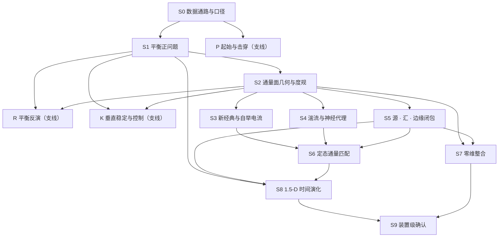

# 验证定序册 · 一页汇总

**一句话**：fydoc 算例书的 18 组算例，在 fylite 这一侧按**物理依赖**排成 13 个阶段
（10 级干路 + 3 条支线）共 29 条计划条目；**上游不成立，下游不跑**。

- 日期 (recorded)：2026-09-04 ·〔手写件，不是生成件〕
- 阶段：13（干路 S0..S9，支线 R · K · P）· 计划条目：29
- 条目现状：**已有记录 20** · 拟立 4 · 因参考侧缺失而阻塞 5
- 算例来源：fydoc `cases/` 的 18 组**全部**被引用（`$FYDOC_ORACLE`）
- 现行豁免：1 条（性能门，见末节）

> ★本页**不含任何量到的数**。数在两处：对外部答案量到多少在
> [`../reports/README.md`](../reports/README.md)（公开 V&V 登记册），产出自洽与否在
> [`../physics/SUMMARY.md`](../physics/SUMMARY.md)。本页只说**顺序 · 阻塞 · 缺口**。
> 机读的一份在 [`plan.jsonld`](plan.jsonld)，执行流程在 [`README.md`](README.md)。

## 依赖图

**排序的依据只有一条：消费关系。** B 的输入里有 A 的输出，A 就在 B 上游——不是难度，
不是重要性，也不是谁先写出来的。两处汇合值得单独记住：**S6**（新经典 + 湍流 + 源）与
**S8**（平衡 + 通量闭包 + 源，且带回路）。

## 逐阶段

| 阶段 | 问什么 | 上游 | 算例来源（fydoc） | 记录 | 现状 |
| :--- | :--- | :--- | :--- | :--- | :--- |
| **S0** 数据通路与口径 | 值 · 单位 · 坐标与径向标签 · COCOS 进出后有没有变 | — | `-12` 合成 · `-13` TEQ · `-03` 冻结库 | `physics/equilibrium-gfile` · `V-01` · 拟 `V-15` | 部分已有 |
| **S1** 平衡正问题 | 解出的 ψ 是不是那道方程的解 | S0 | `-13` TEQ · `-07` TOSCA · `-04` FUSE | `B-01` · 拟 `C-06` `C-07` | 部分已有，两条阻塞 |
| **S2** 几何与度规 | V′ · ⟨\|∇ρ\|²⟩ · 面平均是否逐位一致 | S1 | `-05` GACODE · `-03` · `-10` METIS | `V-01` · `B-04` | 已有 |
| **S3** 新经典 | 新经典系数与自举电流 | S2 | `-05` NEO · `-03` · `-16` Redl | `V-01` `V-04` `V-08` | 已有 |
| **S4** 湍流与代理 | 本征值 · 拟线性通量 · 代理网络 | S2 | `-14` `-05` TGLF · `-18` GYRO · `-11` QLKNN · `-06` GENE | `V-01` `V-03` `V-04` `V-05` `C-05` · 拟 `C-08` | 已有 + **1 处缺口** |
| **S5** 源 · 汇 · 边缘 | 沉积 · 反应率 · 冷却率 · 靶板闭包 | S2 | `-10` METIS · `-16` TORAX | `C-04` `V-08` `V-09` `V-10`..`V-13` | 已有 |
| **S6** 定态通量匹配 | 匹配出的梯度剖面 | S3 · S4 · S5 | `-15` TGYRO | `V-06` `V-07` · 拟 `B-07` | 只到映射层，**解本身无记录** |
| **S7** 零维整合 | 全局量与约束定标 | S2 · S5 | `-10` METIS · `-08` ITPA TC-33 | `B-04` · 拟 `C-09` | 已有 + **1 处缺口** |
| **S8** 1.5-D 演化 | 剖面的时间轨迹 | S1 · S5 · S6 | `-16` TORAX · `-09` JINTRAC · `-04` FUSE · `-02` DINA | `V-14` `B-05` `B-02` `B-03` · 拟 `B-08` `B-09` | 已有 + 两条阻塞 |
| **S9** 装置级确认 | 这条链路的答案该不该被相信 | S8 · S7 | `-01` ASTRA / ITER 参考算例 | `C-01` `C-02` | 已有；`C-01` 复测未评估 |
| **R** 平衡反演（支线） | 由磁测量反演出的平衡 | S0 · S1 · S2 | 实验测量集（仅指针） | `B-06` | 已有 |
| **K** 垂直稳定与控制（支线） | 刚性位移增长率与控制裕度 | S1 · S2 | **无登记的算例来源** | `C-03` | 已有，**参考待补** |
| **P** 起始与击穿（支线） | 击穿判据与起始阶段模型 | S0 | `-17` TRANSMAK（报告体） | 拟 `C-10` | 阻塞 |

★**支线单列的理由是止损**：R · K · P 不在输运干路上（不消费通量，也不被通量消费），
把它们并进干路，会让一条与输运无关的失败挡住整条链，反之亦然。

## 阻塞规则

对每条条目 `x`：

| 上游判决 | `x` 怎么办 | 记成什么 |
| :--- | :--- | :--- |
| `pass` | 执行 | 按实测判 |
| `conditional` | 执行 | 判决上确界继承为 `conditional` |
| `fail` | **不执行** | `blocked`，写明挡它的是哪一条 |
| `unevaluated` / `blocked` | **不执行** | `blocked-unknown` |

★★**这是工作约定，不是物理定律**：它把「上游不成立时下游的数不可判读」这一认识论
事实固定成执行规则。理由在 S6 与 S8 那两处汇合上最清楚——上游有错时求解器照样收敛、
轨迹照样吻合，**吻合本身不再是证据**。判决六态（`pass` / `conditional` / `fail` /
`unevaluated` / `blocked` / `blocked-unknown`）中后两态**永不并进「通过」**，也不并进
「未评估」：三者的成因不同（没跑 · 上游挡了 · 上游状态不明）。

## 四处缺口（本册子的产出之一）

| # | 缺什么 | 算例来源在不在 | 为什么值得先做 |
| :--- | :--- | :--- | :--- |
| G-1 | **S7 · ITPA TC-33**（拟 `C-09`） | **在**，公开可复取（Zenodo, CC BY 4.0，`-08`） | 本图里**最强的一条 C 路径**：ITER 场景的机构共识参考算例，且不受限——`C-01` / `C-02` 的参考是受限件，读者复算不了 |
| G-2 | **S4 · GENE ITER 基准**（拟 `C-08`） | **在**，公开可复取（Zenodo, CC BY 4.0，`-06`） | S4 目前对回旋动理学一手答案的确认只有 `C-05`（文献一张表），覆盖面窄 |
| G-3 | **S6 · 定态解本身**（拟 `B-07`） | 部分：`-15` 有 deck，`outputs` 为空 | 现有 `V-06` / `V-07` 只钉住**映射层**（喂进去的局域态逐键对得上），求解器求出的根未验 |
| G-4 | **K · 参考侧无指针** | **不在**（`C-03` 的纳入类别一栏是「—」） | 一条不写明参考取自哪一份的记录，不可复算——按公开册的四样要求，它缺第 2 样 |

★另有五条因**参考侧未取回或缺答案**而阻塞：`C-06` `C-07`（TEQ / TOSCA，本体在
`$ITER_SCENARIO_ROOT`）· `B-08`（FUSE 1.1.5 上游**只有问题没有答案**）· `B-09`（DINA，
同一外置根；★它是唯一覆盖**电流爬升与下降**的参考，现有 S8 三条全在平顶）· `C-10`
（TRANSMAK，且是报告体）。**阻塞不是失败**：它记录的是「这一条现在不可执行，因为参考
侧不在手边」，与「量过、没通过」是两件事。

## 现行豁免（1 条）

| 豁免 | 范围 | 理由 | 失效条件 |
| :--- | :--- | :--- | :--- |
| 性能门不阻塞物理下游 | `V-01` 复测中两条**墙钟预算**断言（410k-pair mutual 27.5 ms 对 10 ms 门；90-segment mutual_matrix 66.8 ms） | 数值一致性与执行时间是两个判据类；后者没有物理下游 | `V-01` 的失败断言一旦变成**数值**断言，本豁免立即失效，S2 起全部阻塞 |

★豁免的代价记在这里，免得下次重新发现：判决表因此会显示「上游记为不成立而下游仍在
跑」，读者不查本节就会认为规则被违反了。**默认是阻塞；豁免必须具名、限定到具体断言、
并写明失效条件。**
