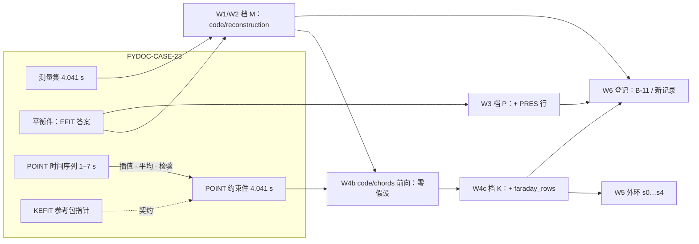

# B-06 · EAST #137985 动理学平衡反演对标：工作流与计划

| | |
| :--- | :--- |
| **类** | **B 对拍 · 计划页**——本页是工作流与计划，不是一条已判定的记录；判定写在各档自己的记录里 |
| **参考** | 档 M / P：EFIT（ASIPP EAST `efit_east` 树 #137985 `\TIME[28]` = 4.041 s 的交付答案，逐值收在 FYDOC-CASE-23）· experiment（内网来源，只收指针与 sha256）；档 K：KEFIT（EAST/Qian 分支的 EFIT_POINT：`EFIT_POINT_GUI_v5.m` + `efitd6565d`，冻结只读参考包 `kefit_reference_bundle`）· private-artefact（包内**没有**带 POINT 约束的答案）|
| **对象** | fylite：`code/reconstruction`（装配反演门）· `code/chords`（POINT 弦、法拉第行）· `code/bootstrap` · `code/profile_fit` · 动理学计划 `kinetic-reconstruction`（五步 + 外环；现归档，待改绑 efit_east 链）|
| **算例** | FYDOC-CASE-23（fydoc `cases/FYDOC-CASE-23-east-137985-efit-east/`；内核私有镜像 `$FYLITE_KERNEL/tests/data/FYDOC-CASE-23-east-137985-efit-east/`）|
| **数据** | 见 §6 |
| **门** | `$FYLITE_KERNEL/tools/benchmark-east-efit-east.py`（档 M，B-11）· `$FYLITE_KERNEL/tests/test_reconstruction_pressure_sign.py`（档 P）· `$FYLITE_KERNEL/tools/benchmark-east-point.py`（档 K：W4b / W4c 的运行与**复现门**——钉读数可复现，不判对参考）|
| **登记册** | B-06 记录（#137985 @ 4.0 s，est2 离线档）`assertion_state: retired`（2026-09-13），摘要见 §8；档 M 的判定在 **B-11**（成立，条件化）；档 P、档 K 尚无记录 |
| **状态** | 计划（2026-09-14）；本页**手写**，未经 `tools/benchmark-publish.py` 渲染。档 K 的 W4b / W4c 已于 2026-09-14 量过（§7）——**无参考答案，不作判定** |

> 本页原是登记册记录 B-06 的渲染件。那条记录 2026-09-13 随「彻底移除 est2」撤回；本页改写为**这一炮动理学平衡反演的对标工作流与计划**。
> B-06 这个号仍指同一个对象（EAST #137985 的平衡反演），换的是测量链与参考。登记册里的 B-06 记录原样保留、仍为 retired，本页不改它的判据与数。
> ★页上每个数都是**转录**的已有读数或对 CASE-23 数据的**算术对齐**，出处逐条写明；转录件收在 FYDOC-CASE-23 `corpus/benchmark/comparison_readings_east137985.fyo.jsonld`。
> ★重跑 `tools/benchmark-publish.py` 会按登记册把本页重新渲染成撤回记录的样子——在登记册为本计划立项之前，发布前须保留本页。

## 1. 问的是什么、分几档

动理学平衡反演按约束阶梯分三档。**档不同，参考与判据都不同，读数不可跨档比较**——同一炮上 q₀ 差百分之几十，可以只是约束集之差。

| 档 | 约束 | fylite 侧 | 参考 | 现状 |
| :--- | :--- | :--- | :--- | :--- |
| **M** 磁 | 环 + 探针 + Ip + 线圈 | `code/reconstruction`，不绑压强 | EFIT `efit_east` 树（"Offline EFIT"，`EFIT_RUN` = EFIT01）| **B-11 成立**（条件化）；不给条件的变体待内核 |
| **P** 磁 + 压强 | + p(ψ_N) 行 | 同一门 + `pressure` 绑定 | EFIT 自己的 PRES（**不是**实测压强）| 压强号门已落；无登记记录 |
| **K** 磁 + POINT（+ Thomson + 自举）| + 11 弦法拉第角 / 线密度（+ n_e、T_e 剖面，j_bs）| `code/chords` → 法拉第行 → `code/reconstruction` 行给定档；外环 = 计划 s0…s4 | KEFIT 的 POINT 契约（参考包）；#137985 的 POINT 约束件（4.041 s，KEFIT namelist 形）在 CASE-23 | 数据阻塞已处置（§4 W4）；**W4b / W4c 已量**（§7）；参考答案转为数据请求 |

★**「磁反演对标 efit_east 树」与「含 POINT 的反演对标 KEFIT」是两条线，不是一条线的两个精度。** efit_east 树只能作 M / P 的参考：
CASE-23 所载 40 个节点没有 POINT 或压强约束通道，装置书 `efit_east_tree_map` 未映射 POINT / 法拉第节点；#70754 / #70745 的 `efit_east` 实查
`MEASUREMENTS:PRESSR` · `TANGAM` 等全为 NODATA（`PLAN.md` H-36）。**#137985 上是否同样为空未查**〔TBD〕——fydoc 实验页 2026-09-08 曾〔推测〕
efit_east 树里是带动理学约束的那一次，这条推测在 CASE-23 读到 `TOP:COMMENTS` = "Offline EFIT" 之后仍未被直接核过。



## 2. 参考侧

### 2.1 档 M / P：efit_east 树（FYDOC-CASE-23）

- **是什么**：EFIT 在 `efit_east` 树里存下的第 28 片，逐值——测量集（35 环 SILOPT + FWTSI · 76 探针槽 EXPMPI + FWTMP2 · 12 路 FCCURT · PLASMA · tf）
  与平衡件（PSIRZ 129² · QPSI / FPOL / FFPRIM / PPRIME / PRES · BDRY · 标量 · CMPR2 / CSILOP / CCBRSP）。2026-09-13 活读、09-14 逐节点重读逐位相同。
- **比较标量**：磁轴 (1.9122, −0.0109) m · q₀ 1.8055 · q₉₅ 7.0320 · CHISQ 0.8879 · PRES(0) 47 270.9 Pa。
- **度规自证**：χ² 公式作用在 EFIT 自己的计算通道上得 0.8873，对自报 CHISQ 差 −0.06 %，所以 fylite 的 χ² 与之同尺可比（B-11）。
- **COCOS**：树 = e_Bp 0 · σ_Bp +1 · σ_RφZ +1（COCOS 1 或 5），已由数据定；整圈形式与 COCOS 17 形式都在平衡件里。
- **review**：pending，reviewer `nobody`——**这批答案目前无人核过**。

### 2.2 档 K：KEFIT（`kefit_reference_bundle`）

参考包是 EAST/Qian 分支 KEFIT 的冻结只读件（`LOCKED.md`：不得改、删、改名，行号引用依赖路径稳定）。它给的是**代码契约**，不是 #137985 的答案。
CASE-23 `corpus/benchmark/kefit_reference_bundle.pointers.json` 记下下表各文件的路径 · 字节 · sha256（根记 `$KEFIT_REFERENCE_BUNDLE`）。

| 步 | KEFIT 怎么做 | 出处（包内路径:行）|
| :--- | :--- | :--- |
| 读 | `mdsopen('east',shot)`，逐弦读 `\point_n<i>` 与 `\point_f<i>`（i = 1…11），减去 t ≈ −0.9 s 附近的均值作零偏 | `active/EFIT_point/EFIT_POINT_GUI_v5.m:380-403`（零偏 `:388`）|
| 平均 | \|t − t_k\| < `intev_pol` 窗内均值（GUI 缺省 0.03 s）| `EFIT_POINT_GUI_v5.m:408-409` |
| 线密度 | `nnel = |mean(n)|·1e19`；namelist `bnel = nnel/1e19` | `:417` · `:687` |
| 法拉第 | `kpol·mean(F)/(2.62e-13·(432.5e-6)²)/2·π/180`，`kpol` = 第 1 弦均值的号；namelist `bpolar = …/1e19` | `:424` · `:676` |
| 弦几何 | `kpolar=1` · `rpol=11*2.5` · `zpol= 0.422, 0.34, … , −0.422` · `thetapol=11*0.0` | `:657-661` |
| 权重与误差 | `sigpol` · `fwtpol` · `fwtnel` · `signel` 取自 GUI 编辑框（缺省 0.05 · 1 · 1 · 0.3）；`knelcur=1` | `:663-685`；缺省值见装置书 `static/now/operational` 组 `gui_v5_fig` |
| 密度拟合 | `knelcur>0` 且第 5 轮起 `matrixnel` 拟合 n_e 剖面；n_e 约束行进拟合矩阵 | `efitdud6565.f:5091-5093` · `:7764` · `:9212-9218` |
| 法拉第响应 | 以拟合的 n_e 加权：`tempne = ne(ψ)·wwwpol`，`rpolfc` / `rpolpc` 为其沿弦积分 | `:6858-6863` · `:6888` · `:6996` |
| 法拉第行进矩阵 | `kpolar>0` 且第 6 轮起 `kkpolar=1`：`arsp = fwtpol·rpolfc`（线圈）· `fwtpol·rpolpc`（等离子体基）· 真空室 · `fitdelz` · …| `:5094-5100` · `:8018-8023` · `:8265-8270` · `:8499-8511` · `:8816-8821` |
| 权重归一 | `fwtpol /= sigpol^nsq`（sigpol ≤ 5e-4 置零）；`fwtnel` 用 `sqrt(signel² + (0.03·bnel)²)` | `:3338-3345` |
| χ² 记账（无密度拟合时）| `knelcur=0` 时另算 `cmpol` 与 `fwtpol²·(cmpol − bpolar)²/swtpol²` | `:1128-1176` |
| namelist | `rpol, zpol, thetapol, sigpol, fwtpol, bpolar, kpolar, fwtnel, knelcur, bnel, signel, knecur, …` | `:2184-2186` |
| 法拉第响应表 | 预算的 `pol2.est`（90 MB）在 `green2018_wpf_64/`；#137985 所解析的几何代 `green2022_pcs/` **没有** `pol2.est` | 目录列表 |

- ★包里的答案都**不带 POINT**：`samples/output/{g,m,x}093060.*`（#93060；m / x 只有 IN1 · BASIS · INWANT 三组）、`active/point/efit_w_pf/efitbuild/fitout.dat`
  （#93060 @ 1000 ms，RPOL · ZPOL · SIGPOL · FWTPOL · BPOLAR 全为零）；`efit/q_constraint_eq/` 是 #49038 的 q 约束运行。
- ★包**不能独立运行**：`efitd6565d` 可执行体与 `fcoil3.dat` · `M_fc.mat` · `EMD2016.mat` 都在包外。`LOCKED.md` 所说的 `SHA256SUMS` 在包根不存在。
- ★包外另有一份带 POINT 的 KEFIT 答案：#94048 @ 5760 ms（KEFIT_wuxm，fyresearch `docs/report/FYR-REPORT-08_kefit_east_benchmark.md`，基准书 `FYR-VV-23` 未立篇）。
  它对的是**旧 fylite**（`libefit.so` 路线）、另一炮，原工作区在本机权限拒绝；本页只把它列为档 K 的**候选第二参考**。

### 2.3 #137985 的 POINT 实测（档 K 的输入）：时间序列 → 对齐 → 约束件

CASE-23 `corpus/point/` 下四件：`slice_04000ms.fyo.jsonld`（fydata 4.0 s 片的逐字副本，唯服务器地址改 `mds.invalid`）·
`point_timeseries_east137985.fyo.jsonld`（fydata 9 片 1.0 … 7.0 s 的 POINT 块逐值抽取）· `point_aligned_east137985_4041ms.fyo.jsonld`（对齐到 EFIT 片时刻）·
**`point_constraint_east137985_4041ms.fyo.jsonld`（档 K 约束件，KEFIT namelist 形）**。
★对齐依据用户裁定（2026-09-14）「**时间序列可，平均，插值，对齐**」，是纯算术，方法写在件里。

| 项 | 读数 / 约定 |
| :--- | :--- |
| 归约与窗 | `fylite.io.est2.reduce_est2`（已随 est2 归档）：每片 = 原始弦序列在 \|t − t_片\| ≤ 30 ms 内的均值（居中窗；先减 t ≈ −0.9 s 附近的均值），与 KEFIT GUI 缺省 `intev_pol` 0.03 s 一致；4.0 s 片覆盖 3.970–4.030 s |
| 量与单位 | `n_e_line19` = \|∫n_e dl\| / 1e19 m⁻²；`bpolar` = `kpol·F[°]/(C·λ²)/2·π/180/1e19`——即 KEFIT namelist 的 `bpolar`，∫n_e B_pol dl，1e19 m⁻²·T |
| 对齐 | 4.0 与 5.0 s 两片在 **4.041 s** 线性插值（系数 0.041）；插值 − 最近片：保留弦 n_e ≤ 1.3 %、`bpolar` ≤ 0.0018（第 10 弦 0.0044）|
| 约束件 `bnel` · `bpolar` | 逐弦实测值**不进公开仓**（#137985 实测读数的公开侧清理规则）；在 CASE-23 约束件 `fylite:namelist_in1_point`，本页只记派生量 |
| 约束件 σ | `signel` 0.3、`sigpol` 0.05（KEFIT GUI 缺省）；有效 σ：n_e 0.30–0.36，法拉第 0.05 |
| 约束件权重（主集，`fwtnel` = `fwtpol`）| 1 1 1 0 1 1 0 0 1 1 0；变体 `c4_faraday_kept`：`fwtpol` 1 1 1 1 1 1 0 0 1 1 0 |
| `zpol` | `zpol_card` ±0.425（A-Box 与文献，fylite 卡片）· `zpol_gui_v5` ±0.422（KEFIT 所用）|
| 同件磁测 | **est2 基**（79 探针槽 · 21 道在用）——est2 已整体移除，不与 efit_east 测量集混用；磁测一律取 CASE-23 测量集 |

## 3. 口径对齐

| 项 | efit_east 树（M / P）| KEFIT（K）| fylite | 判 |
| :--- | :--- | :--- | :--- | :--- |
| ψ 单位与规范 | 每弧度，轴上极小 | g-file 每弧度（同族）| 整圈 Wb，轴上极大 | 固定 −2π 加规范常数（B-11 由数据自证斜率 −6.168 对 −6.283）|
| p′ 号 | EFIT 规范下 p′ < 0 | 同 | 求解器规范下 p′ > 0，p = +span·∫ₓ¹p′ | 已由压强号门对 EFIT PRES 核过 |
| 时刻 | 4.041 s | —（#137985 无运行）| POINT 取约束件，插值到 4.041 s | **已对齐**（用户裁定 2026-09-14）|
| 平均窗 | EFIT01 自己的：树里没有 | 磁测 ±5 ms（`efit/2022/read_data_mds2017_1.m:34-35`）· POINT `intev_pol` 0.03 s | fydata 片：磁测 ±5 ms · POINT ±30 ms | **按参考约定一致**；EFIT01 窗记作假设 |
| σ | —— | GUI `signel` 0.3 · `sigpol` 0.05 | 约束件同 | **一致** |
| 探针道阵 | 76 槽（29 道加权），`efit_green2022_pcs` | 包内 `green2018_wpf_64` 等 est2 代表 | 运行时按炮号与测量链解析卡片 | POINT 件的 est2 磁测**不用** |
| 线圈 | CCBRSP 为拟合值，FCCURT 为实测 | `brsp` / `fwtfc` 由 GUI 定 | 装配门只能把线圈当输入 | 条件化（B-11）或待内核拟合线圈 |
| 竖直位置 | EFIT `fitdelz` | 同源 | 竖直锚点设定点 | B-11 以 χ² 极小代之 |
| POINT 弦端 Z | —— | GUI ±0.422 m | 卡片 ±0.425 m | 差 3 mm，两套都在约束件里，作敏感度 |
| 法拉第常数 · 波长 | —— | 2.62e-13 · 432.5 µm（GUI `:424`）| 运行时卡片 `polarimeter.faraday_constant` 2.62e-13 · `interferometer.laser_wavelength` 4.325e-4 m | **一致**；物理值 2.631e-13，差 0.43 % |
| POINT 响应 | —— | 预算表 `pol2.est` + 拟合 n_e 加权 | `code/chords` 在 ψ 图上沿弦积分 n_e·B_R 现算 | 实现不同，行可比性待 W4 量 |
| 剖面基 | npp 1 / nff 2，边缘为零 | `kppcur` / `kffcur` 取自 GUI（缺省 2 / 2）| x^k − x^top，边缘为零 | B-11 取 EFIT 的 1 / 2 |
| 内感 | 定义与 fylite 不同 | —— | —— | **不比**〔TBD〕|

★**参考侧哪些量是喂进去的**：档 M 条件化读数里线圈电流是 EFIT 的**答案**（CCBRSP），竖直设定点由 fylite 自己的 χ² 选；档 P 的压强是 EFIT 的**答案**（PRES）。
这两档因此量的是「给定参考的一部分答案后，其余部分对不对得上」，不是独立反演。

## 4. 工作流（W0–W6）

| 步 | 做什么 | fylite 入口 | 参考 | 读数 / 判据 | 状态 |
| :--- | :--- | :--- | :--- | :--- | :--- |
| **W0** 数据 | CASE-23 的测量集 · 平衡件 · npz；POINT 原片 · 时间序列 · 对齐件 · 约束件；读数转录件；参考包指针件 | —— | —— | 各件 sha256（§6）| **已落**（2026-09-13 / 14）；review 无人 |
| **W1** 档 M 条件化 | 线圈 = CCBRSP，基 1 / 2，竖直设定点扫描 −30 … −12 mm 取 χ² 极小 | `code/reconstruction` | 平衡件 | 9 条判据，带 = 盆地（χ² ≤ 4.1）内最劣值 | **B-11 成立**（§7）|
| **W2** 档 M 不给条件 | 线圈 = 实测 FCCURT | 同上 | 平衡件 | 同 W1 的量 | **待内核**：装配门能拟合刚性竖直平移（`fitdelz` 对应物）或线圈电流之一（`PLAN.md` H-37b ①）；变体读数已记、不判 |
| **W3** 档 P | 以 EFIT PRES 作压强约束 | `code/reconstruction` + `pressure` | 平衡件 PRES | p(0) 号 · 剖面 rms · q₀ 朝 EFIT 移动 | **门已落**（`test_reconstruction_pressure_sign.py`）；实测压强约束要 4.0 s 的 Thomson，被 H-24 挡住 |
| **W4a** 档 K 装置 | efit_east 链的卡片带 11 条 POINT 弦 | 运行时装置解析 | 装置书 | 弦数 11 · Z 端值 · C · λ 与 KEFIT 口径 | **已核**（运行时卡片 2026-09-14：11 弦、±0.425 m、C 2.62e-13、λ 4.325e-4 m、零偏 −0.9 ± 0.01 s）|
| **W4b** 档 K 零假设 | 在 W1 的 ψ 图上前向算 11 弦 n_e 线积分与法拉第读数，对**约束件**比 | `code/chords` | POINT 约束件（4.041 s）| 逐弦残差，σ 取约束件的有效 σ（KEFIT GUI 约定）——**不拟合 POINT 的前向读数就是本档的零假设** | **已量**（2026-09-14）：加权 7 弦法拉第 2.645 σ、线密度 1.456 σ，见 §7 |
| **W4c** 档 K 拟合 | `faraday_rows` 作行加进拟合，权重 = 约束件 `fwtpol / σ` | `code/reconstruction` 行给定档（`row_extra` / `meas_extra` / `weight_extra`，须同绑 `psi_ext`）| POINT 约束件 | POINT 残差降多少、档 M 各量是否仍在 B-11 的带内、q₀ 往哪走；敏感度：变体 `c4_faraday_kept` · 最近片 · 平台均值 · `zpol` 两套 | **已量**（2026-09-14）：主集 q₀ 2.293、法拉第 2.645 → 2.391 σ，档 M 三项出 B-11 带；变体见 §7 |
| **W4d** 档 K 对 KEFIT | 同一炮同一时刻开 POINT 的 KEFIT 答案 | —— | **缺** | q₀ · 磁轴 · 边界 · POINT 残差 | **转为数据请求**（W4 ⑦）；到来之前档 K 不与 KEFIT 比 |
| **W5** 动理学外环 | 计划 s0 → s1 → s1b → s2 → s3，s4 为外环（判据 dq0_rel < 0.01 · 6 轮）| `fy run` 计划 | W4 的参考 | 轮数 · 逐轮 q₀ / q₉₅ · 与档 K 参考的差 | 计划**已归档**，待改绑 efit_east 链（H-38 ⑤）；外环续跑等价未验（H-22 ①）；est2 上只有连通性读数 |
| **W6** 登记 | 每档一条记录；带按实测盆地定 | 内核登记册 → `tools/benchmark-publish.py` | —— | —— | 档 M = B-11；档 P / K 待 W3 / W4 出读数后另立；fyresearch `FYR-VV-22` 仍指向本号，应改指 B-11 〔他仓〕|

**W4 的阻塞与处置（2026-09-14，只动数据与文档）**——处置结果收成 CASE-23 `corpus/point/point_constraint_east137985_4041ms.fyo.jsonld`
（KEFIT namelist 形：`kpolar=1` · `knelcur=1` · `rpol` · `zpol` · `thetapol` · `bpolar` · `bnel` · `sigpol` · `signel` · `fwtpol` · `fwtnel` · 密度拟合旋钮 `knecur` 3 · `kedgene` 1 · `fwtne0` 50 · `tne_psin` 0.95 · `tne_width` 0.05 · `tne_edge` 0.5），同一组数可交给 KEFIT 与 fylite：

| # | 阻塞 | 处置 | 依据 | 状态 |
| :--- | :--- | :--- | :--- | :--- |
| ① | 时刻差 41 ms | 插值到 4.041 s（4.0 / 5.0 s 线性）；最近片与平台均值作敏感度 | 用户裁定「时间序列可，平均，插值，对齐」；插值 − 最近片在保留弦上 ≤ 0.08（1e19 m⁻²），小于 σ | **已解** |
| ①′ | EFIT 片自己的平均窗 | 取 KEFIT 参考实现的磁测 ±5 ms（fydata 片同）；POINT `intev_pol` 0.03 s，与片的 ±30 ms 窗一致 | `efit/2022/read_data_mds2017_1.m:34-35`；GUI 缺省（装置书 `static/now/operational` · 运行时卡片）| **按参考约定处置**；EFIT01 自己的窗树里没有，记作假设 |
| ② | 逐弦 σ | 取 KEFIT GUI 缺省 `signel` 0.3、`sigpol` 0.05；有效 σ 照求解器：n_e √(signel² + (0.03·bnel)²) = 0.30–0.36，法拉第 = sigpol | 装置书 `facts/device/east/abox/static/now/operational.jsonld` 组 `gui_v5_fig`（读自 `EFIT_POINT_GUI_v5.fig` 编辑框）；`efitdud6565.f:3338-3345` | **已解**（与 KEFIT 同约定）；4–6 s 片间标准差是有效 σ 的 2.5–3.6 倍（n_e）/ 0.5–1.9 倍（bpolar），读作 2 s 内的缓慢演化，作敏感度 |
| ③ | 第 4 弦 | 主集 `fwtnel(4) = fwtpol(4) = 0`；变体 `c4_faraday_kept` 只留法拉第行 | 邻弦检验（两侧邻弦都活）：n_e 偏差逐片变号 −0.43 / +0.53 / −0.33、片间标准差 8.05 σ（他弦 0.5–3.6）⇒ 干涉读数不可用；bpolar 偏差同号 +0.57 / +0.62 / +0.31、标准差 0.54 σ ⇒ 法拉第读数稳定。主集照「干涉失效则连带剔法拉第」的归约规则 | **已解**（主集 + 一个变体，W4c 两者都跑）|
| ③′ | 第 11 弦 | 两行都为 0 | 5.0 s 被条纹闸剔；**法拉第道是死道**：九片 \|bpolar\| ≤ 7.5e-5，而第 10 弦 0.11–0.69 | **新发现，已处置** |
| ④ | `bpolar` 单位与法拉第常数 | `bpolar` = KEFIT namelist 的 ∫n_e B_pol dl / 1e19（1e19 m⁻²·T）；C = 2.62e-13、λ = 4.325e-4 m 在 GUI、运行时卡片、归约三处相同 | 归约代码（注为 GUI `:424`）；运行时卡片；物理值 e³/(8π²ε₀mₑ²c³) = 2.631e-13，GUI 值低 0.43 %，远小于 sigpol/bpolar（8–100 %）| **已解** |
| ⑤ | KEFIT 偏振行的执行条件 | 不矛盾：`knelcur=1` 开密度拟合、法拉第行以拟合 n_e 加权并从第 6 轮起进矩阵；`:1128-1176` 那段 `knelcur=0` 的块只是无密度拟合时的 χ² 记账（§2.2 表）| `efitdud6565.f` 各行 | **已解**（读源码）|
| ⑥ | 弦端 Z | 两套都写进约束件：`zpol_card` ±0.425 与 `zpol_gui_v5` ±0.422 | 装置书已记；对 KEFIT 对拍用 GUI 值，fylite 卡片用 A-Box 值 | **已处置**（3 mm 作敏感度）|
| ⑦ | 没有带 POINT 的参考答案 | **只动数据与文档解不了**：原 KEFIT 工作区（内部路径，不入公开仓）本机权限拒绝，全机无 #137985 的 KEFIT 输出。处置两步：(a) 档 K 先按「离数据多远 + 不破坏档 M」判（§5 前五条），**不与 KEFIT 比**；(b) 数据请求——作为 fydoc `FYDOC-REPORT-01` A-4「kinetic-EFIT 参考输出」的具体化：KEFIT（`EFIT_POINT_GUI_v5.m` + `efitd6565d`）在 #137985、t3 = 4.041 s（并 4.000 s）以 `kpoint=1`、GUI 缺省（`intev_pol` 0.03 · `signel` 0.3 · `sigpol` 0.05）跑一次，交回 `m`/`g`/`a` 文件、`fitout.dat`、`ne_pro.dat`、`int_ne.dat`、`chinel.dat` 与所用 `temp` namelist | 文件系统检索（2026-09-14）| **转为数据请求**；W4d 挂起 |

## 5. 判据草案（档 K，未量；容差一律 [TBD]）

按 `docs/note/benchmark/vocabulary.md` 的 `measured_band`（B 类带取盆地内最劣值，三位有效数字向上取）在第一次运行后定带；在那之前不写数。
前五条不依赖参考答案，W4d 到来之前档 K 就按它们判。

| 量 | 范数 | 容差 | 容差来源 | 备注 |
| :--- | :--- | ---: | :--- | :--- |
| 零假设：W1 平衡上的前向法拉第读数对约束件，逐弦残差 | rms（σ）| [TBD] | 实测后定 | σ = sigpol 0.05，主集权重 |
| 零假设：前向线密度对约束件 | rms（σ）| [TBD] | 实测后定 | σ = √(signel² + (0.03·bnel)²)；与密度剖面假设绑定 |
| 加 POINT 行后法拉第与线密度残差 | rms（σ）| [TBD] | 实测后定 | 必须低于零假设，否则 POINT 行没有说话。**实测**：主集法拉第 2.645 → 2.391 σ（降 9.6 %）· `c4_faraday_kept` 2.712 → 2.685 σ（几乎不降）；线密度 1.456 → 1.480 σ（不降）|
| 输入敏感度：主集 / `c4_faraday_kept` / 最近片 / 平台均值 / `zpol` 两套下的 q₀ 与磁轴 | 最大差 | [TBD] | 实测后定 | 大于判据带则输入的处置本身不够好。**实测**（对主集 q₀ 2.293）：最近片 +0.010 · `zpol` GUI +0.002（两态交替，达不到 1e-3 的轮间判据）· `c4_faraday_kept` −0.289 · **平台均值 −0.398**——POINT 的时间处理比对齐与弦端 Z 大一个量级以上 |
| 加 POINT 行后档 M 的量（探针 σ · 环 σ · 磁 χ² · 磁轴 · 边界中位）| 同 B-11 | B-11 的带 | 已有记录 | 不得因 POINT 行掉出带。**实测**：主集 · 最近片 · `zpol` GUI 各有三项出带（磁轴 dR +7.96 mm 对带 6.51 · 边界中位 9.5 mm 对 6.24 · ψ 图 0.55 % 对 0.46 %；探针 0.342 · 环 0.084 · χ² 3.63 在带内）；`c4_faraday_kept` 与平台均值全在带内 |
| q₀ 对 KEFIT（同炮同时刻、开 POINT、同一约束件）| relative | [TBD] | 参考自报或实测后定 | 等 W4d |
| 磁轴 · 边界中位对 KEFIT | absolute | [TBD] | 同上 | 等 W4d |
| 外环收敛 | dq0_rel | 0.01 | 计划 caveat（用户 2026-09-13 裁定）| 已有判据 |

## 6. 数据

| 存储项 | 校验 | 纳入类别 | 规模 |
| :--- | :--- | :--- | :--- |
| fydoc `cases/FYDOC-CASE-23-east-137985-efit-east/corpus/efit_east_137985_k28.npz` | sha256:7620945561e01ce36fd2bf6b6137acc2633ddc8e0112bbfdacd0c009363a9dd8 | experiment | 157 260 B |
| 同组 `corpus/measurement_east137985_4041ms.fyo.jsonld` | sha256:a3a80c3f3a8c20d0598f0619a371f679dfd3bd690b4a3b7676d143d5fbecfec3 | experiment | 15 000 B |
| 同组 `corpus/equilibrium_east137985_4041ms.fyo.jsonld` | sha256:a24846602043b827407fd1ac71302e5d02171ec9e0f8c903d9c3c340c9c8e54c | experiment | 967 498 B |
| 同组 `corpus/point/slice_04000ms.fyo.jsonld` | sha256:054c6f644702bbae6ad0ce5270eb256a6bed20c737e19f7aacdded21788bf919（fydata 原件 265efa7322fb42abe7d34eea04e2806240a7ddb92b2d154087dceba1ff9d04ad）| experiment | 7 881 B |
| 同组 `corpus/point/point_timeseries_east137985.fyo.jsonld` | sha256:7e2c251761bd9ffd48768c6711f9ff8236414eed003400f968b80895a33545cb | experiment | 12 676 B |
| 同组 `corpus/point/point_aligned_east137985_4041ms.fyo.jsonld` | sha256:ae23995e3ae1276805033f31b5780e79d61d0e3cb20aed464fb14f3112481fe4 | experiment（派生：插值 · 平均）| 4 777 B |
| 同组 `corpus/point/point_constraint_east137985_4041ms.fyo.jsonld` | sha256:988e36c06ddf973af0bde5eb2affde0d8043160244313bfcf86cf0a96513c985 | experiment（派生：约束件）| 9 098 B |
| 同组 `corpus/benchmark/comparison_readings_east137985.fyo.jsonld` | 见该组 `case.yaml` 的 `data.checksums` | private-artefact（转录的 fylite 读数）| —— |
| 同组 `corpus/benchmark/kefit_reference_bundle.pointers.json` | sha256:e4e8ea81d4ce2923f673e6946dc4a9a69f6298a99817f3dce04239ac2de098e7 | private-artefact（指针）| 6 094 B |
| `$KEFIT_REFERENCE_BUNDLE/active/EFIT_point/EFIT_POINT_GUI_v5.m` | sha256:0cccdc958f34b5ba41b38e55691c6d2f9d396f59defb28007ab944d7321b182f | private-artefact | 110 748 B |
| `$KEFIT_REFERENCE_BUNDLE/active/point/efit_w_pf/efitbuild/efitdud6565.f` | sha256:0a066a8099e0b90a3c2cbc82fcaa126986121e025305c96d4b285018ce591ec3 | private-artefact | 660 795 B |
| `$FYLITE_KERNEL/facts/device/east/abox/providers/magnetics/efit_green2022_pcs.jsonld` | sha256:fb2744b3eedb939defe1a2c6e1aa7f336ed2961758b74f0ddb84e47db65e5010 | private-artefact | 26 738 B |
| 运行时卡片 `facts:device/east?shot=137985&measurement_chain=efit_east`（2026-09-14 07:47 生成于临时目录，未保留）| sha256:f07f239f2d75547773b3c788d3a806ef19575f0b9188d5530fbf7a926ceeaef1 | private-artefact | 64 183 B |

受限与实验类只存路径与 sha256，本体不在公开仓；CASE-23 的发布判定是 `internal`。

## 7. 已有读数（转录）

| 档 · 读数块 | 输入 | 读数 | 地位 | 出处 |
| :--- | :--- | :--- | :--- | :--- |
| M · 条件化 | 测量集 + CCBRSP + 基 1/2 + 设定点 −20 mm | 磁轴 +4.53 / +0.54 mm（带 6.51）· q₀ 1.9378，+7.32 %（带 7.79 %）· q₉₅ 6.5767，−6.47 %（带 7.68 %）· 边界中位 5.04 mm（带 6.24）· 最大 130.9 mm，在 EFIT 上 X 点（带 147）· 探针 0.336 σ（带 0.361）· 环 0.0893 σ（带 0.0954）· χ² 3.547，EFIT 同度规 0.8873（带 4.08）· ψ 图 rms 0.40 %（带 0.46 %）；357 次迭代收敛 | B-11 成立 | 登记册 `record/B-11` |
| M · 设定点扫描 | 同上，−30 … −12 mm | χ² 6.94 · 5.72 · 4.76 · 4.07 · 3.67 · **3.55** · 3.71 · 4.13 · 4.84 · 5.80；盆地 −24 … −18 mm | B-11 条件 3 的出处 | 同上 |
| M · 实测线圈 | 线圈改 FCCURT | dR +26.0 mm · dZ −4.0 mm · q₀ +33.2 % · q₉₅ −8.3 % · 探针 0.528 σ · 环 0.142 σ · χ² 8.78 | 变体，不判 | 同上 |
| P · 纯磁 | EFIT 计算通道作测量（与 M 不同输入）| p(0) +48 086.7 Pa 对 EFIT +47 270.9 · rms 365.8 Pa · q₀ 1.9172 | 门的实测注 | `test_reconstruction_pressure_sign.py` |
| P · 动理学 σ 20 % | + EFIT PRES（9 行）| p′ 系数 +8.61e5 · p(0) +47 927 Pa · rms 293.9 Pa · q₀ 1.8526（离 EFIT 0.0471，纯磁 0.1117）；旧负号行未收敛被拒；σ 5 % / 10 % 两种号都未收敛 | 门的实测注 | 同上 · `PLAN.md` H-37b ④ |
| K · POINT 约束件 | fydata 9 片 → 对齐到 4.041 s → KEFIT 约定的 σ 与权重 | 见 §2.3 与 §4 W4 表 | 输入，非读数 | CASE-23 `corpus/point/` |
| K · W1 / C0 复现 | B-11 条件化拟合经内核 tree door；行给定档（`psi_ext` + 扣线圈份额的环 / 探针）| W1：q₀ 1.9378 · q₉₅ 6.5767 · dR +4.53 mm，356 次迭代——与 B-11 相同；C0 与 W1 最大相对差 2.0e-8（求解器容差内，非逐位）| 复现 | `$FYLITE_KERNEL/tools/benchmark-east-point.py` |
| K · W4b 零假设 | W1 的 ψ 图 + 约束件（主集权重 1 1 1 0 1 1 0 0 1 1 0，KEFIT GUI σ）；`code/chords` 以自带 (1 − x²)^α 扫描拟合线密度 | 加权 7 弦：**法拉第 2.645 σ** · 线密度 1.456 σ；号约定一致（与 KEFIT 同一 `kpol` 规则）；上方第 1–3 弦实测比模型**低** 2.5–4.8 σ，第 9–10 弦 0.2 σ 内；被剔弦独立地偏：第 4 弦线密度 +9.2 σ · 第 7 / 8 弦 +22 σ（干涉死道）· 第 11 弦法拉第 −10.9 σ（死道）；密度拟合停在扫描下沿（α = 0，平直剖面）；行路线对场积分 3.6 % | 实测，零假设 | 同上；读数 CASE-23 `#K-W4b-null` |
| K · W4c 主集 | C0 + 7 条法拉第行（量值 = 实测 − 线圈份额，权 fwtpol / sigpol），逐轮重建行至 \|Δq₀\|/q₀ < 1e-3（3 轮）| q₀ 1.9378 → **2.2933**（对 EFIT 纯磁 Q0 +27.0 %）· q₉₅ 6.6692 · dR +7.96 / dZ +1.04 mm · 边界中位 9.48 mm · ψ 图 0.55 % · 探针 0.342 σ · 环 0.084 σ · χ² 3.63；法拉第 2.645 → **2.391 σ**，线密度 1.456 → 1.480 σ；拟合后残差保持形状（第 1 弦 +4.3 σ，第 9 / 10 弦变为 +1.0 / +0.9 σ）| 实测，**不判**（无参考）；档 M 三项出 B-11 带 | 同上；`#K-W4c-rows` |
| K · W4c 变体 | 同主集，各改一处 | `c4_faraday_kept` q₀ 2.0048、法拉第 2.712 → 2.685 σ、档 M 全在带内 · 最近片 q₀ 2.3036 · 平台均值 q₀ **1.8950**、档 M 全在带内 · `zpol` GUI q₀ 2.2953 / 2.2994 两态交替 | 实测，敏感度 | 同上 |
| K · 归因 | —— | **未归因**：以基 1 / 2 与平直密度，法拉第行吸收不了上下差；候选为密度形状 · 弦标定或零偏 · 上下密度不对称 · 基——需 KEFIT 参考或更多自由度才能分开 | 开 | —— |
| K · 不可比的交付档 | est2 路线 4.000 s，EFIT↔NEO，含 POINT 11 弦 · Thomson n_e · 自举反馈 | Ip 393.46 kA · q₀ 0.7825 · q₉₅ 3.0849 · 磁轴 (1.8308, −0.0750) m · χ² 11.758 | **不得作参考**：道阵不同，fydoc 判其与 efit_east 储能差 4.00 倍（`divergent`）| `$FYLITE_KERNEL/docs/note/port-oracle-examples.md` §3.2 |
| 链 · 连通性（est2）| 计划 s0 … s4，压强取交付重构自己的 | s0 → s3：q₀ 0.832 → 0.559 · q₉₅ 3.92 → 3.26 · lᵢ(3) 2.62 → 3.64；外环第 3 轮收敛：q₀ 0.5589 → 0.5651 → 0.5650 · dq0_rel 0.0110 → 9.8e-5 · 自举电流和 9522 → 15363 → 15439 A | 只证链路连通，输入已归档 | `PLAN.md` H-21 · H-22 |

## 8. 前身：撤回的 B-06 记录（摘要）

- **比的是什么**：#137985 @ 4.000 s 的 est2 测量集（79 探针 / 35 环，`efit_w_pf` 几何）上，fylite `gs_inverse_solve` 与离线 gfortran EFIT（`libefit.so`，preset gui_v5 / tables wpf2018）
  的「磁 + kprfit = 1 直接压强」档答案（q₀ 0.6698 · q₉₅ 2.9544 · χ² 0.0724）。登记册结论「部分」，2026-09-08 复测 18 过。
- **为什么撤回**：2026-09-13 用户裁定「彻底移除 est2」，其测量集 FYDOC-CASE-22 归档，记录按「保留、标为撤回」处置（`assertion_state: retired`）。
- **留下的发现**（全文在 `$FYLITE_KERNEL/docs/note/east-reconstruction-benchmark.md` 与内核登记册该条）：环残差的共模主项是径向锚点的虚拟电流（改成行后 −10.0 σ → +0.57 σ）；
  散布是竖直锚点的虚拟丝对（相关 +0.953）；那份竖直力是承重的，参考自己也扛着 12.3 kN、缺口 5.9 kN；挡住高阶基的是 CONDIN 截断（收紧后 q₀ 缺口 −47.1 % → +2.6 %，开关、非缺省）；
  2026-09-14 更正：「装配层 span_pr 号相反」那条修法是用第二个负号抵消动理学行的错号，p′ 本身是反的——现已四处同改为 +，独立参考换成 EFIT 自己的 PRES（本页档 P）。
- **本页不再渲染那条记录的判据表与复测表**：它们在内核登记册里原样保留；本仓 git 历史里有渲染件（2026-09-14 之前的版本）。

## 9. 复现（已有的门；写本页时未跑）

```bash
cd $FYLITE_KERNEL   # CASE-23 在内核私有镜像 tests/data/ 里
# 档 M（B-11）：扫描设定点、量 9 条判据，--check 对登记册的带
FYLITE_PUBLIC=$FYLITE_PUBLIC FYLITE_KERNEL_LIB=rust/fylite/target/release/libfylite_kernel.so \
  uv run --no-project --with numpy --with scipy --with h5py \
  python tools/benchmark-east-efit-east.py --out <scratch dir> --check
# 档 P：压强号门（物理档）
PYTHONPATH=$FYLITE_PUBLIC/python FYLITE_KERNEL_LIB=rust/fylite/target/release/libfylite_kernel.so \
  uv run --no-project --with pytest --with numpy --with pyyaml \
  python -m pytest tests/test_reconstruction_pressure_sign.py
# 档 K（W4b / W4c）：运行并对 CASE-23 读数件复核（相对容差 1e-6）
FYLITE_PUBLIC=$FYLITE_PUBLIC FYLITE_DEVICE_DIR=$FYLITE_PUBLIC/dist/facts/device/east \
FYLITE_KERNEL_LIB=rust/target/release/libfylite_kernel.so PYTHONPATH=$FYLITE_PUBLIC/python:tests \
  uv run --no-project --with numpy --with scipy --with pyyaml --with pytest \
  python tools/benchmark-east-point.py --out <scratch dir> --check
```

POINT 对齐件与约束件的算法（插值系数、权重规则、平台均值的 ddof、邻弦检验、有效 σ）写在件内 `fylite:method` · `comment` · `fylite:chord_checks` · `fylite:sigma_reading`，可由时间序列件逐值复算。
档 K 的门是上面第三条：它钉的是**读数可复现**（W1 / C0 复现 B-11、W4b · W4c 的每个数对 CASE-23 读数件），不是对参考答案的判定——参考答案到来之前没有可判的对象。

## 10. 结论

**计划页，不作判定。** 档 M 的判定见 B-11（成立，条件化——去掉三项条件中任一项，那些数都不适用）；档 P 只有号与链路的门。
档 K 的**数据阻塞已全部处置**（§4 W4 表：对齐 · 平均窗 · σ · 第 4 / 11 弦 · 单位与常数 · 偏振行执行条件 · 弦端 Z），结果是一份可同时交给 KEFIT 与 fylite 的约束件；
余下唯一的外部阻塞是**参考答案**——已转为向 ASIPP 的数据请求，档 K 在它到来之前按「离数据多远 + 不破坏档 M」判，不与 KEFIT 比。
档 K 的 fylite 读数 2026-09-14 已有（§7，门 `tools/benchmark-east-point.py`）：不拟合 POINT 时法拉第离数据 2.645 σ；加上法拉第行后只降到 2.391 σ，q₀ 升到 2.293，并把磁轴 · 边界中位 · ψ 图推出 B-11 的带；保留第 4 弦法拉第或改用平台均值则档 M 全在带内但 q₀ 分别为 2.005 / 1.895——**输入的时间处理比对齐大一个量级**。残差的上下形状在基 1 / 2 与平直密度下吸收不了，原因未归因。只回答 B 类对拍的问题，不外推到「fylite 的反演对得上真实的 EAST」。
